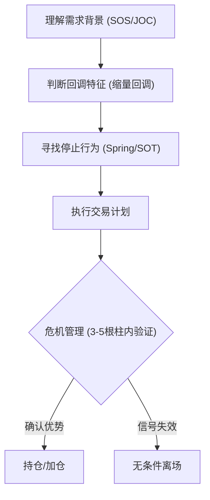

# 后记：交易哲学与实战心得

本书的唯一目的是让大家在证券市场上赚钱。通过识别、分析[吸筹](./术语速查手册.md#accumulation)与派发过程，我们可以捕捉 [CM(狗庄)](./术语速查手册.md#cm-composite-man) 的真实意图。

---

## 一、 核心交易哲学

### 1. 唯有主力的踪迹值得追寻
不是市场上的每一刻、每一个波动都值得分析。只有当 **[CM(狗庄)](./术语速查手册.md#cm-composite-man)** 在场时，价量行为才会变得清晰。在[CM(狗庄)](./术语速查手册.md#cm-composite-man)不在场的随意波动期，休息才是最好的策略。

### 2. 警惕指标陷阱
> [!WARNING]
> **千万别把威科夫方法与那些数学指标系统混用！** 
> 指标遵循的是表象的数学公式，而数学公式无法撼动市场规律。组合使用只会让你重回亏损的老路。

### 3. 操作的“三位一体”
- **识别背景**：确认需求或供应是否占上风。
- **捕捉信号**：掌握 1-2 个核心停止行为（如 Spring 或 SOT）。
- **危机管理**：进场后 3-5 根蜡烛内必须进行甄别，若发现入场过早或判断失误，必须无条件离场。

---

## 二、 威科夫实战训练路径

---

## 三、 给读者的最后建议

### 1. 简单就是力量
不要“眉毛胡子一把抓”。熟练掌握一种高胜率模型（如：需求背景下的 50% 回调 + Spring）并反复实战，它就会成为你的“赚钱机器”。

### 2. 坚持交易笔记
交易笔记是提升的唯一快捷键。通过记录进场、出场、结果与感悟，你会发现自己在与市场对话，这才是真正的进步。

### 3. 心理建设
[CM(狗庄)](./术语速查手册.md#cm-composite-man) 会利用高成交量和极端价格（如恐慌抛售、终极震仓）来制造恐怖气氛，目的是逼迫公众交出筹码。只有读懂这些行为背后的动机，你才能在迷雾中保持冷静。

---

## 🔗 导航

- [← 返回本章目录](./第五章_综合分析与实战演练/README.md)
- [↑ 返回总目录](./README.md)
