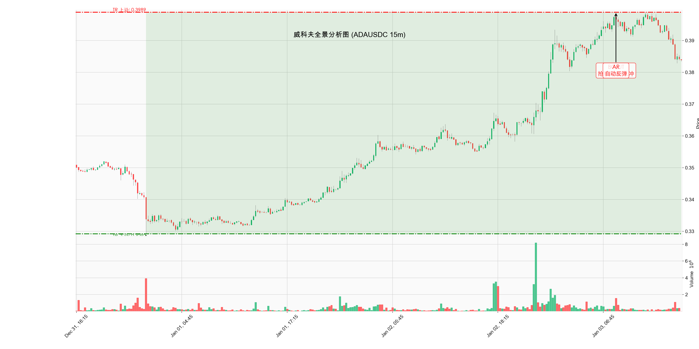

# 威科夫深度分析报告: ADAUSDC_15m

# 威科夫大师深度分析报告：短期市场结构研判

“在股市中，我们必须培养对趋势的本能感悟。每一根 K 线，每一个成交量柱，都在诉说着主力资金的秘密。”

我的朋友，你提供的这份数据片段，清晰地描绘了主力资金（Composite Man）在短期内进行了一次强劲的**趋势移动 (Trending)**，随后进入了一个短暂的**调整期**。我们必须仔细剖析这段时间内的量价关系，以确定下一步的行动。

---

## 1. 定义背景与识别阶段 (Phases)

根据提供的 K 线数据，市场在 $0.35$ 区间完成了强劲的突破，目前正处于上升趋势的中间阶段。

### 大趋势定义

当前市场处于 **趋势移动 (Trending)** 之中，具体而言，是**强劲的上涨趋势 (Markup Phase)** 后的短暂修正。从 $0.3550$ 附近开始的爆发性上涨，表明此前已经完成了充分的吸筹。

### 交易区间 (TR) 识别

在数据片段的后半部分，市场形成了新的短期交易区间，用于消化前期的涨幅。

| 关键点位 | 价格 (USD) | 威科夫逻辑 |
| :--- | :--- | :--- |
| **短期压力 (Resistance)** | $0.3934$ (2026-01-03 01:00:00) | 趋势移动的当前顶点，是多头力量耗尽的初步迹象。 |
| **短期支撑 (Support)** | $0.3842$ (2026-01-03 15:15:00) | 近期回调的低点，是多头必须捍卫的关键水平。 |

### 阶段识别

根据威科夫五阶段模型，我们判断当前行情正处于 **Phase D (趋势移动)** 的后期，并正在经历一次健康的**回撤/回踩**，为进入 Phase E 做准备。

1.  **Phase A/B (隐含):** 在数据开始前，吸筹结构已经完成。
2.  **Phase C (突破确认):** 价格在 17:45 附近以巨量突破，确认了趋势的开始。
3.  **Phase D (Markup):** 从 $0.36$ 区域到 $0.3934$ 的快速、持续上涨，是典型的 **Sign of Strength (SOS)** 序列。
4.  **当前状态 (Phase D 修正):** 价格从 $0.3934$ 回落至 $0.3842$，成交量显著萎缩。这并非派发，而是对前期强劲上涨的**回踩**，以测试市场中剩余的供应。

---

## 2. 量价行为分析 (VSA)

### 供求关系判断

| 时间段 | 价格行为 | 成交量特征 | 供求关系结论 |
| :--- | :--- | :--- | :--- |
| **17:45 - 18:15** | 价格大幅上涨，突破关键阻力。 | 极高成交量 (3M+)，是数据片段中的最高量。 | **需求主导。** 主力资金积极买入，推动价格跳跃“小溪”（Jump Across the Creek）。 |
| **01:00 (高点)** | 价格达到 $0.3934$ 后，上涨动能减弱。 | 仍有高量 (1.9M)，但收盘价未能维持在高位。 | **初步供应出现。** 市场开始消化获利盘。 |
| **01:15 - 16:00 (回调)** | 价格缓慢回落，波动幅度收窄。 | 成交量持续萎缩，多在 200K - 700K 之间。 | **供应疲软。** 回调缺乏抛售恐慌，表明主力资金并未出货，而是允许市场自然回撤。 |

### 主力资金意图

主力资金在 17:45 至 01:00 期间投入了巨大的努力（高量）获得了显著的结果（价格上涨）。随后的回调伴随着低量，这表明：

*   **没有恐慌性抛售：** 市场中的弱手正在离场，但机构级别的供应尚未出现。
*   **测试支撑：** 主力正在测试 $0.3840$ 附近的支撑强度。如果价格在此区域企稳，且成交量保持低迷，则确认这是一个健康的**再吸筹 (Re-accumulation)** 行为，而非派发。

---

## 3. 关键事件点位定义 (Coordinates)

我们必须精确地标记出这段旅程中的里程碑：

| 威科夫术语 | 日期与时间 | 价格 (USD) | 威科夫逻辑解释 |
| :--- | :--- | :--- | :--- |
| **SOS (Sign of Strength)** | 2026-01-02 17:45:00 | $0.3647$ | 在极高成交量下突破前期阻力，确认了需求方的力量。这是 Phase C 向 Phase D 转变的信号。 |
| **BUI (Back-up to the Ice)** | 2026-01-02 18:30:00 | $0.3636$ | 突破后的第一次回踩，价格在低量下成功守住突破位，证明了支撑的有效性。 |
| **Climax of Markup** | 2026-01-03 01:00:00 | $0.3934$ | 趋势移动的高潮点。此后市场开始进入修正。 |
| **LPS (Last Point of Support)** | 2026-01-03 15:15:00 | $0.3842$ | 当前回调的最低点。如果此点位能守住，它将成为下一轮上涨的最后一个支撑点。 |

---

## 4. 总结与大师预测

### 三大定律总结

1.  **供求定律 (Law of Supply and Demand):** 需求在突破阶段压倒性地高于供应。在最近的回调中，供应虽然出现，但其力度（低量）远不足以逆转此前的强劲需求。**需求仍占主导。**
2.  **因果定律 (Law of Cause and Effect):** 前期 $0.35$ 区域的吸筹（因）导致了 $0.39$ 区域的强劲上涨（果）。当前的短期修正（因）正在积蓄能量，为突破 $0.3934$ 创造新的动能（果）。
3.  **努力与结果定律 (Law of Effort vs. Result):** 价格从 $0.3934$ 下跌至 $0.3842$ 的过程中，成交量（努力）显著低于上涨时的成交量。这种**努力与结果的背离**，强烈暗示当前的下跌是暂时的、修正性的，而非趋势反转。

### 下一步行动建议

我的建议是，交易者应将当前的低量回撤视为一个**买入机会**，前提是 $0.3840$ 附近的支撑位能够稳固。

**策略建议：**

1.  **确认买入点：** 密切关注 $0.3840$ - $0.3860$ 区间。一旦价格在此区域出现低量收窄后，紧接着出现一根放量、价差扩大的阳线（小型的 SOS），即可确认再吸筹成功。
2.  **风险管理：** 止损应设置在 $0.3840$ 之下，以防市场结构转变为更深层次的派发。
3.  **下一个潜在目标位：** 既然市场已经建立了强大的上涨动能，一旦突破 $0.3934$ 的短期阻力，根据因果定律推算，下一个目标位将是 $0.40$ 整数关口，甚至更高，达到 $0.42$ 区域。

**结论：** 主力资金已经完成了大部分的建仓工作，目前正在进行最后的“洗盘”。我们应保持耐心，等待市场完成这次健康的修正，然后准备迎接下一轮强劲的上涨。市场结构依然看涨。