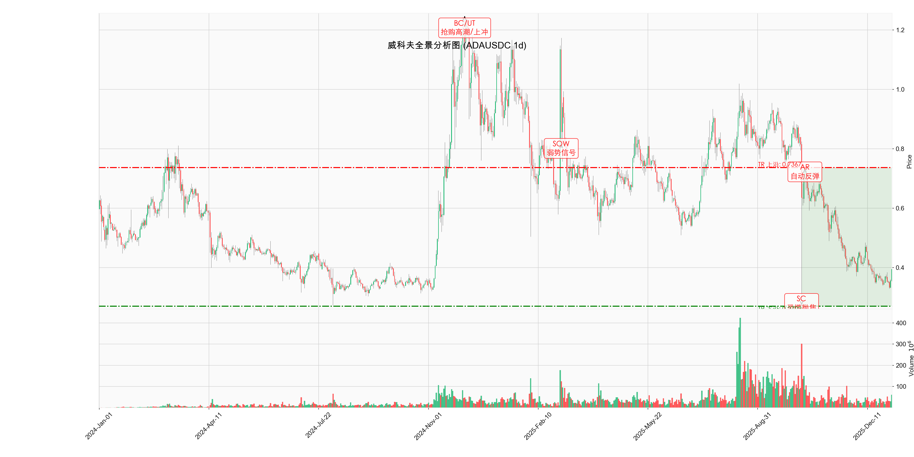

# 威科夫分析报告: ADA/USDC (1d)

**日期**: 2026-01-03
**分析对象**: ADAUSDC (日线级别)
**数据范围**: 2024-01-01 至 2026-01-03 15:30

---

## 1. 威科夫事件标注图 (Daily)

---

## 2. 市场结构分析 (Market Structure) - 日线视角

### 全景周期: 熊市末端的吸筹 (Accumulation off the Bottom)

从日线级别的大周期来看，ADA 经历了一轮深度的熊市调整。图表清晰地展示了 **派发 (Distribution) -> 恐慌下跌 (Markdown) -> 底部吸筹 (Accumulation)** 的完整结构。

#### 关键价格区间 (Trading Range)
*   **上沿 (Resistance / AR)**: **0.7367**
    *   这是重要的长期阻力位，也是此前下跌过程中的中继反弹高点。在此位置聚集了大量套牢盘。
*   **下沿 (Support / SC)**: **0.2702**
    *   2025年10月创下的极端低点，标志着空头力量的集中释放（恐慌抛售）。

### 当前阶段: Phase B (底部构建与测试)
市场在经历 SC (0.2702) 后，价格没有进一步崩盘，而是进入了宽幅震荡。目前价格 (0.3843) 位于 TR 的下半区，正在进行 **Phase B** 的筹码收集任务。此阶段的主力行为特征是"在震荡中消耗剩余供应"。

---

## 3. 量价行为分析 (VSA)

### SC (Selling Climax) - 恐慌抛售
*   **日期**: 2025-10-10
*   **解读**: 日线级别的放量长下影线，确立了 **0.27** 附近的长期政策铁底。主力资金在此位置完成了大规模的恐慌盘承接。

### AR 与 TR 的形成
*   SC 后的反弹构建了初始的 TR。从日线看，这个 TR 区间非常宽 (0.27 - 0.73)，这意味着主力需要花费更长的时间（数月甚至半年）来完成吸筹。

### 当前状态与策略
*   **现价**: **0.3843**
*   **趋势**: 日线级别处于震荡偏弱的格局中，但底部 (Higher Lows) 似乎正在逐步抬升。
*   **策略**:
    *   **左侧交易**: 接近 SC 底部 (0.27 - 0.30) 是极佳的盈亏比买入点。
    *   **右侧交易**: 需等待价格有效突破 **0.45 - 0.50** 的中期阻力，才能确认 Phase B 向 Phase C (Spring/SOS) 的转换。

---

## 4. 结论
日线级别确认了 **0.2702** 为重要的长期底部。当前处于漫长的 **吸筹震荡期 (Phase B)**。对于中长线投资者，每一次回踩底部不破都是布局良机；对于短线交易者，宜在 TR 内部进行高抛低吸。

> *"日线级别的吸筹往往伴随着令人绝望的沉闷震荡，但这正是主力资金完成换手的必要过程。" ——  David H. Weis*
