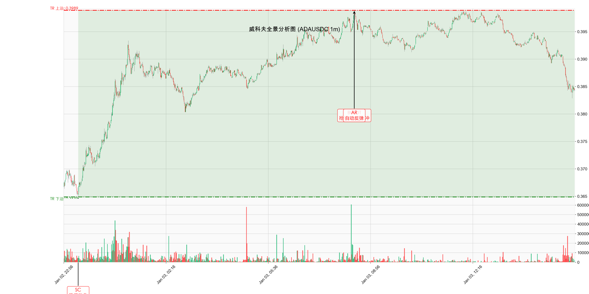

# 威科夫分析报告: ADA/USDC (1m)

**日期**: 2026-01-03
**分析对象**: ADAUSDC (1分钟级别)
**数据范围**: 2025-12-04 至 2026-01-03 (最近30天数据，图表聚焦近期)

---

## 1. 威科夫事件标注图 (1m)

---

## 2. 市场结构分析 (Market Structure) - 微观视角

### 极短线周期: 震荡修复 (Micro-Structure)

1分钟级别的图表捕捉了最近 16 小时内的微观结构。市场在经历了昨夜的急跌后，目前处于修复性的震荡区间。

#### 关键价格区间 (Trading Range)
*   **上沿 (Resistance / AR)**: **0.3989**
    *   短期反弹的高点，构成了目前的微观压力位。
*   **下沿 (Support / SC)**: **0.3649**
    *   **2026-01-02 23:24** 出现的恐慌抛售低点。此位置出现了明显的放量承接。

### 当前阶段: Phase B (微观吸筹)
价格目前运行在 **0.3845** 附近，正好处于 TR 的中轴区域。市场正在消化 SC 带来的恐慌情绪，并测试供求平衡。

---

## 3. 短线量价行为分析

### SC (Selling Climax)
昨夜 23:24 的急跌 (0.3649) 伴随了 1分钟级别的巨量，这是典型的恐慌盘涌出。随后的反弹 (AR) 确立了短期底部。

### 交易策略 (Intraday)
*   **区间操作**: 鉴于 1分钟级别的噪音较大，建议在 TR 边界进行高抛低吸。
    *   **多单**: 关注 **0.3650 - 0.3700** 区域的支撑力度。
    *   **空单**: 关注 **0.3950 - 0.3980** 区域的阻力。
*   **趋势确认**: 若有效突破 0.4000，则微观结构转牛，可看高一线。

---

## 4. 结论
微观层面 (1m) 显示市场在 **0.3649** 获得支撑，短期进入 **0.3650 - 0.4000** 的箱体震荡。适合日内超短线交易者参考。
