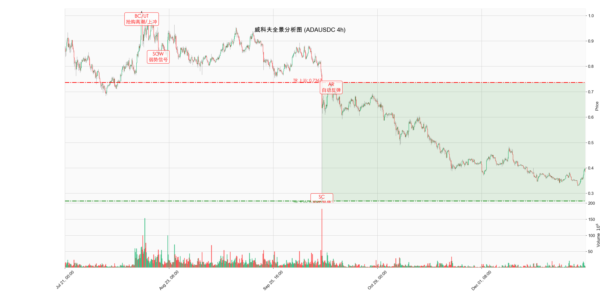

# 威科夫分析报告: ADA/USDC (4h)

**日期**: 2026-01-03 (API 实时数据更新)
**分析对象**: ADAUSDC (4小时级别)
**数据范围**: 2024-01-01 至 2026-01-03 15:30

---

## 1. 威科夫事件标注图

---

## 2. 市场结构分析 (Market Structure)

### 当前阶段: 派发后的吸筹 (Re-Accumulation attempt)

根据最近 5 个月的全景扫描 (2025.08 - 2026.01)，市场完整经历了一轮 **BC (抢购高潮) -> 派发 -> SOW (弱势信号) -> SC (恐慌抛售)** 的过程。目前正处于剧烈下跌后的 **Phase A** 止跌修复期。

#### 关键价格区间 (Trading Range)
*   **上沿 (Resistance / AR)**: **0.7367** (此为前期下跌中继或反弹高点)
*   **下沿 (Support / SC)**: **0.2702** (2025年10月创下的极端低点)
*   **当前位置**: 0.3841 (在此区间底部运行，试图构建底部)

---

## 3. 量价行为分析 (VSA)

### 历史背景: 派发 (Distribution)
*   **BC/UT**: 图表左侧显示市场曾处于相对高位，随后在高点出现滞涨，供应开始涌现。
*   **SOW (弱势信号)**: 在下跌中途出现显著的长阴线，伴随成交量放大，确立了供应的主导地位，这是趋势反转的信号。

### 近期结构: 吸筹 (Accumulation)
### SC (Selling Climax) - 恐慌抛售
*   **日期**: 2025-10-11
*   **解读**: 价格在 **0.2702** 见底，此时恐慌盘大量涌出。随后市场进入了长达两个月的底部震荡。

### 当前状态
*   **现价**: **0.3841**
*   **解读**: 价格并未跌破 SC 低点 (0.2702)，而是在其上方进行震荡。这可能是在构建一个更高底部的 **LPS (最后支撑点)**，或者是在进行 Phase B 的测试。需要关注能否持续站稳 0.35 一线。

---

## 4. 结论与交易策略

### 结论
市场已暂时终结了单边下跌趋势，转入 **横盘震荡 (Trading Range)**。主力资金已在底部由被动承接转为尝试控制局面。

### 观察重点 (Next Steps)
未来几天需密切关注 **ST (Secondary Test, 二次测试)** 的形成：
1.  **若价格回落**: 观察是否缩量。如果价格回踩 0.3300 - 0.3400 区域且成交量显著萎缩，说明供应枯竭，是构建 Phase B 的良好基础。
2.  **若价格突破**: 如果放量突破 0.3961，则需观察是否为 **JAC (Jump Across the Creek)** 或仅是 **UT (Upthrust, 上冲回落)**。考虑到目前仅处于 Phase A，直接 V 型反转的概率通常低于震荡筑底的概率。

> *"市场永远在吸筹、上涨、派发、下跌这四个阶段中循环。识别出当前所处的阶段，就掌握了交易的罗盘。" —— Richard D. Wyckoff*
