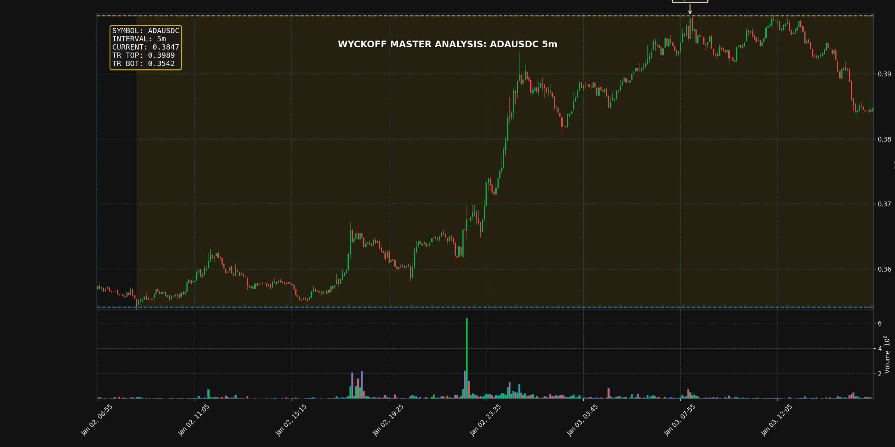

# 威科夫深度分析报告: ADAUSDC_5m

# 威科夫大师深度分析报告

**分析师**: 理查德·D·威科夫 (Richard D. Wyckoff)
**数据时间范围**: 2026年1月3日 07:55:00 至 16:10:00 (5分钟K线)

---

## 威科夫大师名言引导:
> "在股市中, 我们必须培养对趋势的本能感悟. 每一根 K 线, 每一个成交量柱, 都在诉说着主力资金的秘密."

---

## 1. 定义背景与识别阶段 (Phases)

根据阁下提供的 K 线数据，我们观察到市场在经历了一段短暂的震荡和下跌之后，近期出现了剧烈的抛售行为，随后价格迅速稳定。这表明市场正在从下跌趋势转变为一个潜在的横向整理结构。

### 大趋势定义

当前市场正处于从下跌趋势向 **吸筹 (Accumulation)** 结构转变的初期。主力资金（Composite Man）似乎在利用恐慌性抛售来完成其筹码收集工作。

### 交易区间 (TR) 识别

虽然结构尚处于萌芽阶段，但我们已经可以初步划定一个交易区间：

| 边界 | 价格 (初步) | 威科夫事件 | 逻辑解释 |
| :--- | :--- | :--- | :--- |
| **压力 (Resistance)** | 约 $0.3989$ (08:20) | Preliminary Supply/Initial High | 结构形成前的最高点，代表了上方的初步供应区。 |
| **支撑 (Support)** | 约 $0.3829$ (15:30) | Selling Climax Low | 恐慌性抛售的最低点，标志着大量供应被吸收。 |

### 阶段识别

基于最近的量价行为，我们判断当前行情正处于 **Phase A (停止前期趋势)** 的尾声，并即将进入 **Phase B (构建因果)**。

*   **Phase A 确认**: 市场在 15:15 至 15:30 之间经历了剧烈的放量下跌，形成了恐慌性抛售 (SC)，成功停止了前期的下降动能。
*   **当前状态**: 市场正在 SC 之后进行初步的稳定和反弹尝试。

---

## 2. 量价行为分析 (VSA)

量价行为是威科夫方法的基石，它揭示了供求关系的真实面貌。

1.  **早期供应进入 (08:15 - 08:35)**: 在价格达到 $0.397$ 附近时，我们看到数根高量（794k, 503k, 280k）K线，但价格未能持续突破 $0.3989$ 的高点。这表明在较高价位，主力资金已开始派发或至少限制了价格的上涨，供应开始压倒需求。

2.  **恐慌性抛售 (15:10 - 15:20)**: 市场进入加速下跌，并在 15:20 达到高潮。
    *   **15:20 K线 (Volume 506k)**: 这是数据片段中的最高成交量。价格大幅下跌，但请注意，尽管成交量巨大，收盘价 $0.3853$ 距离最低价 $0.3843$ 仍有一定距离，且相较于前一根 SC 蜡烛 (398k volume) 而言，其向下延伸的幅度（Spread）有所收窄。
    *   **大师解读**: 如此巨大的成交量，伴随着价格下跌动能的减弱，是 **主力资金正在吸收散户恐慌抛售筹码的明确信号**。供应正在被强大的机构需求所满足。

3.  **稳定与测试 (15:35 至今)**: 在 SC 之后，价格在 $0.384$ 至 $0.385$ 之间窄幅波动。成交量虽然仍高于平均水平，但缺乏进一步的向下突破。这确认了在低位，供应已经枯竭，或者说，任何新的供应都被迅速吸收。

---

## 3. 关键事件点位定义 (Coordinates)

| 威科夫术语 | 日期/时间 | 价格范围 | 威科夫逻辑解释 |
| :--- | :--- | :--- | :--- |
| **PSY (初步支撑)** | 约 08:35 | $0.3948$ | 第一次出现显著的买入尝试，但未能阻止后续的下跌。 |
| **SC (恐慌抛售)** | 2026-01-03 15:20 | Low: $0.3843$ | 伴随片段内最大成交量，标志着恐慌性抛售的高潮，是 Phase A 的决定性事件。 |
| **AR (自动反应)** | 尚未明确 | 待观察 | SC 后的反弹尚未形成一个清晰的高点。目前价格仍在 SC 区域附近盘整，等待更强的反弹来确立 TR 的上边界。 |
| **ST (二次测试)** | 预期即将发生 | 约 $0.384$ 附近 | 在 SC 发生后，主力资金将需要进行一次或多次的二次测试，以确保低位供应已被清除。我们应密切关注价格是否会再次接近 $0.3843$ 区域，并观察此时的成交量是否显著萎缩。 |

---

## 4. 总结与大师预测

### 三大定律总结

1.  **供求定律 (Law of Supply and Demand)**:
    *   在 $0.398$ 附近，供应大于需求，导致价格下跌。
    *   在 $0.384$ 附近，巨大的供应被吸收（高量 SC），需求开始平衡甚至超越供应，导致价格下跌停止。

2.  **因果定律 (Law of Cause and Effect)**:
    *   我们目前正在观察 **因 (Cause)** 的构建，即吸筹交易区间 (Accumulation Trading Range)。
    *   这个吸筹结构一旦完成，将产生一个向上的 **果 (Effect)**，即一次新的上涨趋势。

3.  **努力与结果定律 (Law of Effort vs. Result)**:
    *   在 15:15 至 15:20 期间，我们看到了巨大的 **努力 (高成交量)**，但 **结果 (价格下跌幅度)** 却在减弱。这清晰地表明，主力资金正在介入，吸收了抛压。努力与结果不一致，预示着趋势即将发生变化。

### 下一步行动建议

我的建议是：**保持耐心，准备在确认需求后介入。**

1.  **等待二次测试 (ST)**: 交易者不应急于在 SC 结束后立即买入。主力资金需要确认低位没有残留的供应。我们应等待价格回落至 $0.384$ 附近进行测试。
2.  **确认信号**: 如果二次测试发生时，成交量显著低于 SC 时的成交量，且价格能够迅速反弹，这将是供应枯竭的有力证据。
3.  **潜在目标位**: 一旦 Phase B 稳定，并且我们看到成功的 Spring 或 Sign of Strength (SOS) 出现，初步目标将是测试交易区间的上边界，即 **$0.3989$** 附近。

**结论**: 市场正处于一个重要的转折点。恐慌性抛售已经发生，现在是观察主力资金如何构建其吸筹基础的关键时刻。在确认供应真正枯竭之前，保持警惕，但要准备好在二次测试成功后，跟随主力资金的步伐。