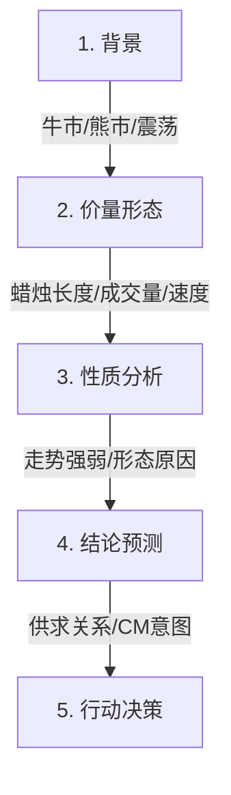
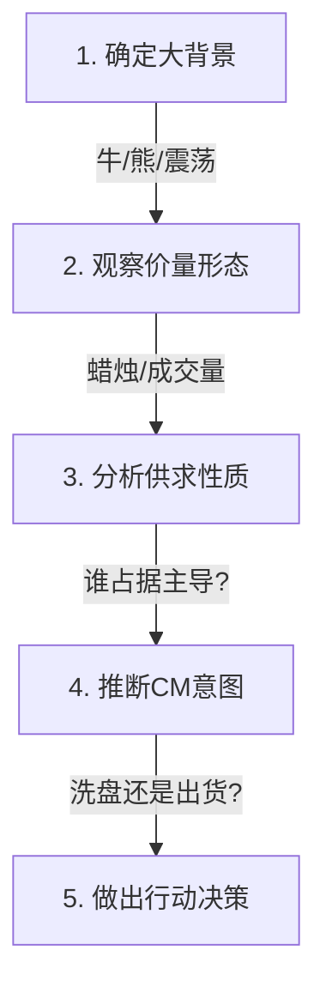

# 第一节 聪明钱的看盘顺序

## 核心思想

[聪明钱(CM)](../术语速查手册.md#cm-composite-man)通过 **价格、成交量、走势速度** 三个工具观察市场，而不是依赖技术指标。核心方法是 **5 步看图法**。

---

## 核心逻辑/框架

---

## 案例讲解

### 案例 1：牛市中的停止行为

| 分析维度 | 观察                  | 结论             |
| :------- | :-------------------- | :--------------- |
| **背景** | A→B 牛市，成交量递增  | 上涨趋势         |
| **形态** | 小蜡烛 + 小成交量回调 | 没有供应进入市场 |
| **性质** | 价格回落力度很弱      | 停止行为         |
| **预测** | 价格还会尝试上涨      | 趋势延续         |
| **行动** | ✅ **进场买入**        | 顺势交易         |

---

### 案例 2：牛市中的供应扩大

| 分析维度 | 观察                  | 结论         |
| :------- | :-------------------- | :----------- |
| **背景** | C→D 继续上涨          | 牛市背景     |
| **形态** | 大阴线 + 大成交量回调 | 供应进入市场 |
| **性质** | 回调力度 > 上涨力度   | 异常行为     |
| **预测** | 供应强于需求          | 牛市可能反转 |
| **行动** | ❌ **不能买入**        | 等待供应枯竭 |

---

### 案例 3：综合吸筹分析 (图1-3)

| 阶段/点   | 市场行为分析 (背景：熊市) | 供求解析                           |
| :-------- | :------------------------ | :--------------------------------- |
| **A → B** | 下跌速度快，无反弹        | **超卖** 行为，公众恐慌抛售        |
| **B**     | 成交量达顶峰              | **恐慌抛售**，需求开始吸收抛盘     |
| **1**     | 遇阻回落                  | 震荡区上轨有前期套牢盘供产生的压力 |
| **4 → 5** | 无量上涨                  | 需求较弱，回测压力区               |
| **死角**  | 波幅变窄，成交量极小      | 供求双重虚弱，临界状态             |
| **急跌**  | 振幅大，测试支撑          | **震仓** 行为，清洗浮动供应        |
| **7**     | **停止行为** (量大滞跌)   | 供应枯竭，需求力挺，完成吸筹       |

**核心结论**：吸筹结束，确认进场买入。

*验证：吸筹完成后，价格开启新一轮上涨。*

---

## 实战要点

### 信号判断原则

| 信号              | 含义         | 应对               |
| :---------------- | :----------- | :----------------- |
| **停止行为**      | 趋势可能反转 | 准备反向操作或离场 |
| **供应/需求扩大** | 趋势强度改变 | 重新评估市场背景   |
| **吸筹/派发完成** | 趋势即将启动 | 最佳进场/出场点    |

### 常见误区警示

| 误区                 | 后果                 | 正确做法               |
| :------------------- | :------------------- | :--------------------- |
| ❌ **只看技术指标**   | 指标滞后，容易被套   | ✅ **关注价量/供求**    |
| ❌ **看到超卖就抄底** | 无吸筹过程，可能被埋 | ✅ **等待吸筹完成信号** |
| ❌ **放量大涨就追**   | 可能是派发陷阱       | ✅ **观察背景和位置**   |

---

## 核心总结

| 维度         | 要点                                     |
| :----------- | :--------------------------------------- |
| **三大工具** | 价格(蜡烛长度)、成交量、走势速度         |
| **五步法则** | 背景 → 形态 → 性质 → 结论 → 行动         |
| **核心理念** | 供求关系决定趋势；CM行为通过价量留下痕迹 |
| **关键信号** | 停止行为(努力≠结果)是识别拐点的利器      |
| **底部定律** | 没有吸筹过程的底部不是真底               |

---

## 导航链接

- [← 返回第一章目录](./README.md)
- [→ 第二节:CM观察走势遵循的原则](./第二节_CM观察走势遵循的原则.md)
- [↑ 返回总目录](../README.md)
