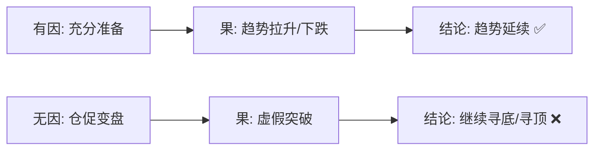
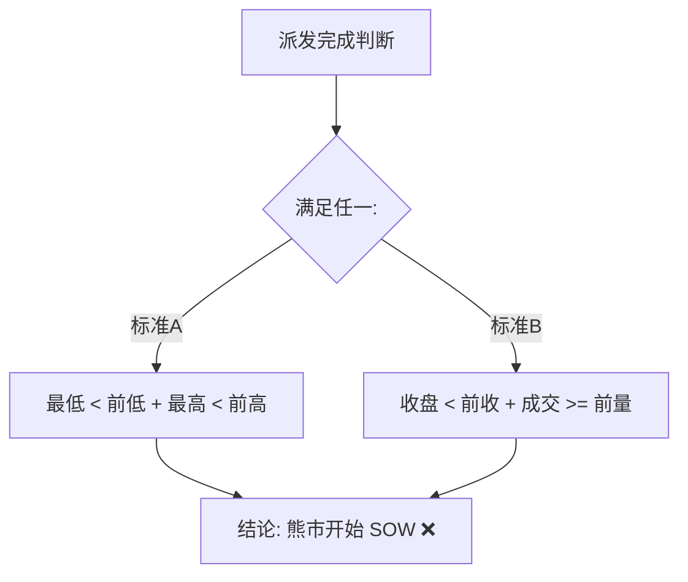

# 第七节 因果关系

### 核心思想

因果关系强调：没有准备过程（因），就不会有趋势形成（果）。这是避免盲目抄底的关键理论。**不要着急抄底，要等待完整的[吸筹](../术语速查手册.md#accumulation)过程**。

---

## 📋 因果关系速查表

| 类型         | 因（准备过程）                                                                                                                              | 果（趋势） | 交易信号       |
| :----------- | :------------------------------------------------------------------------------------------------------------------------------------------ | :--------- | :------------- |
| **熊市反转** | [恐慌抛售](../术语速查手册.md#sc-selling-climax) + [吸筹](../术语速查手册.md#accumulation) + [SOS](../术语速查手册.md#sos-sign-of-strength) | 牛市开始   | ✅ 底部确认可进 |
| **牛市派发** | 长上影线 + 供应区 + [SOW](../术语速查手册.md#sow-sign-of-weakness)                                                                          | 熊市开始   | ❌ 派发完成要出 |
| **无因反转** | 快速下跌/上涨，无准备                                                                                                                       | 假突破     | ⚠️ 信号无效     |

---

## 一、因果关系的定义

### 什么是"因"和"果"

| 概念   | 含义                 | 表现                                                  |
| :----- | :------------------- | :---------------------------------------------------- |
| **因** | 趋势出现前的准备过程 | [吸筹](../术语速查手册.md#accumulation)阶段或派发阶段 |
| **果** | 趋势的形成           | 明确的上升或下跌趋势                                  |

### 核心原理



---

## 二、趋势的形成与案例分析 (图1-14)

### 案例：真实行情中的教训 - 2015年A股


### 教训

- 抄底前的跌势非常猛，属于超卖状态。
- 7月初的长下影线和扩大的成交量，看似抄底好机会。
- **错误原因**：没有准备过程（因）。反转理论基础（供应枯竭+需求扩大）未成立。
- **结果**：盲目抄底被套。

## 三、熊市反转的因果关系（底部过程）

### 反转的理论基础

**两个条件必须同时成立**：

1. **供应枯竭** - 卖单流入量已经很少
2. **需求扩大** - 持续的买单流入，非一次性行为

**这些根据必须在价量关系中体现出来**，才能确认反转基础成立。

### 公众抄底失败的三大原因

| 原因             | 后果                                            |
| :--------------- | :---------------------------------------------- |
| 害怕错过大底     | 着急抄底                                        |
| 缺乏市场行为知识 | 不懂[吸筹](../术语速查手册.md#accumulation)过程 |
| 缺乏耐心         | 被套在准备阶段                                  |

### 案例：需求扩大的过程

### 案例：需求扩大的过程

（图1-11 已移至第五节，此处略）

**关键分析**：

- 熊市反转需要看到需求持续扩大。
- 只有恐慌抛售是不够的，必须有[吸筹](../术语速查手册.md#accumulation)震荡区。

### 案例：[吸筹](../术语速查手册.md#accumulation)过程详解

的[吸筹](../术语速查手册.md#accumulation)过程（区间内反复买入）](../wyckoff_content/OEBPS/Image00016.jpg)

**CM的[吸筹](../术语速查手册.md#accumulation)策略**：

- 目标：在小区间内（控制成本）不断买入建仓
- 手段：利用震仓迫使高位被套者抛售
- 特点：持续进行，直到仓位建满

### 案例：[吸筹](../术语速查手册.md#accumulation)的完整过程

开始的信号](../wyckoff_content/OEBPS/Image00017.jpg)

**逐蜡烛讲解**：

```mermaid
graph TD
    S0[前置: [恐慌抛售](../术语速查手册.md#sc-selling-climax)] --> S1[1. 初步反弹/初步底]
    S1 --> S2[2. 再次下冲/震仓清供]
    S2 --> S3[3. 缩量回调/供应枯竭]
    S3 --> S4[4. [SOS](../术语速查手册.md#sos-sign-of-strength): 需求主导]
    S4 --> S5[进场确认 ✅]
    style S5 fill:#e6fffa,stroke:#4fd1c5,stroke-width:2px
```

**核心规则**：需要完整过程，不要急于抄底

---

## 四、牛市派发的因果关系（顶部过程）

### 派发的特点

| 特征         | 原因                                   |
| ------------ | -------------------------------------- |
| 不一次性完成 | 快速抛完会导致价格急跌，无法最大化利润 |
| 分阶段进行   | 缓慢转移风险给公众                     |
| 维持在派发区 | 价格维持在一个范围内，掩盖派发行为     |

### 案例：顶部派发过程 (图1-19)


**逐蜡烛讲解**：

| 蜡烛    | 形态      | 含义                                                          | 阶段         |
| ------- | --------- | ------------------------------------------------------------- | ------------ |
| **1**   | 上影+放量 | 供应初次进入，形成供应区                                      | 派发开始     |
| **2-4** | 反复放量  | 供应再次扩大，确认阻力                                        | 派发推进     |
| **5**   | **VSC**   | **熊市开始 ([SOW](../术语速查手册.md#sow-sign-of-weakness))** | **趋势翻转** |



---

## 五、时间框架的灵活应用

### 案例：短暂的准备过程 (图1-17, 1-18)

**问题**：有时准备过程较短，日线图上看不出吸筹阶段。


**解决方案**：向下切换时间框架（如3小时图），寻找震荡区。


**结论**：在3小时图上，震荡区清晰可见，反转的理论根据（因果关系）成立。

### 关键原则

**无论时间框架如何，安全的进场位置都在：区间的右手边**

---

## 💡 实战要点

### 三个关键观察点

| 观察点               | 判断标准                         |
| -------------------- | -------------------------------- |
| **供应是否枯竭**     | 成交量和价格的关系，是否出现低量 |
| **需求是否出现**     | 反弹是否坚定，是否有放量跟进     |
| **浮动供应是否清除** | 二次回调时成交量是否缺量         |

### 进场的正确时机

| ❌ 错误时机     | ⏳ 观察期         | ✅ 正确时机    |
| -------------- | ---------------- | ------------- |
| 恐慌抛售出现时 | 底部可能即将来临 | **SOS出现时** |
| 第一次反弹时   | 底部开始信号     | 需求已占上风  |
| -              | -                | 底部确认可进  |

### 因果关系的对称性

| 维度         | 吸筹（底部）       | 派发（顶部）       |
| ------------ | ------------------ | ------------------ |
| **准备过程** | 恐慌 + 吸筹 + 需求 | 长阳 + 派发 + 供应 |
| **关键信号** | SOS（需求占上风）  | SOW（供应占上风）  |
| **进出时机** | SOS后回撤位进      | SOW后回撤位出      |

---

## 📌 核心总结

### 三个关键认识

**1. 因必须完整**

- 没有吸筹过程（因）= 没有趋势（果）
- 没有派发过程（因）= 没有转熊（果）
- 任何跳跃都是假信号

**2. 不能着急**

- 恐慌 ≠ 底部，只是开始
- 反弹 ≠ 底部，只是信号
- SOS出现 = 底部真正确认

**3. 理论统一**

- 第五节的"区间右手边" = 第七节的"SOS/SOW后回撤"
- 本质都是：等待因完成 → 在确定点进出 → 低风险交易

---

## 🔗 导航

- **上一节**：[第六节 - 牛市中怎么看出供应进场了](./第六节_牛市中怎么看出供应进场了.md)
- **下一节**：[第八节 - 努力和结果的关系](./第八节_努力和结果的关系.md)
- **上级目录**：[第一章 - 聪明钱解读市场的工具](./README.md)
