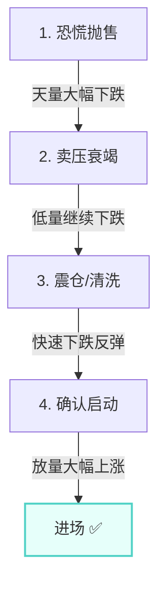

# 第三节 供求关系

## 核心思想

供求关系是市场运动的根本原理，也是威科夫理论与传统技术分析的本质区别。掌握供求关系，就掌握了市场的真实面目。

---

## 📋 供求关系速查表

| 供求关系        | 价格走势     | 市场特征       | 交易策略 |
| :-------------- | :----------- | :------------- | :------- |
| **需求 > 供应** | 上涨（牛市） | 购买力超过卖压 | 回调就买 |
| **供应 > 需求** | 下跌（熊市） | 卖压超过购买力 | 反弹就卖 |
| **需求 ≈ 供应** | 震荡（危险） | 双方力量平衡   | 避免交易 |

---

## 一、供求关系主导趋势

### 基本原理

- **上涨**：购买力（需求）> 现有卖单（供应）→ 买方被迫提高出价。
- **下跌**：卖压（供应）> 购买力（需求）→ 卖方被迫降低售价。

### 市场意义掌握供求关系的交易者，即使正确率只有 30-40%，仍能盈利：

1. 通过识别供求关系**把风险降到最低**。
2. 一次大盈利补平多次小亏损。
3. 其余盈利为纯利润。

**本质**：懂得供求关系 = 懂得市场本质。

---

## 二、证券市场：本质 vs 表象

| 维度                | 内容                              | 特征                                 |
| :------------------ | :-------------------------------- | :----------------------------------- |
| **表象** (第一层面) | 走势图、指标(MACD/均线)、几何图形 | 滞后、容易陷入参数调整的恶循环       |
| **本质** (第二层面) | **供求关系**                      | 市场的根本动力，决定趋势的持续与反转 |

### 为什么指标会失效？

| 场景         | 图表表现       | 指标信号 | 事实真相 (供求视角)                                                                                              |
| :----------- | :------------- | :------- | :--------------------------------------------------------------------------------------------------------------- |
| **牛市末期** | 量大但价格停滞 | 继续买入 | ❌ **供应扩大，**[**CM**](../术语速查手册.md#cm-composite-man)**正在****派发** |
| **熊市末期** | 量大但下跌放缓 | 继续卖出 | ❌ **需求扩大，CM正在****吸筹**                                                |

---

## 三、牛市中的供求分析

### 牛市停止的关键信号

判断牛市是否到顶，关键看**供不应求**的局面是否被破坏：

| 观察点       | 表现         | 含义                       |
| :----------- | :----------- | :------------------------- |
| **成交量**   | 高           | 交易活跃，大量筹码换手     |
| **价格进展** | 小           | 努力没有产生结果 (滞涨)    |
| **结论**     | **供应扩大** | CM正在出货，阻碍了价格上涨 |

### 如何判断回调性质？

| 回调特征           | 供求含义               | 结论                     |
| :----------------- | :--------------------- | :----------------------- |
| **伴随大成交量**   | 供应在扩大，CM抛盘增加 | ⚠️ **危险，牛市可能反转** |
| **不伴随大成交量** | 供应缺乏，仅是获利回吐 | ✅ **健康，可能继续上涨** |

---

## 四、熊市中的供求分析

### 下跌停止的必要条件

要让下跌停止，必须**需求大量出现**，吸收掉市场上的供应，使卖方不用降价也能成交。

### 安全抄底四步法

抄底必须看到**供应枯竭**和**需求扩大**的双重确认：

### 盲目抄底的代价

| 错误做法           | 原因               | 后果       |
| :----------------- | :----------------- | :--------- |
| **看指标背离就抄** | 指标滞后，供求未变 | 被套       |
| **见一次反弹就进** | 可能还在吸筹早期   | 反复被锤   |
| **无理论根据操作** | 只看表象           | 抄在半山腰 |

---

## 五、实战核心能力总结

### 培养目标

在**不使用技术指标**的情况下，通过**价格和成交量的细节**识别供求关系。

### 实战优势

- **提前预警**：在趋势启动前识别。
- **风险控制**：在危险来临前离场。
- **主动规划**：在市场大动作前制定计划。

### 关键认识

1. **供求是本质，指标是表象**：供求驱动价格，指标只是价格的影子。
2. **位置决定表现**：
    - 上涨中盯住**供应**（是否扩大？）。
    - 下跌中盯住**需求**（是否出现？）。
3. **交易需有据**：抄底/逃顶都必须有完整的供求转化证据（四步法）。
