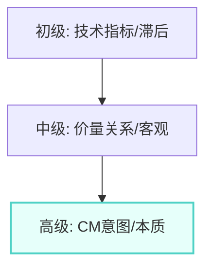
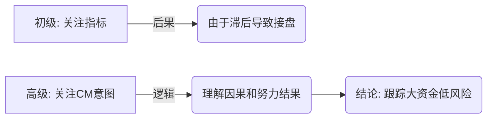
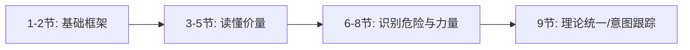

# 第九节 总结

## 核心思想

威科夫理论的核心：通过供求关系和价量细节，**洞察和跟踪CM的操作意图**。这是把风险控制在最低水平的唯一方式。

---

## 📋 技术指标 vs 供求关系

### 对比分析

| 维度         | 技术指标     | 供求关系     |
| ------------ | ------------ | ------------ |
| **本质**     | 基于表象计算 | 市场真实力量 |
| **信号质量** | 表象的表象   | 市场本质     |
| **对CM意图** | ❌ 无法解释   | ✅ 能够洞察   |
| **用途**     | 追涨杀跌     | 跟踪大资金   |

### 公众的误区

| 表现                 | 后果         |
| -------------------- | ------------ |
| 新指标出现就急于使用 | 陷入指标陷阱 |
| 不考虑理论根据       | 交易失败     |
| 无法理解CM意图       | 被动跟随     |

**正确做法**：从供求关系角度观察市场 = 专业交易员的习惯

---

## 二、掌握供求关系的五个境界

### 能回答的五个关键问题

掌握供求关系后，你能够洞察：

| 问题                            | 能力                                                           |
| ------------------------------- | -------------------------------------------------------------- |
| **1. CM何时接盘，下跌何时停止** | 识别底部形成过程                                               |
| **2. CM如何引诱割肉**           | 识别[震仓](../术语速查手册.md#shakeout)、派发手法              |
| **3. 吸筹何时结束，最佳进场点** | 识别[SOS](../术语速查手册.md#sos-sign-of-strength)，区间右手边 |
| **4. 危机信号如何提前出现**     | 识别放量滞涨等危险                                             |
| **5. 虚假上涨如何识别**         | 识别[抢购高潮](../术语速查手册.md#bc-buying-climax)、假突破    |

### 升级过程

---

## 三、认知升级框架

### 三个层级

**突破陷阱案例**：

- 公众看法：向上突破 → 兴奋买入
- 现实：CM决定是否让突破成立
- 结果：失望的公众割肉 → 落入CM囊中
- **关键**：价格本身无法决定，CM意图才是关键

---

## 四、第一章核心工具回顾

### 三大工具

| 工具         | 内容                   |
| ------------ | ---------------------- |
| **价格**     | 蜡烛的长度、高低点位   |
| **成交量**   | 成交量的高度、变化速度 |
| **走势速度** | 上涨或下跌的斜率       |

### 三大原则

| 原则           | 含义           | 应用         |
| -------------- | -------------- | ------------ |
| **供求关系**   | 不平衡产生趋势 | 识别市场现状 |
| **因果关系**   | 准备过程→趋势  | 识别反转依据 |
| **努力和结果** | 成交量→价格    | 识别力量变化 |

### 第一章核心学习成果

---

## 💡 实战智慧

### 市场细节的反向性

| 公众关注        | 市场关键       |
| --------------- | -------------- |
| 明显的长阳/长阴 | 细微的停止行为 |
| 技术指标变化    | 供求关系转变   |
| 表面突破        | CM的真实意图   |

**重要认识**：市场起关键作用的细节往往和公众认知相反

### 跟踪趋势的真实含义

表面理解 ❌：价格上升 → 跟踪趋势

深层含义 ✅：利用供求关系 → 跟踪CM操作意图

**本质**：大资金（CM）代表市场能动力，掌握他们的动向 = 掌握趋势

---

## 五、实战决策矩阵

### 供求关系辨识表

| 现象                           | 市场含义                                                  | [CM](../术语速查手册.md#cm-composite-man) 意图 | 你的对策            |
| :----------------------------- | :-------------------------------------------------------- | :--------------------------------------------- | :------------------ |
| **上涨放量 + 回调缩量**        | **需求主导**                                              | 吸筹或推高                                     | **做多/持仓**       |
| **上涨缩量 + 回调放量**        | **供应主导**                                              | 派发或压价                                     | **做空/离场**       |
| **突破阻力 + 极宽价差 + 天量** | **[抢购高潮 (BC)](../术语速查手册.md#bc-buying-climax)**  | 诱多出货                                       | **止盈/准备做空**   |
| **跌破支撑 + 极宽价差 + 天量** | **[恐慌抛售 (SC)](../术语速查手册.md#sc-selling-climax)** | 诱空吸筹                                       | **不杀跌/准备做多** |
| **窄幅震荡 + 极低成交量**      | **供求平衡**                                              | 酝酿变盘                                       | **观望/等待方向**   |

---

## 📌 一句话总结

威科夫理论 = 通过供求关系和价量细节，洞察和跟踪CM的操作意图，实现低风险交易。

---

## 🔗 导航

- **前一节**：[第八节 - 努力和结果的关系](./第八节_努力和结果的关系.md)
- **下一章**：[第二章 - 怎么知道主力机构开始接盘了](../第二章_怎么知道主力机构开始接盘了/README.md)
- **上级目录**：[第一章 - 聪明钱解读市场的工具](./README.md)
