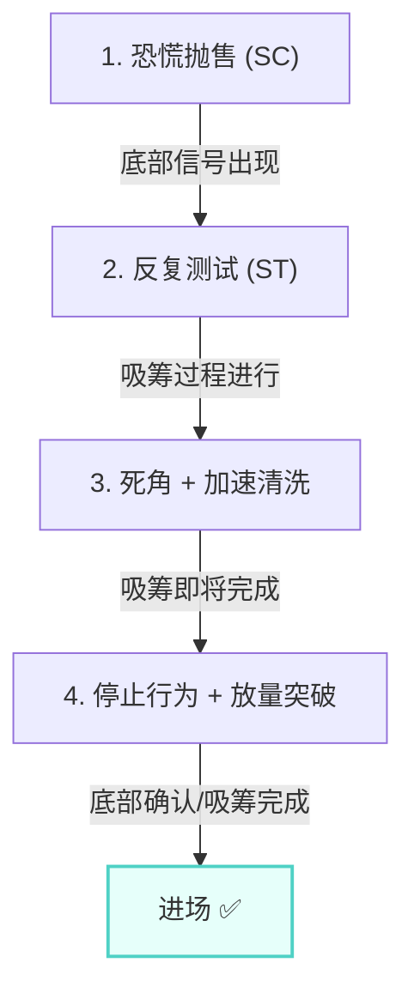
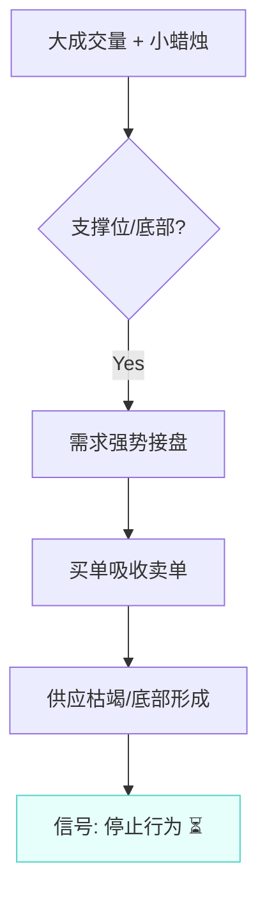

# 第二节 CM观察走势遵循的原则

## 核心思想

聪明钱在观察市场时遵循三个基本原则。这三个原则是威科夫理论的理论基础，也是所有市场判断和交易决策的根基。

---

## 📋 三大原则速查表

| 原则               | 核心含义       | 应用场景           | 实战意义           |
| :----------------- | :------------- | :----------------- | :----------------- |
| **供求关系原则**   | 不平衡产生趋势 | 判断强弱、确定方向 | 决定是否持仓或出场 |
| **因果关系原则**   | 因→果的过程    | 避免盲目抄底       | 避免被困在准备阶段 |
| **努力和结果原则** | 努力≠结果      | 识别转折点         | 提前发现反转信号   |

---

## 原则 1️⃣：供求关系原则

### 基本关系

供求关系与价格趋势的对应关系：

| 供求关系        | 价格走势         | 市场特征             |
| :-------------- | :--------------- | :------------------- |
| **需求 > 供应** | 上涨趋势（牛市） | 购买力不断抬高价格   |
| **供应 > 需求** | 下跌趋势（熊市） | 卖方不断降价寻找买家 |
| **需求 ≈ 供应** | 震荡区           | 最危险，容易亏钱     |

### 交易中的实际应用

进场后，供求关系的变化决定了你的持仓决策：

| 场景                 | 判断       | 行动           |
| :------------------- | :--------- | :------------- |
| 供求关系支持你的判断 | 方向正确   | ✅ **持有仓位** |
| 供求关系否定你的判断 | 方向错误   | ❌ **立刻离场** |
| 大趋势供应>需求      | 熊市中反弹 | **反弹即卖**   |
| 大趋势需求>供应      | 牛市中回调 | **回调即买**   |

**关键**：进场后需要持续评估供求关系，用价量细节来识别变化。

---

## 原则 2️⃣：因果关系原则

### 定义

趋势的形成分为两个阶段：

| 阶段               | 含义               | 特征                     |
| :----------------- | :----------------- | :----------------------- |
| **因**（准备过程） | 吸筹或派发的震荡区 | 价格在底部或顶部反复测试 |
| **果**（趋势形成） | 趋势的形成和发展   | 价格突破震荡区，单向运动 |

### 核心要点

**强调因果关系的目的**：提醒不要着急抄底

| 做法                             | 结果                         |
| :------------------------------- | :--------------------------- |
| ❌ **看到底就立刻抄底**           | 被套在吸筹过程中，反复被锤   |
| ✅ **等待****吸筹****完成后进场** | 在最低风险位置进场，避免被困 |

### 底部形成的四步过程

任何主要趋势反转前，都需要一个完整的准备过程：

**理论基础**：没有这个准备过程，后续形成的趋势不会持续。

---

## 原则 3️⃣：努力和结果的关系原则

### 定义和含义

| 概念         | 代表       | 说明                 |
| :----------- | :--------- | :------------------- |
| **努力**     | 成交量     | 市场流入的订单总量   |
| **结果**     | 价格幅度   | 价格的实际变化幅度   |
| **停止行为** | 两者不匹配 | 努力没有产生相应结果 |

### 典型表现：停止行为

*   **定义**：成交量的增长没有使价格大幅增长（努力 ≠ 效果）。
*   **含义**：价格涨跌过程中的**暂时停止**。

**案例分析（以熊市为例）**：

*   **现象**：大量卖单流入市场（大成交量），但价格没有下跌（小蜡烛）。
*   **原因**：价格下跌遇到了阻力，阻力来自需求（大量买单流入截住了下跌势头）。
*   **结论**：这是一种**停止行为**。市场并未立即反转，但预示着方向可能改变。

停止行为在不同位置有不同含义：

| 位置       | 现象              | 含义             | 行动         |
| :--------- | :---------------- | :--------------- | :----------- |
| **支撑位** | 大成交量 + 小跌幅 | 底部形成，需求强 | ✅ **可以买** |
| **阻力位** | 大成交量 + 小涨幅 | 顶部形成，供应强 | ❌ **要卖出** |

---

## 📚 三大原则的综合应用

### 实例：如何安全地抄底？

要满足两个理论条件：

1. **供应枯竭** - 卖单流入量大幅减少
2. **需求出现** - 买单大量流入并主导市场

### 对应的价量表现

安全抄底需要看到的四个阶段：

| 阶段  | 形态               | 供求含义             | 观察           |
| :---- | :----------------- | :------------------- | :------------- |
| **1** | 天量大幅下跌       | 供应达到极限         | 极端供应       |
| **2** | 低量继续下跌       | 供应逐步减弱         | 供应衰竭       |
| **3** | 快速下跌、中途反弹 | 清洗浮动卖单         | 震仓清洗       |
| **4** | 放量大幅上涨       | 新需求进场、主导市场 | ✅ **底部确认** |

**关键**：这四个阶段都要看到！缺少任何一步，都容易"抄在半山腰"。

### 常见的抄底失败原因

| 错误做法                 | 为什么失败                 |
| :----------------------- | :------------------------- |
| **看指标背离就抄底**     | 指标滞后，供求关系已经变化 |
| **只看一次反弹就进场**   | 可能还在吸筹早期，会被锤   |
| **不考虑理论根据直接抄** | 只看表象，没有理论支撑     |

---

## 🎯 培养核心能力

### 最高目标

在**不使用技术指标**的情况下，通过**价格和成交量的细节变化**识别市场的供求关系。

### 实战优势

- 能在市场大动作前**提前发现端倪**
- 不用等待滞后的技术指标信号
- 可以抢在公众之前行动
- 从价量细节中**实时掌握市场脉搏**

---

## 📌 核心总结

### 三大原则的联系

| 原则               | 作用                       |
| :----------------- | :------------------------- |
| **供求关系原则**   | 告诉你趋势的方向和强弱     |
| **因果关系原则**   | 告诉你趋势何时会真正出现   |
| **努力和结果原则** | 提供识别两个原则的具体工具 |

### 最关键的认识

- **第一节** - 教的是"怎么看"（5步法、分析框架、案例）
- **第二节** - 讲的是"为什么这样看"（三大原则、理论基础）
- **两者结合** - 才能真正理解威科夫理论的本质
