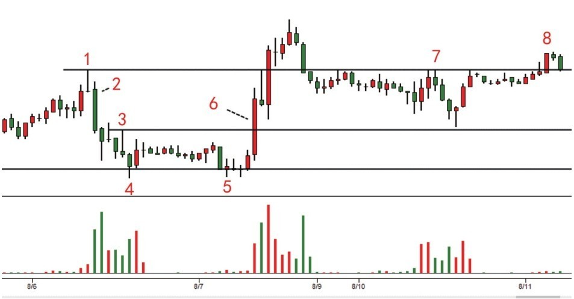
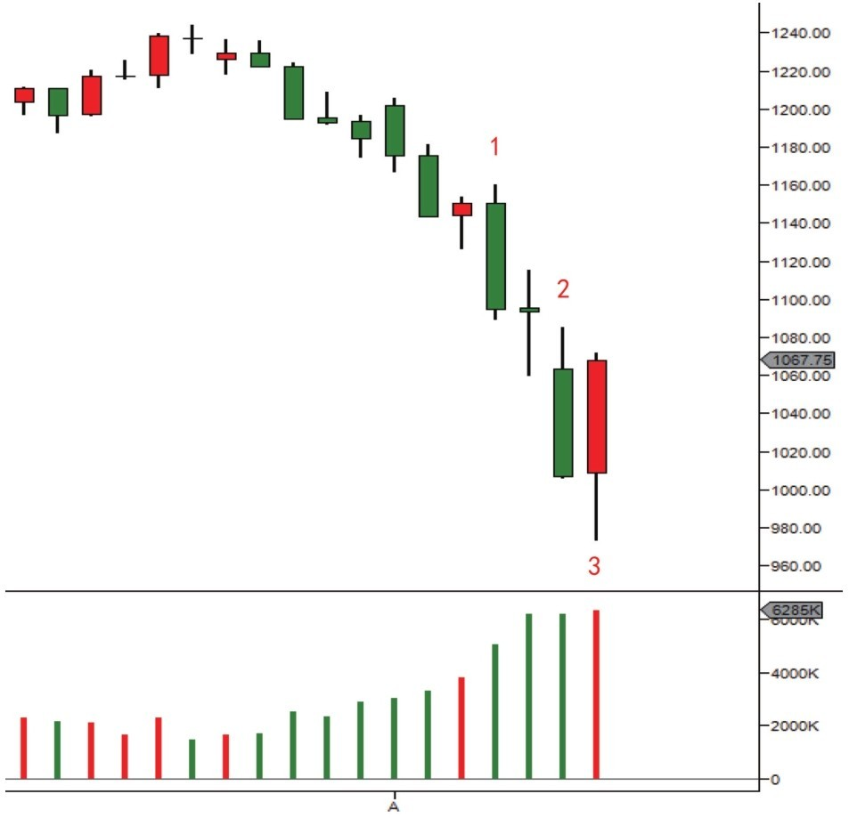
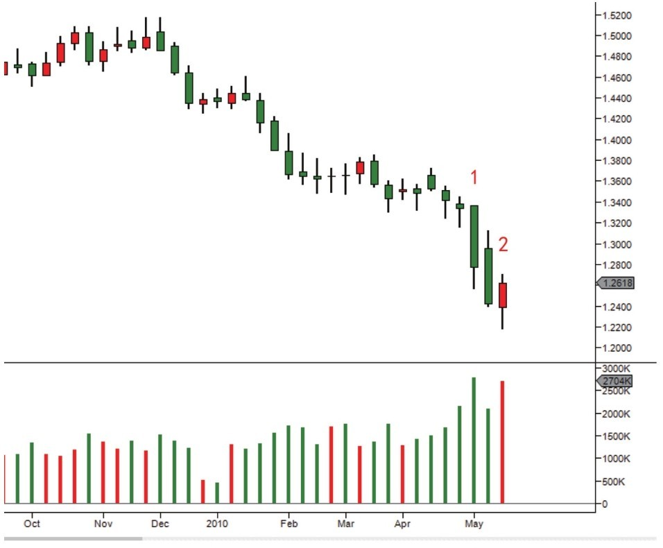
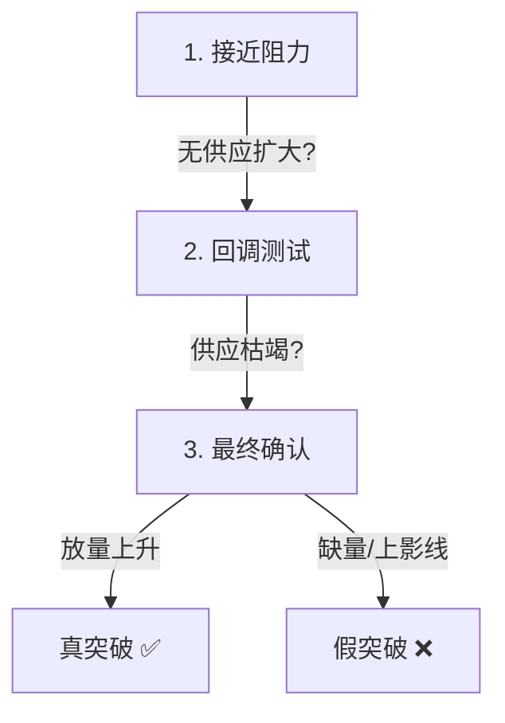
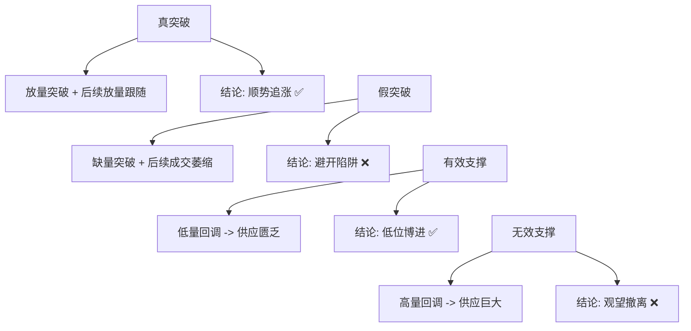

# 第五节 如何识别供应和需求扩大

## 核心思想

从价量图表上识别供应和需求的扩大是掌握供求关系的关键实战技能。**位置和背景**决定了同一形态的完全不同含义。

---

## 📋 供应和需求识别速查表

| 形态                                                          | 含义                                             | 特征                | 应用                                                            |
| :------------------------------------------------------------ | :----------------------------------------------- | :------------------ | :-------------------------------------------------------------- |
| [VDC (放量大涨)](../术语速查手册.md#vdc-volume-demand-column) | 需求扩大                                         | 放量 + 大幅上涨     | **底**：支撑形成，可进；**顶**：派发陷阱，远离                  |
| [VSC (放量大跌)](../术语速查手册.md#vsc-volume-supply-column) | 供应扩大                                         | 放量 + 大幅下跌     | **底**：供应测试；**顶**：供应压倒，要出                        |
| **天量大跌**                                                  | [恐慌抛售](../术语速查手册.md#sc-selling-climax) | 异常高量 + 大幅下跌 | [CM(狗庄)](../术语速查手册.md#cm-composite-man)在吸筹，底部信号 |
| **低量小幅跌**                                                | 低量测底                                         | 低量 + 小幅下跌     | 供应逐步枯竭，进场预警                                          |

---

## 一、阻力位的突破与反转判断

### 突破 vs 反转

| 判断点         | 突破成功             | 反转失败               |
| :------------- | :------------------- | :--------------------- |
| **阻力位供应** | 无供应扩大，需求吸收 | 产生大量供应，需求无力 |
| **突破时信号** | 放量大涨             | 高量上影线（反弹无力） |
| **后续成交量** | 放量持续             | 成交量衰竭或缩量       |
| **交易信号**   | ✅ **可以追多**       | ❌ **应该远离**         |

### 案例：阻力位的博弈 (图1-10)

**逐蜡烛分析**：

| 蜡烛  | 形态     | 含义                                                                    | 信号           |
| :---- | :------- | :---------------------------------------------------------------------- | :------------- |
| **1** | 高量上影 | 供应扩大                                                                | ⚠️ **警告**     |
| **2** | 放量下跌 | [VSC (放量大跌)](../术语速查手册.md#vsc-volume-supply-column)，供应爆发 | ❌ **下跌**     |
| **4** | 放量反弹 | 浮动供应测试                                                            | ⏳ **观察**     |
| **5** | 缩量回调 | 浮动供应枯竭                                                            | 🔔 **准备**     |
| **6** | 放量长阳 | [SOS](../术语速查手册.md#sos-sign-of-strength)(强势信号)                | ✅ **突破确认** |

---

## 二、位置决定含义：底 vs 顶

### 核心原理

**同一形态在不同位置的含义完全相反！**

### 案例对比 (图1-9)

| 蜡烛    | 形态     | 位置       | 供求含义                                                                 | 交易信号           |
| :------ | :------- | :--------- | :----------------------------------------------------------------------- | :----------------- |
| **1**   | 放量长阳 | 上升趋势中 | 需求爆发 ([VDC (放量大涨)](../术语速查手册.md#vdc-volume-demand-column)) | ✅ **底部支撑形成** |
| **2~3** | 放量上影 | 震荡区顶部 | 供应出现                                                                 | ⚠️ **警示信号**     |
| **4**   | 放量反弹 | 支撑位     | 需求反击 ([Spring](../术语速查手册.md#spring))                           | ✅ **进场机会**     |

**关键认识**：

- **顶部VDC** → 放量大涨 = [BC(抢购高潮)](../术语速查手册.md#bc-buying-climax) (属于派发行为)，远离。

---

## 三、熊市中的需求扩大 (恐慌抛售)

### 案例：熊市反转 (图1-11)

**天量大跌的含义**：

| 特征         | 分析           | 结论                          |
| :----------- | :------------- | :---------------------------- |
| **成交量**   | 异常高的成交量 | 被套公众在恐慌抛售            |
| **价格表现** | 大幅下跌       | CM在强势吸收筹码              |
| **趋势**     | 供应到达极端   | **底部开始形成** (不是进场点) |

### 案例：努力没有结果 (图1-12)

| 现象      | 分析                                               | 含义                       |
| :-------- | :------------------------------------------------- | :------------------------- |
| **蜡烛A** | 天量大跌                                           | 极端供应释放 (恐慌抛售)    |
| **蜡烛B** | 放量但跌幅减小                                     | 成交量扩大，但价格不再下跌 |
| **结论**  | [**停止行为**](../术语速查手册.md#stopping-action) | 供应开始枯竭，底部可能出现 |

---

## 四、判断阻力突破的实战三步

---

## 💡 实战要点

### 常见错误

| 错误                 | 原因               | 后果           |
| :------------------- | :----------------- | :------------- |
| **只看形态不看位置** | 忽视背景的作用     | 底和顶判断相反 |
| **第一次反弹就进场** | 不理解吸筹是过程   | 被反复锤打     |
| **放量就追**         | 不区分需求和派发   | 在高位接盘     |
| **缺量回调就怕**     | 不理解供应枯竭信号 | 过早离场       |

### 核心判断标准

---

## 📌 核心总结

### 三个关键认识

1. **位置决定含义**
    - 同一形态在底和顶含义完全相反。
    - 必须结合前期走势和当前背景判断。

2. **过程而非结果**
    - 吸筹是一个多步骤的过程。
    - 任何单一现象都不能作为进场点。

3. **努力≠结果**
    - 高成交量不一定对应大幅价格变动。
    - 停止行为（量大但幅度小）是关键信号。
