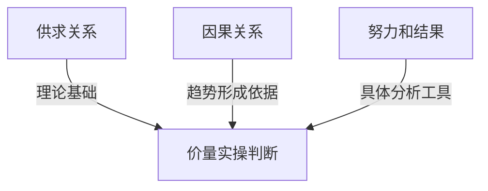
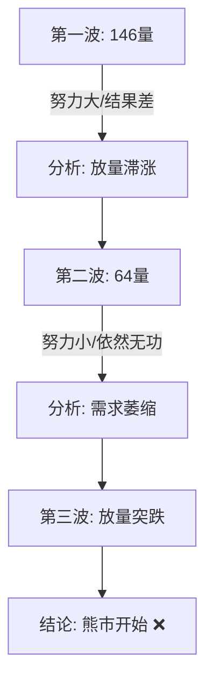

# 第八节 努力和结果的关系

### 核心思想

努力应该产生相应的结果。当努力没有产生预期结果时，就是**停止行为**（统称 [SOT](../术语速查手册.md#sot-shortening-of-thrust)）。这是识别价格反转的关键工具，也是连接理论和实战的桥梁。

---

## 📋 努力和结果速查表

| 现象         | 努力    | 结果     | 含义                   | 交易信号   |
| :----------- | :------ | :------- | :--------------------- | :--------- |
| **放量滞涨** | 量稳/增 | 涨幅减弱 | 供应压力出现，买单失效 | ❌ 危险出场 |
| **放量滞跌** | 量增    | 跌幅减弱 | 需求主导，卖单失效     | ✅ 安全进场 |
| **缩量上涨** | 量减    | 价格上升 | 惯性上涨，力量衰退     | ⚠️ 谨慎     |
| **缺量下跌** | 量减    | 价格下跌 | 供应枯竭，底部信号     | ✅ 机会     |

---

## 一、努力和结果的定义

### 核心概念

| 要素         | 定义      | 含义                       |
| :----------- | :-------- | :------------------------- |
| **努力**     | 成交量    | 市场参与度和成交活跃度     |
| **结果**     | 价格幅度  | 价格的上涨或下跌幅度       |
| **停止行为** | 努力≠结果 | 努力无法产生预期的价格变动 |

### 理论框架

---

## 二、顶部的放量滞涨

### 案例：牛市中的放量滞涨 (图1-20)

**逐蜡烛分析**：

-   **蜡烛1 (努力无果)**：成交量与前一天持平（高量），说明购买力依然很强。但价格涨幅明显低于前一天。
    -   **含义**：努力（成交量）没有产生应有的结果（涨幅）。这是因为CM开始派发，平价供应满足了公众的买盘，导致价格滞涨。
-   **蜡烛2 (供应>需求)**：成交量继续扩大（公众抢购热情增加），但价格却无法创新高。
    -   **含义**：这是第二次努力没有结果。供应已经超过需求。
-   **后续 (需求耗尽)**：接下来一天成交量迅速萎缩。
    -   **信号**：需求已经消耗殆尽。这是清仓的最后时机 (❌ **派发确认**)。

---

## 三、底部的放量滞跌

### 案例：底部的放量滞跌 (图1-20)

**逐蜡烛分析**：

-   **蜡烛3和4 (需求吸收)**：从长上影线可以看出卖单量很大（供应足），且成交量扩大（努力大）。但是价格并没有进一步下跌（结果不匹配）。
    -   **含义**：这是需求扩大的结果。CM的大量买单吸收了市场上的恐慌卖单。
-   **结论**：供应被需求完全吸收，市场背景转为**需求控制市场**。
    -   **信号**：这是进场买入的信号 (✅ **底部确认**)。

---

## 四、波段交易量的观察

### 概念

波段交易量 = 一波价格走势的累积成交量（而不是单根蜡烛）

**优势**：更能体现整波走势中的市场努力程度

### 案例：波段交易量分析 (图1-21)

**关键认识**：量价双低（从146→64，都无法突破）= 买方热情快速衰退 = 最危险的阶段

---

## 💡 实战要点

### 三个关键判断

| 观察点           | 判断标准         | 交易意义       |
| ---------------- | ---------------- | -------------- |
| **顶部放量滞涨** | 努力无法产生突破 | 买方力量在衰退 |
| **底部放量滞跌** | 供应无法产生下跌 | 卖方力量在衰退 |
| **量价双低**     | 连续努力都失效   | 反转信号最强   |

### 对称性应用

| 位置     | 第一波   | 第二波   | 结论                    |
| -------- | -------- | -------- | ----------------------- |
| **顶部** | 量大不涨 | 量小不涨 | 买方力量衰退 → 反转向下 |
| **底部** | 量大不跌 | 量小不跌 | 卖方力量衰退 → 反转向上 |

### 常见错误

| 错误               | 原因               | 后果           |
| ------------------ | ------------------ | -------------- |
| 只看第一个停止行为 | 不理解力量衰退过程 | 过早出场/进场  |
| 忽视量价关系       | 只看价格或成交量   | 判断不准确     |
| 不切换时间框架     | 被时间框架迷惑     | 找不到理论根据 |

---

## 📌 核心总结

### 三个关键认识

**1. 努力必须有结果**

- 供应充足 + 需求强 = 价格上涨
- 卖单充足 + 买单强 = 价格下跌
- 努力失效 = 对抗方力量在增强

**2. 量价关系是反转信号**

- 放量滞涨 = 市场背景从牛转派发
- 放量滞跌 = 市场背景从熊转吸筹
- 量价双低 = 力量对比转变最完成

**3. 理论的具体应用工具**

- 努力和结果就是价量判断
- 把抽象理论变成可观察现象
- 提供最实用的进出场依据
