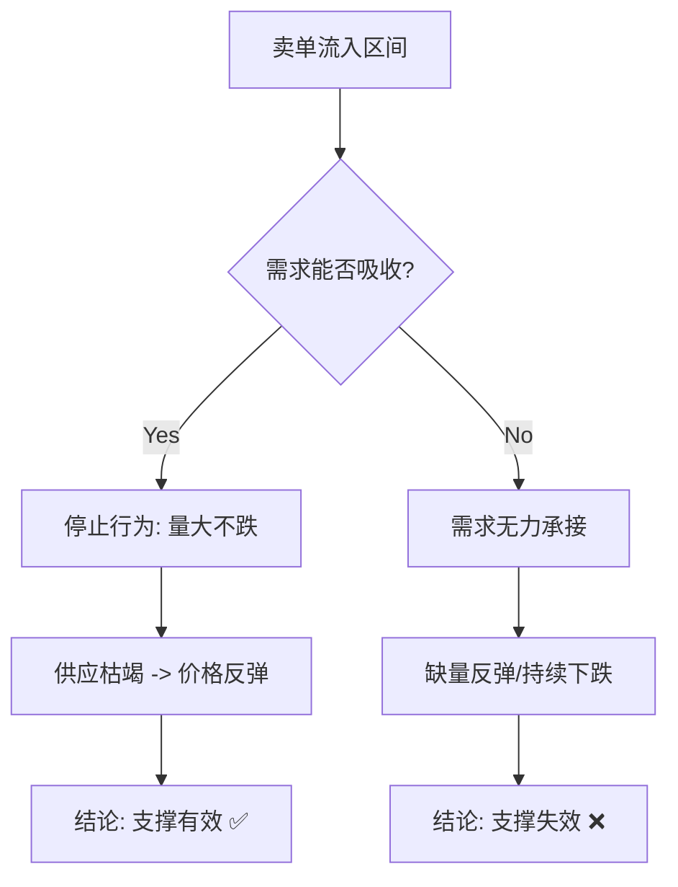
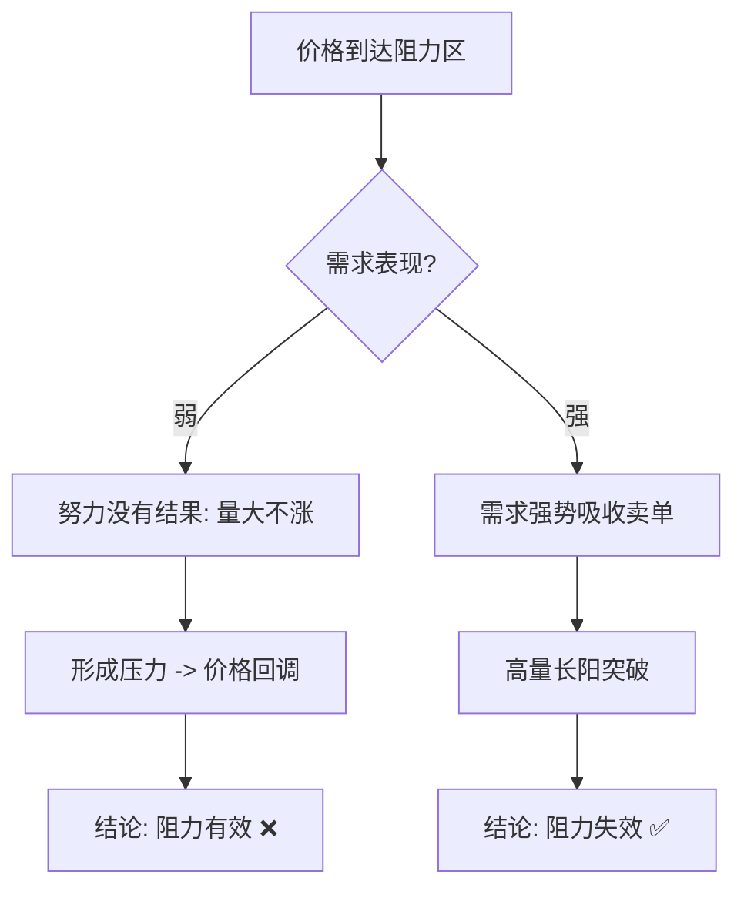
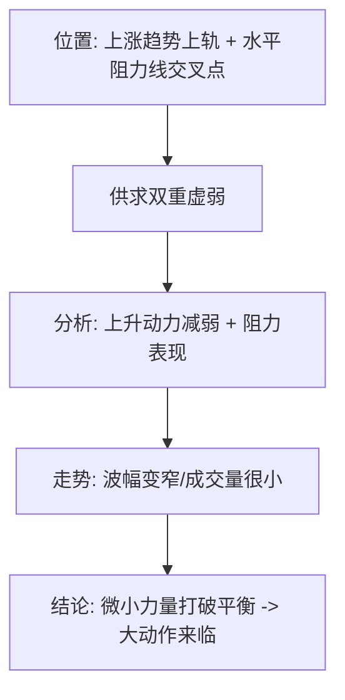

# 第四节 公众对支撑和阻力的误解

## 核心思想

支撑和阻力的本质不是图上的某条线（均线、黄金分割等），而是**供求关系平衡点的价格区间**。只有正确理解供求关系，才能真正把握支撑和阻力的有效性。

---

## 📋 支撑和阻力速查表

| 概念         | 供求关系    | 判断标准             | 交易信号       |
| :----------- | :---------- | :------------------- | :------------- |
| **支撑有效** | 需求 > 供应 | 量大不跌（停止行为） | ✅ **可以进场** |
| **支撑失效** | 供应 > 需求 | 无力反弹或缩量       | ❌ **继续下跌** |
| **阻力有效** | 供应 > 需求 | 量大不涨（停止行为） | ❌ **要卖出**   |
| **阻力失效** | 需求 > 供应 | 放量突破             | ✅ **可以买入** |

---

## 一、支撑的真实含义

### 定义与判断

| 维度         | 含义                                                       |
| :----------- | :--------------------------------------------------------- |
| **定义**     | 在某个价位，需求 > 供应，买方购买力超过卖方抛售力          |
| **表现**     | 卖方不愿意降价，因为有足够的买家在这个价位接盘             |
| **判断标准** | **停止行为**：大量卖单流入，但价格没有大幅下跌（量大不跌） |
| **失效信号** | 无力反弹、缺量反弹、持续下跌                               |

### 案例：支撑位置的供求分析

**关键点分析**：

| 蜡烛    | 形态            | 含义                       | 交易信号       |
| :------ | :-------------- | :------------------------- | :------------- |
| **1**   | 长阳 + 放量     | 大量需求进场，底部支撑形成 | ✅ **支撑区**   |
| **2**   | 放量 + 小幅波动 | 量大不跌，需求吸收卖单     | ⏳ **轻仓试多** |
| **3-4** | 相对放量阴线    | 二次测试，供应逐步衰退     | ✅ **持续吸收** |

**理论依据**：支撑有效 = 垂直需求柱(VDC)底部 + 量大不跌 + 需求持续吸收

---

## 二、阻力的真实含义

### 定义与判断

| 维度         | 含义                                                       |
| :----------- | :--------------------------------------------------------- |
| **定义**     | 在某个价位，供应 > 需求，卖方抛售力超过买方购买力          |
| **表现**     | 买方不愿意接价，因为有足够的卖家在这个价位抛售             |
| **判断标准** | **停止行为**：大量卖单流入，但价格没有大幅上涨（量大不涨） |
| **失效信号** | 放量突破、缺量突破、持续上涨                               |

### 案例：供应线与超卖线

**关键概念**：

- **超卖线**（下轨）：过度卖出的极端点，反弹的基础。
- **供应线**：前期放量大跌形成，卖家在此聚集成本和出货意愿。
- **冰线**：高位被套买单的成本区（重要阻力）。

**关键点分析**：

| 蜡烛     | 形态          | 含义                     | 信号                   |
| :------- | :------------ | :----------------------- | :--------------------- |
| **1**    | 冰线 + 供应线 | 双重阻力区，观察是否吸收 | ⏳ **待确认**           |
| **2**    | 高量 + 超大   | 需求突破阻力             | ⚠️ **公众行为，勿跟风** |
| **3**    | 缩量          | 供应缺乏，需求优势       | ✅ **确认强势**         |
| **之后** | 放量反弹      | 收于中部以上             | ✅ **建多仓**           |

---

## 三、支撑和阻力的对称性

### 停止行为的镜像含义

| 位置       | 表现     | 供求含义                   | 判断           |
| :--------- | :------- | :------------------------- | :------------- |
| **支撑位** | 量大不跌 | 供应在扩大，但需求强势吸收 | **支撑有效** ✅ |
| **支撑位** | 缩量反弹 | 需求无力，只有低量参与     | **支撑失效** ❌ |
| **阻力位** | 量大不涨 | 需求在增加，但供应强势压制 | **阻力有效** ❌ |
| **阻力位** | 放量突破 | 供应无力，需求强势突破     | **阻力失效** ✅ |

**关键认识**：支撑和阻力完全对称，理解供求关系的镜像逻辑，无需记忆复杂规则。

---

## 四、死角与价格突破

### 死角的定义与特征

### 案例：死角的形成与风险

**图的最右边** - 死角的形成：窄幅通道 + 极小成交量 = 供求双重虚弱 → 微小力量打破平衡 → **大动作来临**。

**关键洞察**：不看价格只看质量 —— 第一波需求强（抢购），第二波需求弱（强弩之末）。

---

## 五、重要概念速查

### 1. 放量大涨 (VDC) - 需求爆发

| 特征            | 含义         | 应用                               |
| :-------------- | :----------- | :--------------------------------- |
| 放量 + 大幅上涨 | 需求强势进场 | 形成底部支撑，价格回测时低风险进场 |

### 2. 放量大跌 (VSC) - 供应爆发

| 特征            | 含义         | 应用                             |
| :-------------- | :----------- | :------------------------------- |
| 放量 + 大幅下跌 | 供应强势出现 | 形成顶部阻力，价格回测时需要谨慎 |

### 3. 抢购高潮 (BC) - 牛市顶部信号

| 特征               | 含义                     | 警告                                   |
| :----------------- | :----------------------- | :------------------------------------- |
| 牛市顶部的放量大涨 | CM在派发，需求达到最高点 | ❌ **不能继续进场**，后续将进入派发阶段 |

---

## 💡 实战要点

### 支撑和阻力的唯一判断标准

**停止行为**：大成交量 + 小蜡烛 = 努力≠结果

- 在支撑位：量大不跌 → 支撑有效
- 在阻力位：量大不涨 → 阻力有效

### 常见错误

| 错误               | 原因                           | 后果                   |
| :----------------- | :----------------------------- | :--------------------- |
| **把支撑当线**     | 用固定的线（均线、黄金分割等） | 市场不按照你的指标运动 |
| **支撑失效不出场** | 不看供求只看形态               | 被套在下跌中           |
| **阻力突破就追多** | 不确认需求强度                 | 在派发高位接盘         |
| **只看价格不看量** | 忽视供应/需求信号              | 判断不全面             |

---

## 📌 核心总结

### 三个关键认识

1. **本质 vs 表象**
    - ❌ 表象：支撑和阻力是图上的某条线
    - ✅ 本质：支撑和阻力是供求关系的平衡点

2. **判断标准**
    - 支撑有效：停止行为（量大不跌）
    - 阻力有效：停止行为（量大不涨）
    - 镜像逻辑，无需复杂记忆

3. **死角的含义**
    - 供求双重虚弱的形态
    - 只需小力量就能打破平衡
    - 大动作的根源是平衡脆弱，不是能量积聚

---

## 导航链接

- [← 第三节:供求关系](./第三节_供求关系.md)
- [→ 第五节:如何识别供应和需求扩大](./第五节_如何识别供应和需求扩大.md) (待生成)
- [↑ 返回第一章目录](./README.md)
- [↑ 返回总目录](../README.md)
