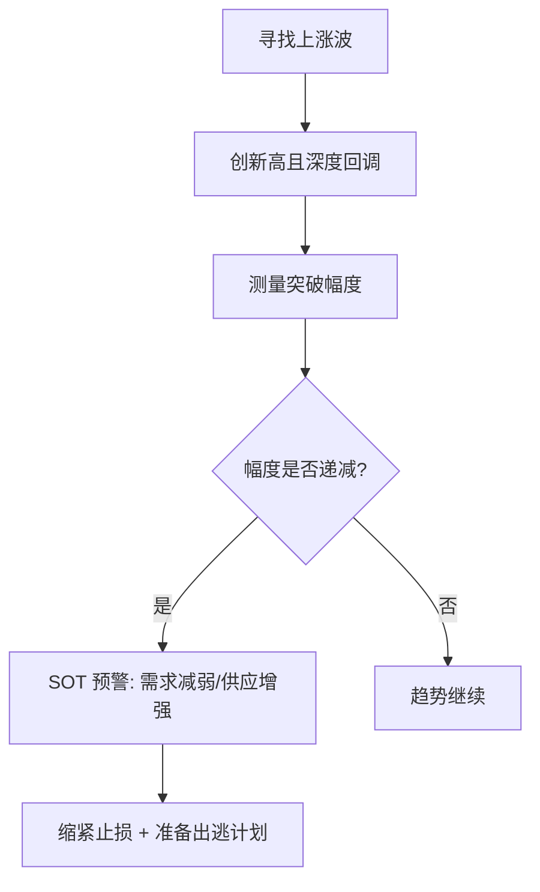
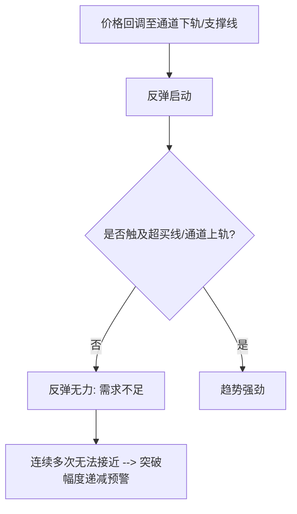
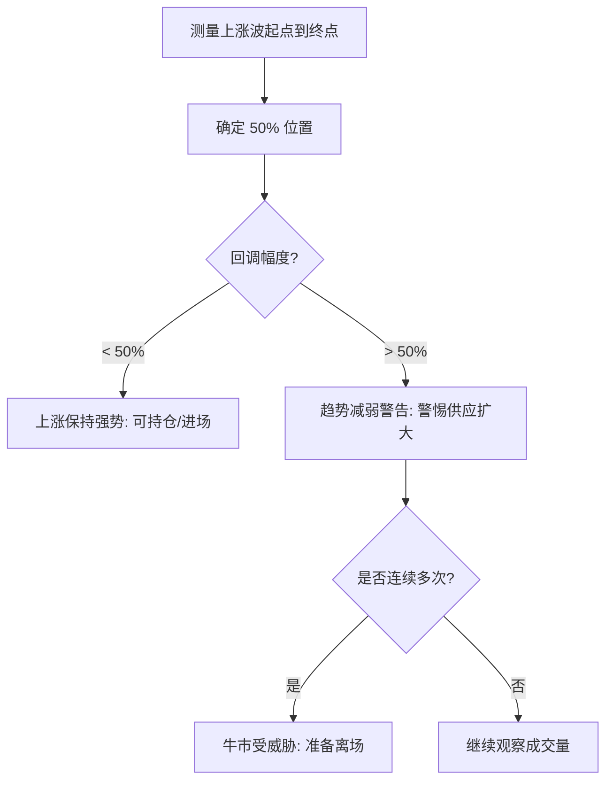
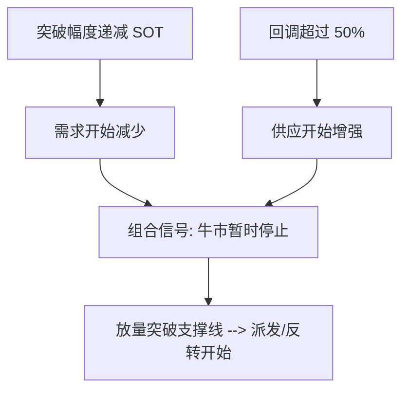
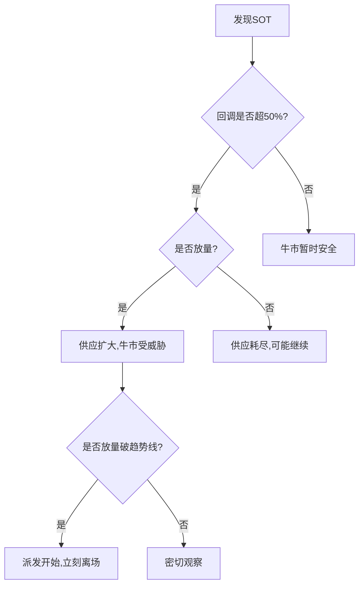

# 第一节 牛市到顶的信号

## 核心思想

通过识别**突破幅度递减**和**50%原则**两大预警信号,判断牛市是否接近终止,及时规避顶部风险。

---


## 核心逻辑

### 一、突破幅度递减 (SOT)

#### 1. 识别方法



#### 2. 利用通道线识别



#### 应对策略

- ✅ **缩紧止损**:调整止损位置,降低风险暴露
- ✅ **准备出逃计划**:制定离场策略
- ⚠️ **趋势线被突破**:无论盈亏,必须离场

---

### 二、50% 原则：牛熊的分界线

#### 1. 判断标准



#### 2. 组合应用

**SOT + 50% 原则 = 强力预警**



---

## 案例讲解

### 案例1:2015年上证指数 - [SOT](../术语速查手册.md#sot-shortening-of-thrust)


| 要素         | 观察                     | 结论                                                        |
| :----------- | :----------------------- | :---------------------------------------------------------- |
| **突破幅度** | 上涨波的突破幅度明显递减 | 需求萎缩或[CM](../术语速查手册.md#cm-composite-man)开始出货 |
| **成交量**   | 突破时成交量扩大         | 供应量增加                                                  |
| **趋势线**   | 被放量突破               | 供应超过需求,牛市背景改变                                   |
| **操作**     | 趋势线突破时必须离场     | 避免灾难                                                    |

**关键信息**:

- 突破幅度递减是预警,不是每次都出现,但一旦出现就要警惕
- 趋势反转前的最后防线是趋势线

---

### 案例2:使用超买线识别SOT


| 观察点       | 现象                    | 含义         |
| :----------- | :---------------------- | :----------- |
| **反弹高度** | 只到中线,无法测试超买线 | 突破幅度缩小 |
| **连续反弹** | 连续几次无法接近超买线  | 需求很弱     |
| **最后回调** | 放量突破支撑线          | 供应超过需求 |

**判断逻辑**:

```
反弹无法到超买线 → 需求减弱 → 回调放量破支撑 → 派发或反转
```

---

### 案例3:50%原则应用 - 2015年上证


| 波段  | 50%位置     | 实际回调      | 市场状态     | 操作         |
| :---- | :---------- | :------------ | :----------- | :----------- |
| X~Y   | 3883        | Y~Z远高于3883 | 牛市未受威胁 | 好时机进场   |
| A~B   | 4621        | B~C明显突破   | 牛市受威胁   | 观察其他信号 |
| B~C   | -           | 放量波动增大  | 供应扩大     | 制订计划     |
| C反弹 | D (50%位置) | 反弹被拒绝    | 供应继续     | 市场弱势     |
| C~顶  | -           | 突破B后无进展 | 突破幅度减小 | **立刻离场** |

**综合判断**:

1. 突破幅度递减 → 需求减少
2. 突破50% + 放量 → 供应扩大
3. 放量突破趋势线 → 供应超过需求 → 派发阶段开始

---

### 案例4:熊市中的50%原则 - 上证周线


| 时间              | 现象                    | 判断         | 市场背景     |
| :---------------- | :---------------------- | :----------- | :----------- |
| 2014下半年~2015.6 | 大幅上涨                | 牛市         | -            |
| 2015.6~7月初      | 回调严重超过50%         | 需求减弱     | 牛市结束     |
| 7月               | 短暂反弹未超过下跌波50% | 供应控制市场 | **熊市确认** |

**操作原则**:

- ❌ **抢反弹**:逆市而为,风险远大于盈利
- ✅ **顺势而为**:进场前先看市场背景

---

## 实战要点

### 预警信号识别

| 信号             | 表现               | 应对                  |
| :--------------- | :----------------- | :-------------------- |
| **SOT出现**      | 突破幅度明显递减   | 缩紧止损,准备出逃     |
| **回调超50%**    | 连续多次超过50%    | 观察供应是否扩大      |
| **放量破趋势线** | 成交量扩大突破支撑 | **无论盈亏,必须离场** |

### 组合判断原则



### 关键误区

| 误区                  | 正确理解                         |
| :-------------------- | :------------------------------- |
| ❌ 教条地等回调正好50% | ✅ 观察回调过程的蜡烛和成交量变化 |
| ❌ 单一信号就判断反转  | ✅ 需要多个信号组合确认           |
| ❌ 忽视成交量变化      | ✅ 成交量是关键,决定突破是否成功  |

### 风控要点

1. **趋势线是最后防线**:一旦被放量突破,无论盈亏必须离场
2. **不要心存侥幸**:看到预警信号就要行动,不要等灾难发生
3. **顺势而为**:进场前先判断市场背景(牛市/熊市)

---

## 核心总结

| 维度         | 要点                                                         |
| :----------- | :----------------------------------------------------------- |
| **两大预警** | [SOT](../术语速查手册.md#sot-shortening-of-thrust) + 50%原则 |
| **判断逻辑** | SOT → 需求减弱; 超50% → 供应增强; 破趋势线 → 供应超需求      |
| **操作原则** | 预警出现 → 缩紧止损; 趋势线破 → 立刻离场                     |
| **关键工具** | 趋势线、超买线/超卖线、50%位置                               |
| **核心理念** | 通过价量关系识别供求变化,提前规避风险                        |
