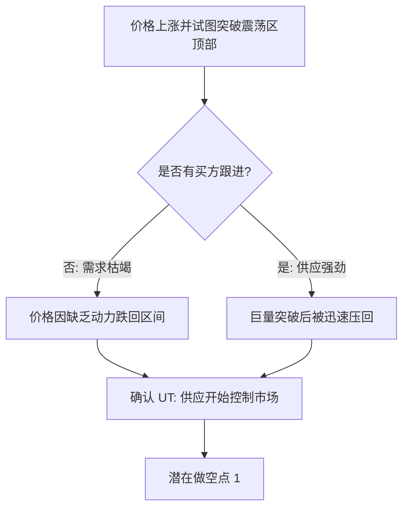
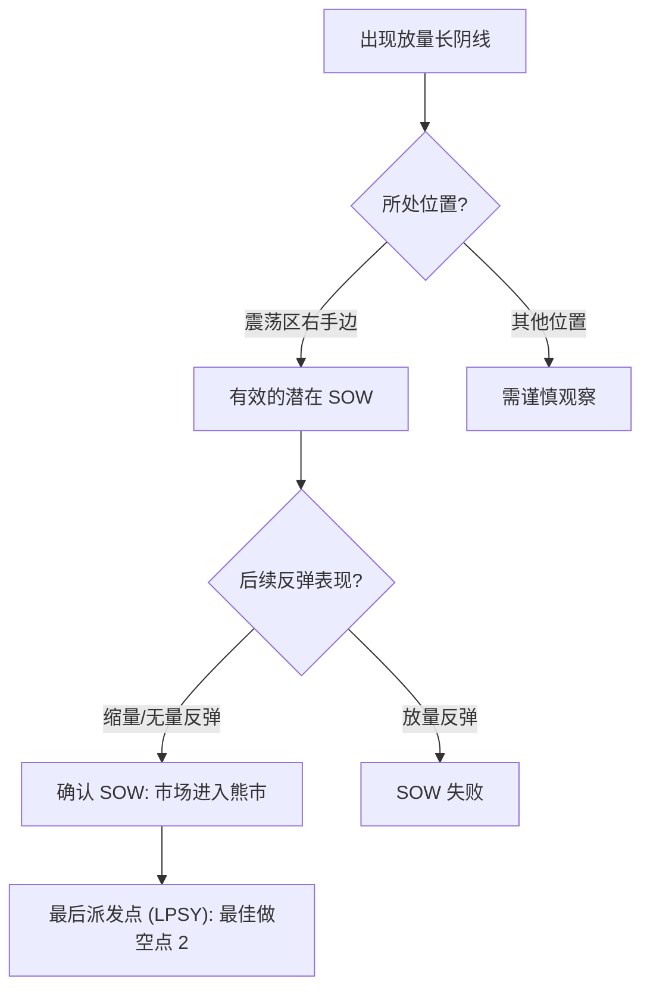

# 第三节 派发的确认阶段

## 核心思想

在派发确认阶段，市场通过**测试行为**（如 UT 和 SOW）由牛市正式转为熊市。识别这些信号的关键在于观察**供应的表达方式**：只要供应没有扩大，牛市就没有终止；一旦供应控制市场，任何反弹都是做空机会。

---

## 一、上冲回落 (Upthrust, UT)

UT 是价格试图突破震荡区顶部失败，并迅速跌回区间的行为。这是 CM 测试市场需求是否枯竭的重要手段。

### 1. UT 的形成逻辑

### 2. 关键要点

- **洗盘与评估**：UT 的目的是扫清空头止损，并评估上方是否还有真实的需求。
- **努力与结果**：如果突破伴随高成交量但价格无法维持，说明“努力多而结果少”，是典型的停止行为。
- **确认信号**：UT 出现后，接下来的放量下挫是最终确认。

---

## 二、弱势出现 (Sign of Weakness, SOW)

SOW 是市场进入熊市的明确信号，通常表现为放量长阴线。

### 1. SOW 的确认逻辑

### 2. 两类 SOW 表现

1. **区间内 SOW**：供应完全控制市场，震荡区内表现极弱。
2. **破冰 SOW**：直接跌破支撑线（冰线）。类似于人掉落冰层，在此之下的所有反弹若遇到阻力，则重回水底。

---

## 三、案例演练：深振业案例分析 (图 3-8)

| 位置               | 市场行为      | 解析                                                     |
| :----------------- | :------------ | :------------------------------------------------------- |
| **1 (PSY)**        | 初次供应      | 供应开始扩大。                                           |
| **2 (BC)**         | 抢购高潮      | 天量新高，出现派发可能。                                 |
| **4/5/6 (ST)**     | 持续测试      | 扩量高抛，卖盘持续增加，提醒公众不能追高。               |
| **7/8 (Support)**  | 建立护盘支撑  | CM 维持价格以继续派发，此反弹通常伴随利好蛊惑。          |
| **9 (UT)**         | 上冲回落      | 最后的测试，锁住最后追高的买家。                         |
| **10 (SOW/Break)** | 破冰/弱势出现 | 长阴突破冰线，成交量增长。**此后的任何反弹均为做空点**。 |

---

## 四、派发确认阶段的操作策略

1. **观察供应表达**：重点在 UT 和 SOW 之后。
2. **两个进场点**：
   - **点 1**：上冲回落（UT）确认时。
   - **点 2**：最后派发点（LPSY），即 SOW 之后的弱势反弹。
3. **警惕比真实行为更动人的“故事”**：在派发区，利好消息往往是 CM 出货的掩护。

---

## 📌 核心总结

1. **UT 是测试，SOW 是结论**。
2. **破冰之后的下跌空间巨大**，此时反弹是最后的逃命或做空机会。
3. **成交量的增长比天量更重要**：在关键位置（如破冰点），增量意味着供应的持续流入。

---

## 🔗 导航

- [← 第二节: CM 的出货过程](./第二节_CM的出货过程.md)
- [→ 第四节: 派发案例分析](#) (待生成)
- [↑ 返回第三章目录](./README.md)
- [↑ 返回总目录](../README.md)
