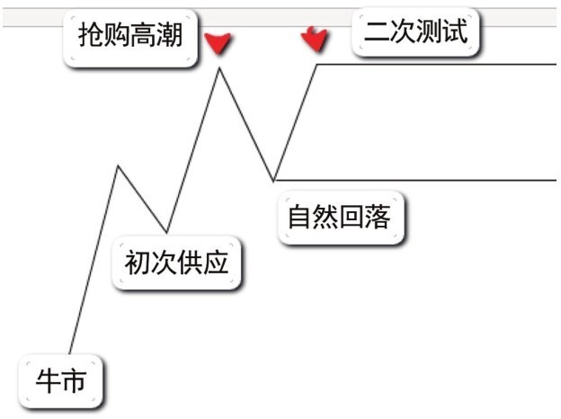

# 第二节 [CM(狗庄)](../术语速查手册.md#cm-composite-man) 的出货过程

## 核心思想

派发（Distribution）是 [CM(狗庄)](../术语速查手册.md#cm-composite-man) 在顶部将底位吸筹的筹码卖给公众的过程。通过识别初始供应、[BC(抢购高潮)](../术语速查手册.md#bc-buying-climax)、二次测试等关键行为，判断牛市何时结束并进入熊市。

---

## 📋 派发阶段的关键术语

| 术语                                                                  | 定义                                                                                          | 市场含义                                                               |
| :-------------------------------------------------------------------- | :-------------------------------------------------------------------------------------------- | :--------------------------------------------------------------------- |
| **[初次供应 (PSY)](../术语速查手册.md#psy-preliminary-supply)**       | Preliminary Supply, 牛市中首次出现的大量卖盘                                                  | 预警信号，牛市上涨遇到初步阻力                                         |
| **[BC(抢购高潮)](../术语速查手册.md#bc-buying-climax)**               | [BC(抢购高潮)](../术语速查手册.md#bc-buying-climax), 价格急涨吸引公众疯狂买入                 | 核心转折点，需求达到顶峰并被供应吸收                                   |
| **[AR(自动回落)](../术语速查手册.md#ar-automatic-rally-reaction)**    | Automatic Reaction, [BC(抢购高潮)](../术语速查手册.md#bc-buying-climax) 后的首次显著回调      | 初步确认供应控制了局面                                                 |
| **[二次测试 (ST)](../术语速查手册.md#st-secondary-test)**             | Secondary Test, 价格再次上探 [BC(抢购高潮)](../术语速查手册.md#bc-buying-climax) 或其附近区域 | 测试市场上剩余的需求是否有力                                           |
| **[冰线 (Ice Line)](../术语速查手册.md#ice-line-ice)**                | 派发区底部的支撑价位                                                                          | [CM(狗庄)](../术语速查手册.md#cm-composite-man) 维持出货价格的最后防线 |
| **破冰 (Break of Ice)**                                               | 价格以长阴放量跌破支撑线                                                                      | 确认派发完成，熊市正式开始                                             |
| **[最后派发点 (LPSY)](../术语速查手册.md#lpsy-last-point-of-supply)** | Last Point of Supply, 破冰后的弱势反弹                                                        | 最后的离场机会或极佳的做空位置                                         |

---

## 一、派发的整体流程

```mermaid
graph TD
    A[牛市趋势中] --> B["初次供应 (PSY)"]
    B --> C"[BC(抢购高潮)"]
    C --> D"[AR(自动回落)"]
    D --> E["二次测试 (ST)"]
    E --> F[震荡派发区]
    F --> G["破冰 (Break of Ice)"]
    G --> H["最后派发点 (LPSY)"]
    H --> I[熊市开始]
    style C fill:#fff5f5,stroke:#feb2b2
    style G fill:#fff5f5,stroke:#feb2b2
    style I fill:#f99,stroke:#333
```

---

## 二、关键行为详述

### 1. 初次供应 (PSY) 与 [BC(抢购高潮)](../术语速查手册.md#bc-buying-climax)

- **初次供应 (PSY)**：
  - **现象**：放量下跌，或先急速上涨后放量下跌。
  - **意义**：阻止牛市发展的临时行为，是持仓者的**预警信号**。
- **[BC(抢购高潮)](../术语速查手册.md#bc-buying-climax)**：
  - **现象**：成交量陡然剧增，上涨角度变得陡峭（超买态势）。
  - **心理**：公众受利好消息诱惑，贪婪驱使疯狂买入。
  - **结果**：天量成交通常对应着 [CM(狗庄)](../术语速查手册.md#cm-composite-man) 的大规模出货，导致上涨动力耗尽。

### 2. [AR(自动回落)](../术语速查手册.md#ar-automatic-rally-reaction) 与 二次测试 (ST)



- **二次测试 (ST) 的成功标志**：
  - **反弹无力**：价格无法创新高。
  - **成交量递减**：说明需求正在枯竭。
  - **结论**：ST 成功即意味着牛市暂时终止。

### 3. [上冲回落 (Upthrust)](../术语速查手册.md#ut-upthrust) 的深度解析 (图 3-7)


- **核心逻辑**：价格试图突破区间顶部失败，跌回区间。
- **停止行为**：突破伴随高成交量但由于卖压太大而无进展（努力≠结果）。
- **心理诱骗**：扫清空头止损，锁住追高公众。
- **确认**：随后出现放量下挫。

### 4. 破冰 (Break of Ice) 与 最后派发点 (LPSY)

```mermaid
graph TD
    A"[CM(狗庄) 设置支撑夹板/冰线"] --> B[在冰线之上进行派发]
    B --> C{派发是否完成?}
    C -- 否 --> D[继续维持支撑]
    C -- 是 --> E[撤掉夹板/冰线被放量突破]
    E --> F["确认破冰: 派发完成"]
    F --> G["弱反弹: LPSY"]
    G --> H[熊市全面开启]
```

---

## 三、案例分析

### 📊 图 3-5：纽约铜案例分析


| 位置                                                                      | 行为                                                | 解析                                                                                                             |
| :------------------------------------------------------------------------ | :-------------------------------------------------- | :--------------------------------------------------------------------------------------------------------------- |
| **柱 1 ([BC(抢购高潮)](../术语速查手册.md#bc-buying-climax))**            | [BC(抢购高潮)](../术语速查手册.md#bc-buying-climax) | 天量创新高，伴随极其陡峭的上涨角度。随后急跌，突破无进展（[SOT](../术语速查手册.md#sot-shortening-of-thrust)）。 |
| **柱 2 ([AR(自动回落)](../术语速查手册.md#ar-automatic-rally-reaction))** | 自然回落                                            | 快速回调确认初次支撑（暂时的派发平台底部）。                                                                     |
| **柱 3 (ST)**                                                             | 二次测试                                            | 阴线力度（成交量和长度）明显大于阳线。反弹无力且不创新高，确认牛市终止。                                         |
| **柱 4 (Break)**                                                          | 破冰行为                                            | 放量深跌突破支撑，说明 [CM(狗庄)](../术语速查手册.md#cm-composite-man) 已撤掉护盘夹板。                          |
| **LPSY**                                                                  | 最后派发点                                          | 破冰后的缩量反弹，需求完全耗尽。**做空最佳点，离场末班车**。                                                     |

---

## 四、实战要点

### 1. 派发与[吸筹](../术语速查手册.md#accumulation)的区别

| 特点         | [吸筹](../术语速查手册.md#accumulation)阶段 | 派发阶段                 |
| :----------- | :------------------------------------------ | :----------------------- |
| **公众心理** | 恐惧（被迫抛售）                            | 贪婪（主动买入）         |
| **持续时间** | 较长（挤牙膏式吸收）                        | 较短（蛊惑式快出）       |
| **成交量**   | 逐渐萎缩，到死角                            | 暴涨高潮，随后不规则波动 |

### 2. 核心原则

- **别相信利好**：派发阶段充斥着来自 [CM(狗庄)](../术语速查手册.md#cm-composite-man)、媒体和上市公司的“谎言”。
- **看冰线表现**：支撑位不再反弹或放量突破，是卖出的死命令。
- **顺势而为**：不要在熊市开头抢反弹，顺应供应控制的背景。

---

## 📌 核心总结

1. **观察背景**：从 PSY 和 [BC(抢购高潮)](../术语速查手册.md#bc-buying-climax) 开始，视角从“持币观望”转为“寻找离场证据”。
2. **确认反转**：破冰是派发的最终定性。
3. **分步离场**：
   - PSY/[BC(抢购高潮)](../术语速查手册.md#bc-buying-climax) 出现：减仓 or 缩紧止损。
   - ST 失败：进一步出局。
   - 破冰/LPSY：清仓离场。
