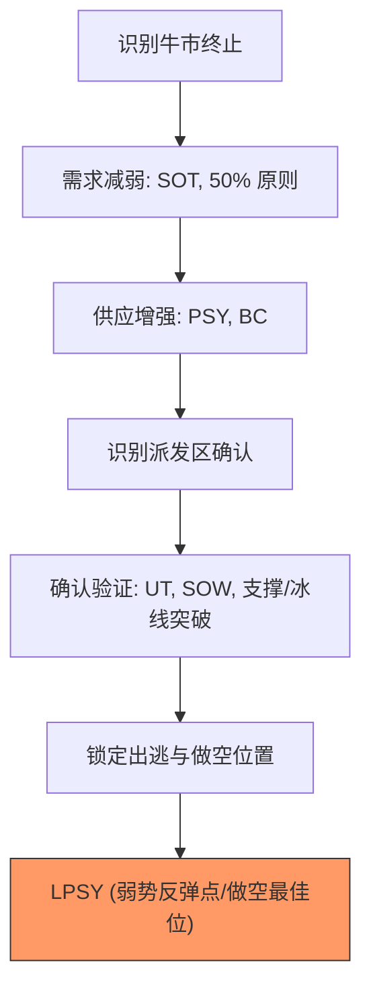

# 第五节 总结

## 核心回顾

本章系统解析了**威氏逃顶策略**，其核心在于识别主力机构（CM）的派发意图。通过观察价格、成交量与进度的关系，我们能够先于趋势反转识别并规避顶部风险。

---

## 💡 派发阶段的逻辑框架

---

## 🗝️ 核心战术要点

### 1. SOT (Shortening of Thrust) 的实战价值
- **定义**：上升突破前面高点的幅度递减。
- **意义**：极为实用的**停止行为**。在震荡区的阻力位出现 SOT，意味着当前上升趋势即将动能枯竭。

### 2. 风险控制与耐心
- **风险控制**：掌握派发过程能有效避免“买在顶部”。即便买入，也能通过对 SOW 的识别及时纠正错误并平仓。
- **耐心等待右手边**：不要在震荡区中间盲目预测，应耐心等待价格运行至**右手边**（出现 SOW 或跌破冰线后），在回测确认时段进场。

### 3. 做空的盈利节奏
- **速度优势**：下跌趋势的发展速度通常**远快于**上升趋势。
- **利润效率**：在确认派发完成后介入，利润积累的效率通常更高。

---

## 📌 威氏逃顶三步走

1.  **首选判断牛市结束**：观察需求是否减弱（Thrust 减小、回调加深超过 50%）。
2.  **次选判断供应增强**：关注高成交量带来的价格停滞（努力没有结果）。
3.  **最终确认派发发生**：等待 SOW 或破冰，并锁定 LPSY 的离场末班车。

---

## 🛠️ 建议练习
- 搜集大量历史顶部图表，尝试标记出 PSY、BC、AR、ST、UT、SOW 和 LPSY 的位置。
- 重点练习识别 SOT（突破幅度的减小），并观察其后续的价格演变。

---

## 🔗 导航

- [← 第四节: 派发案例](./第四节_派发案例.md)
- [↑ 返回第三章目录](./README.md)
- [↑ 返回总目录](../README.md)
