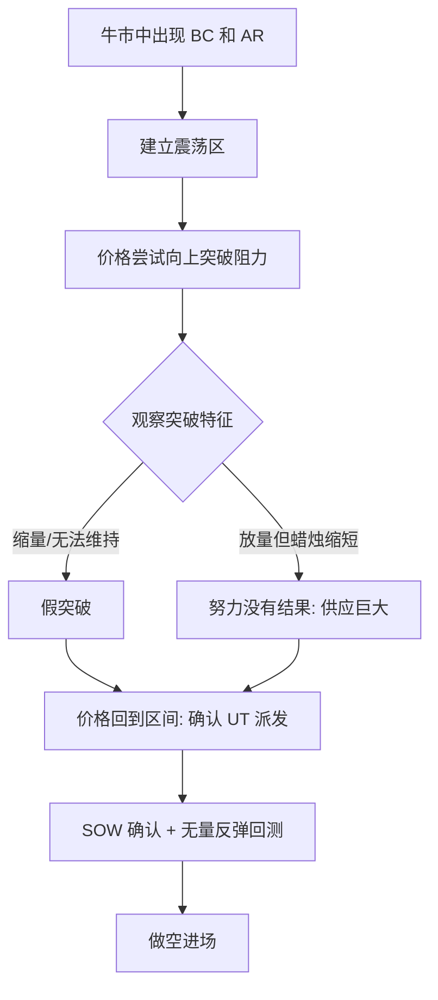
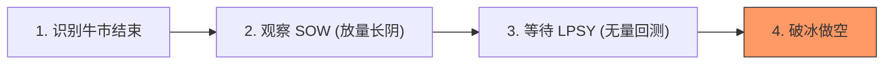

# 第四节 派发案例分析

## 核心思想

本节通过多个实战案例（头肩顶、UT 模式、破冰案例等），展示如何利用**趋势线分析**、**50% 原则**和**累积成交量**来确认派发阶段的完成。核心在于识别需求耗尽与供应增强的交汇点。

---

## 一、特殊派发模式：上冲回落 (UT) 模式

这种模式不常发生，但一旦出现，是极佳的做空时机。

### 1. 识别逻辑

---

## 二、派发确认的三个核心维度

| 维度           | 分析方法                 | 核心逻辑                                             |
| :------------- | :----------------------- | :--------------------------------------------------- |
| **趋势变化**   | 50% 原则 & 趋势线        | 回调超过前一波上涨的 50%，或跌破趋势通道，预示转势。 |
| **供求失衡**   | 努力与结果 (SOT)         | 突破前高的幅度（即 Thrust）在缩小，即便成交量很大。  |
| **成交量质量** | 波形成交量 (Wave Volume) | 下跌波累积成交量 > 上涨波累积成交量，确认供应主导。  |

---

## 三、经典案例解析

### 1. 派发与破冰分析 (图 3-25)

#### **关键步骤：**
1.  **牛市疲态**：C-E 之间的突破幅度几乎为零（Thrust 减小），需求开始枯竭。
2.  **努力没有结果**：B-C 波累积成交量巨大（46.4万手），但价格进展受限，说明供应在剧增。
3.  **二次测试成功**：D-E 波累积成交量（13.3万手）远小于 B-C 波，确认需求耗尽，牛市结束。
4.  **破冰与确认**：E-F 产生 34.5万手成交量，长阴破冰（SOW）。F-G 的缩量反弹（22.2万手）确认了 SOW。

### 2. 多重二次测试分析 (图 3-24)

- **第一次测试**：成交量过大，不是理想的二次测试。
- **第二次测试**：成交量大幅递减，需求耗尽，确认牛市即将终止。
- **最后测试 (UT)**：蜡烛 2 猛烈上涨但受限于供应， confirmed the distribution behavior of the left side.

---

## 四、实战决策流

若要在派发阶段成功做空，请遵循以下流程：

- **做空点**：
  - 上冲回落 (UT) 确认时。
  - SOW 之后的回测（LPSY）。
  - 破冰（Break of Ice）之后的任何无需求反弹。

---

## 📌 核心总结

1.  **回调深度是关键**：当回调开始超过前一波上涨的 50%，且伴随成交量扩大，警惕初次供应。
2.  **波形成交量比单日量更有说服力**：通过累积成交量的对比，更清晰地捕捉供需力量的消长。
3.  **关注“应该发生却未发生”的事**：价格理应突破却受阻，是供应介入的死命令。

---

## 🔗 导航

- [← 第三节: 派发的确认阶段](./第三节_派发的确认阶段.md)
- [→ 第五节: 总结](./第五节_总结.md)
- [↑ 返回第三章目录](./README.md)
- [↑ 返回总目录](../README.md)
