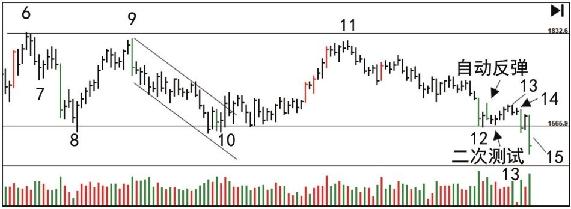
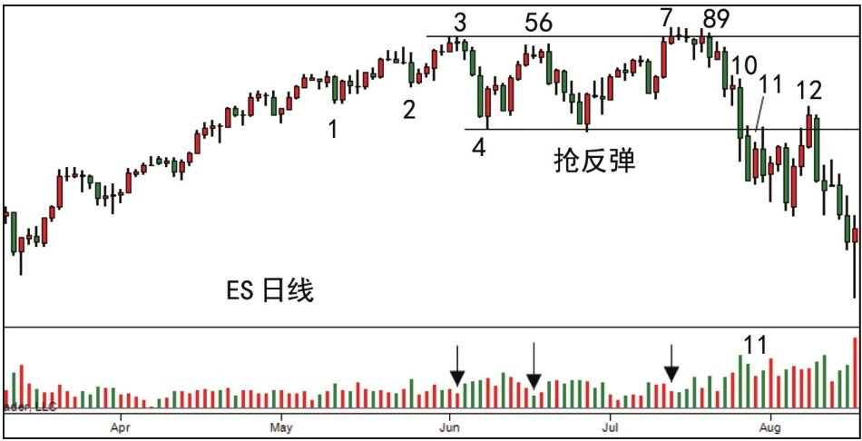
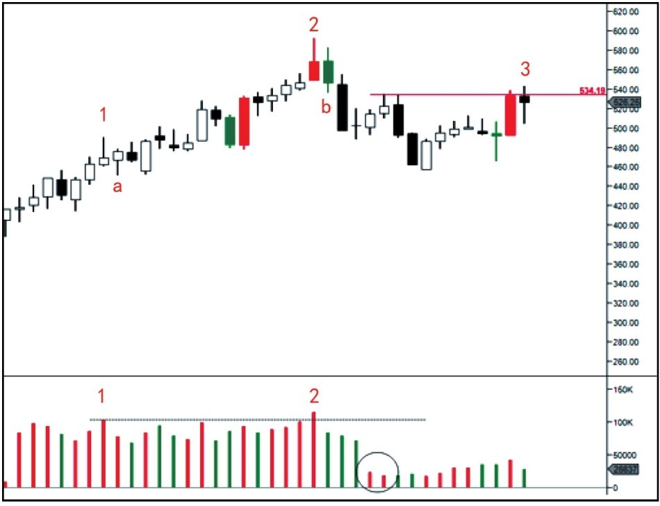
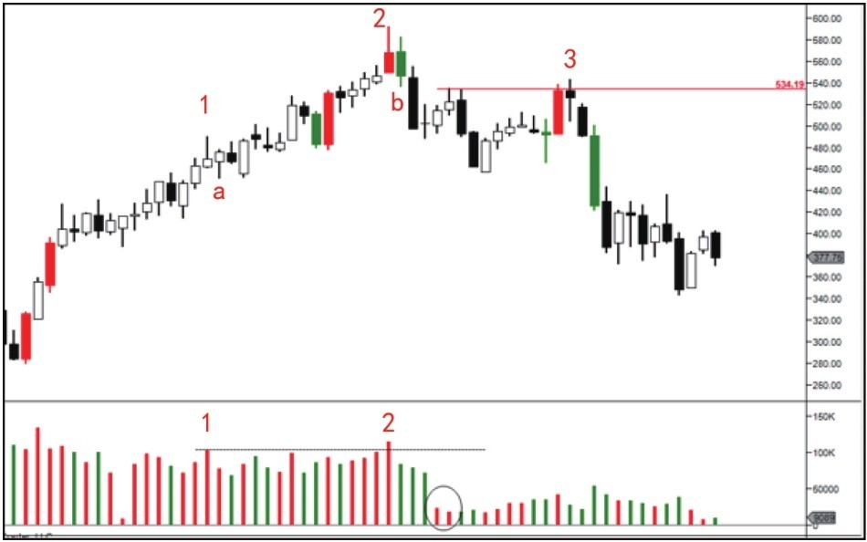
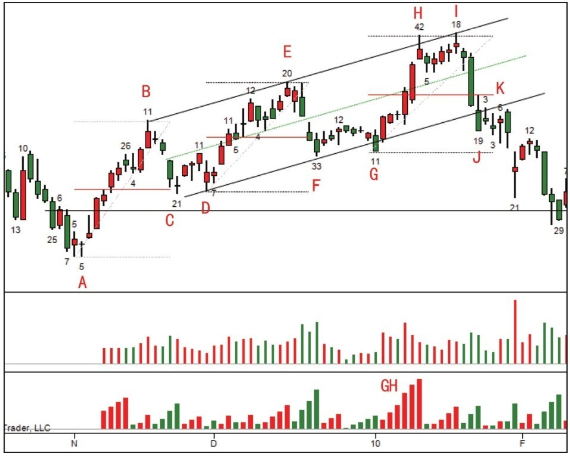

# 第四节 派发案例分析

## 核心思想

本节通过 16 个实战案例，深入剖析派发阶段的各种形态（从高位派发、低位派发到特殊 UT 模式）。核心工具包括：**波形成交量 (Wave Volume)**、**50% 原则**、**趋势线速度**及**上冲回落确认**。

---

## 一、波形成交量与供求转变 (图 3-11, 3-12)

通过累积成交量（柱状图）观察波浪式的供求消长，比单日成交量更具趋势性。

- **特征**：绿色柱（下行波）累积量巨大，红色柱（上行波）累积量缩小。
- **结论**：供应占据主导，价格反弹无力。

---

## 二、特殊场景：低位派发 (图 3-13, 3-14, 3-15)

派发不一定只发生在高位，也可能发生在震荡区中部的“再派发”。

 后的跟进 [SOW](../术语速查手册.md#sow-sign-of-weakness)](../wyckoff_content/OEBPS/Image00067.jpg)

- **观察**：蜡烛 4 的上冲回落后跟进放量阴线（[SOW](../术语速查手册.md#sow-sign-of-weakness)），确认供应完全超过需求。
- **警示**：不要心存侥幸，[SOS](../术语速查手册.md#sos-sign-of-strength)（强势信号）未出现前严禁抄底。

贯穿导致的暴跌](../wyckoff_content/OEBPS/Image00068.jpg)

---

## 三、趋势线速度与 [BC(抢购高潮)](../术语速查手册.md#bc-buying-climax) (图 3-16, 3-17, 3-23)

](../wyckoff_content/OEBPS/Image00069.jpg)

- **技巧**：趋势线角度变陡（几乎垂直）说明 CM 在挑动公众兴奋。价格在无阻力的空中急速上涨通常是 **[BC(抢购高潮)](../术语速查手册.md#bc-buying-climax)**。

---

## 四、牛市中的供应扩大预警 (图 3-18至 3-21)

识别牛市终结的第一道防线是“供应量的显著增加”。

- **逻辑**：供应扩大（图 3-19 蜡烛 1）虽被吸收，但接下来的努力没有结果（图 3-20 蜡烛 3）导致 SOW 出现。

---

## 五、经典形态：头肩顶与 50% 原则 (图 3-22, 3-24, 3-25, 3-26)

不要死记“头肩顶”图形，要理解其背后的力量对比。

- **要点**：第二次测试（蜡烛 2 附近）的成交量大幅递减，是需求耗尽的终极证据。

 与 50% 原则)](../wyckoff_content/OEBPS/Image00078.jpg)

- **50% 原则**：观察回调是否超过前波上涨的 50%。
- **Thrust 减小**：新高之间的幅度越来越小，即便成交量很大。

---

## 📈 实战决策总结

| 信号类型                                                  | 关键行为         | 对应结论与行动           |
| :-------------------------------------------------------- | :--------------- | :----------------------- |
| **[BC(抢购高潮)](../术语速查手册.md#bc-buying-climax)**   | 垂直涨幅 + 天量  | 停止买入，准备撤离。     |
| **努力无结果**                                            | 增量但不创新高   | 供应控制市场，准备做空。 |
| **破冰 ([SOW](../术语速查手册.md#sow-sign-of-weakness))** | 跌破冰线 + 放量  | 派发确认，反弹即抛。     |
| **[LPSY](../术语速查手册.md#lpsy-last-point-of-supply)**  | 破冰后的缩量反弹 | 最佳做空点/最后逃命点。  |

---

## 🔗 导航

- [← 第三节: 派发的确认阶段](./第三节_派发的确认阶段.md)
- [→ 第五节: 总结](./第五节_总结.md)
- [↑ 返回第三章目录](./README.md)
- [↑ 返回总目录](../README.md)
