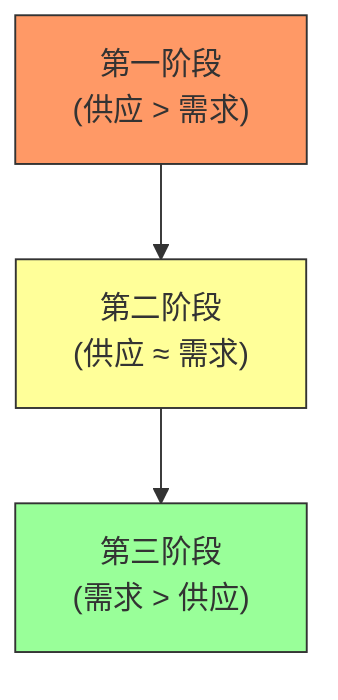
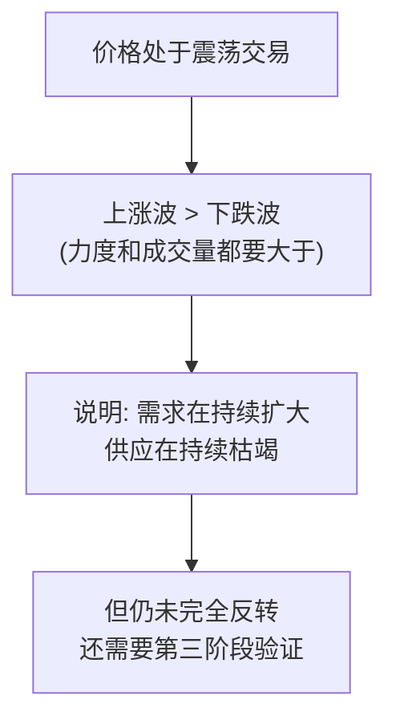
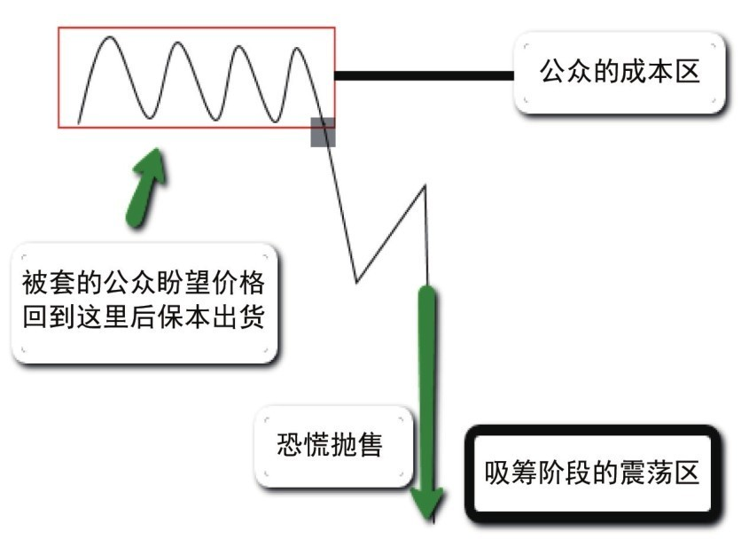
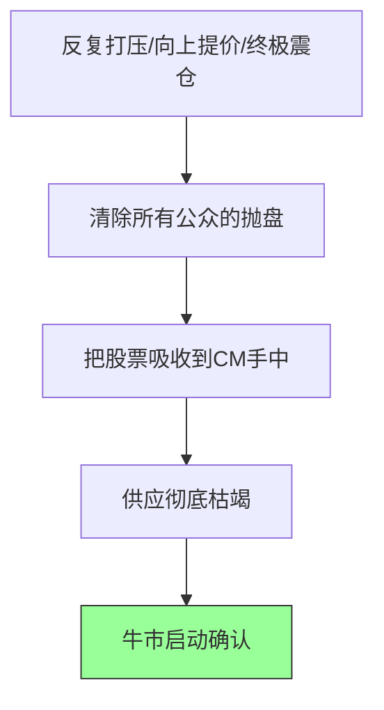
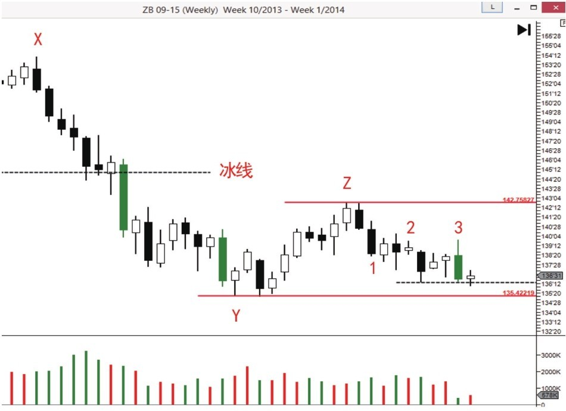
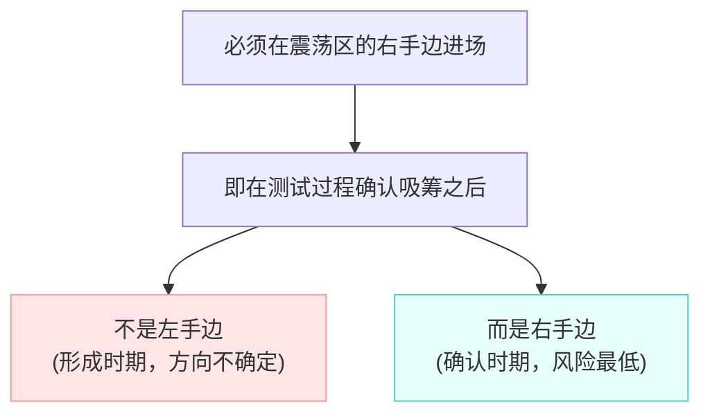

# 第三节 吸筹的第二阶段

### 核心思想

### 吸筹第二阶段 = 震荡区中的拉锯战

二次测试成功后，市场进入吸筹第二阶段。[CM](../术语速查手册.md#cm-composite-man)的核心任务是**控制价格上涨以便大量收购股票**。这个阶段是[CM](../术语速查手册.md#cm-composite-man)使用疲劳战术的关键时期，通过反复打压、向上提价、终极震仓等手段，迫使公众抛售筹码。

**关键原则：必须在震荡区的右手边进场**（即测试过程确认吸筹之后）

---

## 📋 第二阶段的供求关系演变

**供求演变逻辑**：

---

## 一、吸筹的定义与特点

### 定义吸筹是CM**建仓并期待价格进入牛市**的过程。CM的眼光在长远盈利，收购公众已失去兴趣的股票。

### 第二阶段的特征

**特征流程**：

---

## 二、进场的三个位置

### 📊 图2-4：进场位置示意

### 📊 三个进场位置对比

| 进场位置               | 时机                                                                                                     | 特征                            | 风险 | 信号             |
| :--------------------- | :------------------------------------------------------------------------------------------------------- | :------------------------------ | :--- | :--------------- |
| **位置 1**（最安全）   | [SOS](../术语速查手册.md#sos-sign-of-strength)/[JOC](../术语速查手册.md#joc-jump-across-the-creek)后回测 | 小蜡烛+低量                     | 最低 | ✅ **最稳妥点**   |
| **位置 2**（弹簧效应） | [ST](../术语速查手册.md#st-secondary-test)后                                                             | 小幅突破直接进 / 大幅突破等二测 | 中等 | ⚠️ **看量决定**   |
| **位置 3**（吸筹末期） | 终极震仓中                                                                                               | 直接进场 / **等二测(最稳)**     | 较低 | ✅ **盈亏比最佳** |

---

## 三、疲劳战术：CM的三层手段

### 📊 图2-5：疲劳战术示意图

### 📊 CM的折磨策略

| 方法      | 形式     | 目的         | 效果                   |
| :-------- | :------- | :----------- | :--------------------- |
| **方法1** | 反复打压 | 控制价格上涨 | 公众：希望→失望→绝望   |
| **方法2** | 向上提价 | 吸引抄底者   | 同时清除底部和顶部卖盘 |
| **方法3** | 终极震仓 | 最后一击     | 扫清最坚持的持有者     |

### 📊 三种方法的共同目的

---

## 四、案例讲解

### 案例（一）：疲劳战术完整演示

### 📊 图2-6：第二阶段吸筹案例

| 蜡烛      | 形态                                                 | 含义                                                             | 信号       |
| :-------- | :--------------------------------------------------- | :--------------------------------------------------------------- | :--------- |
| **1**     | 供应压倒                                             | 价格离开上方震荡区（超卖），无反抗急速下跌。                     | ⏳ 观察     |
| **2-3**   | [AR](../术语速查手册.md#ar-automatic-rally-reaction) | 熊市第一次大反弹，但不能进场，需等待吸筹完成。                   | ❌ 不进场   |
| **4**     | 成功二测                                             | 小成交量+小波动，确认熊市暂时终止，吸筹区开始建立。              | ✅ 底部确认 |
| **5**     | 顶部打压                                             | CM立刻阻止上涨，套住抄底者，打破被套者解套幻想。                 | ❌ 吸筹未完 |
| **6-7**   | 二次打压                                             | 再次给希望又再次破灭。CM迫使绝望者抛售。                         | ⏳ 等待     |
| **8-9**   | **假突破**                                           | 突破阻力线极具诱惑性，吸引跟风盘。随后被打回，表明CM收购未结束。 | ⚠️ 诱多陷阱 |
| **9-10**  | **阴跌折磨**                                         | **最折磨阶段**：控制下跌节奏，缓慢阴跌+低量。摧毁公众最后防线。  | ❌ 继续观察 |
| **11-12** | 快速反弹                                             | 再次被CM直接否定，确认CM为了吸筹将价格死死控制在低位。           | ⏳ 吸筹继续 |

**关键认知**：

- 突破阻力后又返回 = 吸筹未完成
- 无论多少抄底消息 = 都不能相信
- 供应枯竭（缺量） = 底部成熟信号

---

### 案例（二）：高位支撑的形成

### 📊 图2-7：支撑位逐步提高

**1. 市场背景 (X - Z)**

| 阶段       | 现象          | 供求分析                                                                                                                            |
| :--------- | :------------ | :---------------------------------------------------------------------------------------------------------------------------------- |
| **X -> Y** | 明显熊市/超卖 | 价格急速下跌，无反抗，供应压倒性优势。                                                                                              |
| **Y -> Z** | 缩量反弹      | 突破了下降趋势线，确认 Y 为 **[PS](../术语速查手册.md#ps-preliminary-support)**。但因无需求跟随（量小），反弹无力，有再次探底风险。 |

**2. 关键细节解读 (1 - 3)**

| 蜡烛       | 现象         | 核心含义 (为什么跌不下去？)                                                     |
| :--------- | :----------- | :------------------------------------------------------------------------------ |
| **Z -> 1** | 放量急跌     | 看似恐怖，但为后续的缩量做铺垫。                                                |
| **1 -> 2** | **波动收窄** | 连续 4 周，虽然成交量平稳，但**收盘价几乎没变**。说明卖盘在减少，供应开始稀少。 |
| **3**      | **缩量阴线** | **看涨信号！** 虽然是阴线，但极低的成交量说明供应彻底枯竭。                     |
| **3 之后** | 极窄幅波动   | 再次确认供应枯竭。                                                              |

**3. 结论：高位支撑的确立**

*   **支撑位提高**：回测没有创 Y 点新低，而是停在了更高的位置。
*   **CM 意图**：低价筹码已买不到，CM 必须提高收购价格 = 吸筹即将完成。
*   **进场信号**：当确认供应枯竭（蜡烛 3 及其后）且支撑位提高时，是绝佳的进场时机（死角交易法）。

---

## 💡 核心认知

### 四个关键原则

### 1. 进场的首要原则

**原则解析**：

### 2. 判断吸筹是否完成

必须看到：

- 上涨波 > 下跌波（力度和成交量）
- 供应枯竭的信号（缺量）
- SOS或JOC的出现

### 3. 进场后必看

- ✅ 价格和成交量递增 → 牛市很强，进场正确
- ❌ 放量阴线 → 大量供应出现，立刻出场！

### 4. 疲劳战术的真实目的

- 第一阶段：恐慌抛售已获得底部筹码
- 第二阶段：需要获得被套者手中的筹码（心理折磨）
- 第三阶段：清除最后的浮供（终极震仓）

---

## 💡 实战要点

### 常见错误

| 错误         | 原因               | 后果           |
| :----------- | :----------------- | :------------- |
| 看到支撑就进 | 不知道吸筹哪个阶段 | 被困在震荡区   |
| 突破阻力就追 | 不知道是否吸筹完成 | 在派发高位接盘 |
| 忽视疲劳战术 | 被心理折磨迫使出场 | 在底部被扫出   |
| 不等二次测试 | 急于抄底           | 陷入高风险位置 |

### 实战判断标准

| 观察点         | 判断标准       | 交易意义     |
| :------------- | :------------- | :----------- |
| **支撑位变化** | 支撑位逐步提高 | 吸筹即将完成 |
| **涨跌波对比** | 上涨波>下跌波  | 需求持续扩大 |
| **成交量特征** | 缺量不创新低   | 供应已枯竭   |
| **测试出现**   | 小蜡烛+缺量    | 安全进场点   |

---

## 📌 核心总结

### 三个关键认识

### 1. 第二阶段 = 吸筹最关键阶段

- 从"供应>需求"向"需求>供应"转变
- CM使用疲劳战术强制转变
- 需要时间和心理考验

### 2. 三个进场位置的本质

- 第一个：最安全但价格不是最低（趋势确认）
- 第二个：比较安全且价格相对较低（震荡中后期）
- 第三个：盈亏比最佳（吸筹末期），稳妥策略是等待二测

### 3. 关键判断标准

- **支撑位上升** = 吸筹进行中
- **缺量反弹** = 供应已枯竭
- **右手边进场** = 风险最低的确认

---

## 🔗 与第一、二节的连接

| 前面概念     | 第三节应用                     |
| ------------ | ------------------------------ |
| 二次测试成功 | 吸筹第二阶段开始的标志         |
| 停止行为     | 第二阶段中频繁出现（反复打压） |
| 缺量不创新低 | 供应枯竭的标志，吸筹即将完成   |
| 支撑和阻力   | 支撑位逐步提高表示吸筹在进行   |
