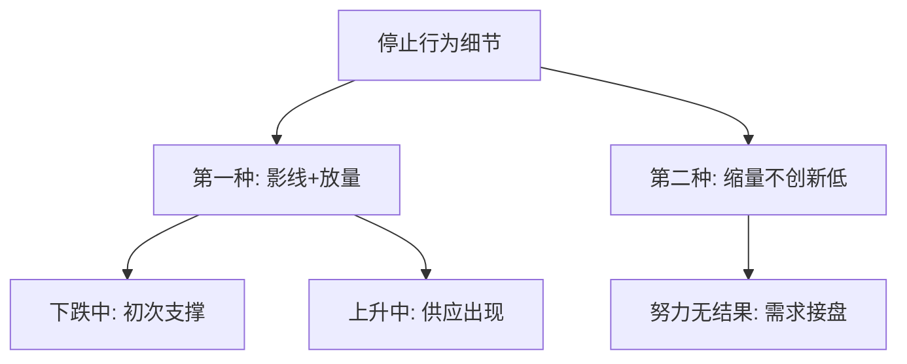
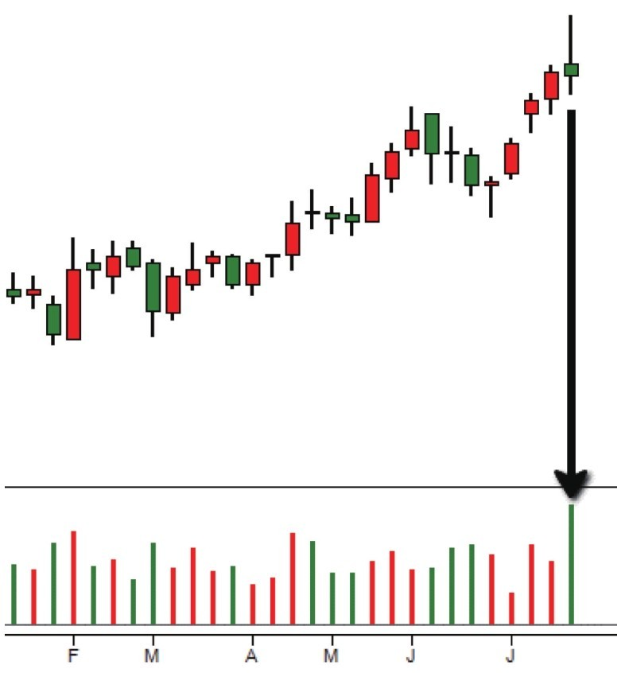
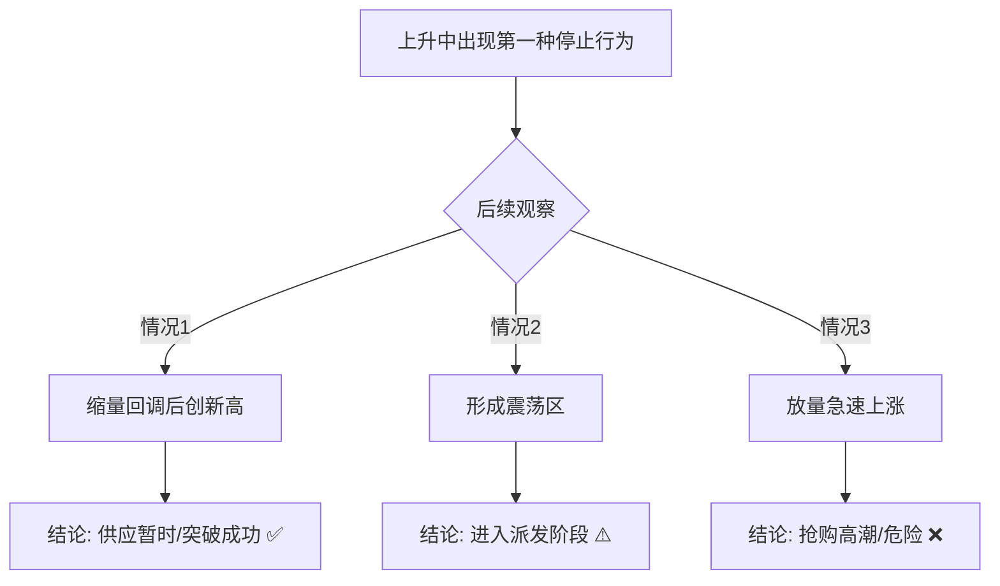
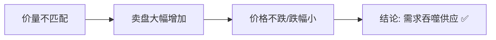

# 第二节 停止行为

## 核心思想

在判断走势过程中，**停止行为是看盘应注意的细节**。停止行为本质是：**价格涨跌过程中的暂时停止 = 一种价量信号，提醒我们即将发生的变化**。

---

## 📋 两种停止行为速查表

---

## 一、第一种停止行为：影线+放量

### 定义

- **下跌过程中**：大下影线 + 扩大的成交量
- **上升过程中**：大上影线 + 扩大的成交量

### 含义

这种行为属于**价格涨跌过程中的暂时停止行为**。它不代表趋势会立刻反转，但是给了我们一个提醒。

### 图2-2、2-3：第一种停止行为

### 在下跌中（初次支撑特征）

| 现象                    | 含义                         | 信号                                                      |
| ----------------------- | ---------------------------- | --------------------------------------------------------- |
| 大下影线 + 扩大的成交量 | 买盘大幅增加，暂时阻止了下跌 | [初次支撑](../术语速查手册.md#ps-preliminary-support)出现 |

---

### 在上升中（供应压力信号）

| 现象                    | 含义                   | 后续可能性       |
| ----------------------- | ---------------------- | ---------------- |
| 大上影线 + 扩大的成交量 | 卖盘大幅增加，供应扩大 | 需要观察后续走势 |

**后续可能发展**：

---

## 二、第二种停止行为：缩量不创新低

### 定义

下跌中，蜡烛大幅缩小，但成交量大幅增加，价格没有创新低。

### 含义

- 卖盘大幅增加（努力）
- 价格没有大幅下跌（没有结果）
- **努力≠结果 = 停止行为**

### 深层供求分析

### 后续走势

- 这种停止行为后，**价格会有反弹**
- 如果发生在**震荡区右手边**，很可能导致**价格大幅上涨**

---

## 图2-2：第二种停止行为案例

| 蜡烛  | 形态          | 含义           | 信号       |
| ----- | ------------- | -------------- | ---------- |
| **4** | 小蜡烛 + 放量 | 卖盘虽大但受阻 | ⏳ 停止行为 |
| **6** | 小蜡烛 + 放量 | 供应被需求吸收 | ⏳ 停止行为 |

---

## 💡 核心认知

### 两种停止行为的共同点

都是**努力≠结果**的表现：

- 第一种：大影线+放量 = 努力很大但价格波动小
- 第二种：高量不创新低 = 努力很大但价格没有下跌

### 两种停止行为的区别

| 特征       | 第一种       | 第二种       |
| ---------- | ------------ | ------------ |
| **形态**   | 大影线       | 缩量         |
| **成交量** | 放量         | 放量         |
| **含义**   | 买卖对抗     | 卖无结果     |
| **信号**   | 方向改变预警 | 反弹即将来临 |

---

## 💡 实战要点

### 第一种停止行为的应用

**上升中**：

- ✅ 如果缩量回调后创新高 → 继续持有
- ⚠️ 如果之后形成震荡 → 警惕派发
- ❌ 如果放量下跌 → 立刻出场

**下跌中**：

- 标志初次支撑，需要等待后续确认

### 第二种停止行为的应用

- ✅ 出现在震荡区底部 → 反弹进场机会
- ✅ 出现在支撑位附近 → 低风险反弹信号
- 需要观察反弹是否放量确认

### 常见错误

| 错误                     | 后果               |
| ------------------------ | ------------------ |
| 看到大影线就立刻反向操作 | 趋势还没反转，被套 |
| 忽视第二种停止行为       | 错过反弹机会       |
| 只看形态不看供求         | 判断错误           |

---

## 📌 核心总结

**停止行为的三个关键认识**：

1. **本质是供求失衡**
   - 第一种：量大幅度小 = 力量对抗
   - 第二种：量大价跌小 = 需求战胜供应

2. **是转折点的预警信号**
   - 不代表立刻反转
   - 但表示变化即将来临

3. **必须结合位置判断**
   - 在底部：看反弹
   - 在顶部：看回调
   - 在震荡区：看方向确认

---

## 🔗 与第一章的连接

| 第一章概念 | 第二章应用                 |
| ---------- | -------------------------- |
| 停止行为   | 两种形式都是努力≠结果      |
| 努力和结果 | 这正是第八节的核心内容     |
| 供求关系   | 两种停止行为都体现供求失衡 |

---

## 🔗 导航

- **上一节**：[第一节 - 熊市终止的市场行为](./第一节_熊市终止的市场行为.md)
- **下一节**：[第三节 - 吸筹的第二阶段](./第三节_吸筹的第二阶段.md)
- **上级目录**：[第二章 - 怎么知道主力机构开始接盘了](./README.md)
