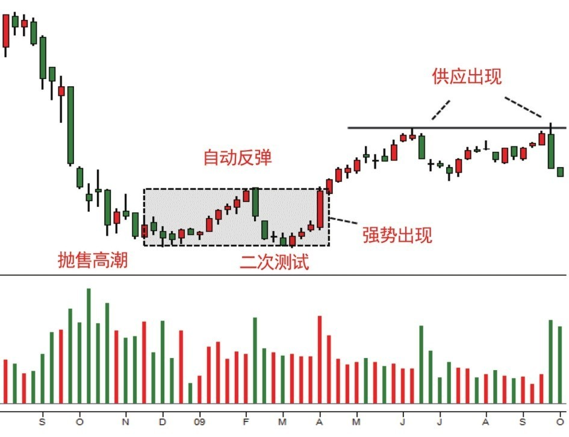
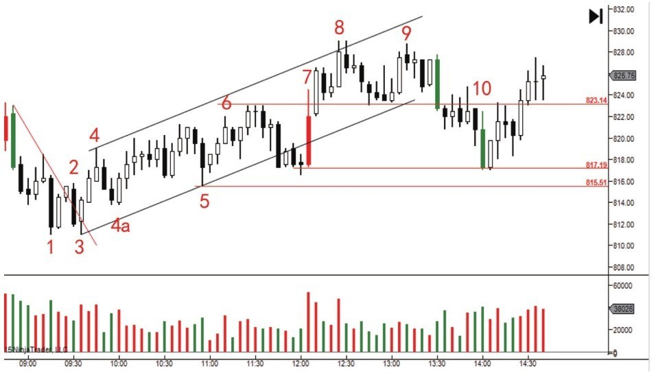
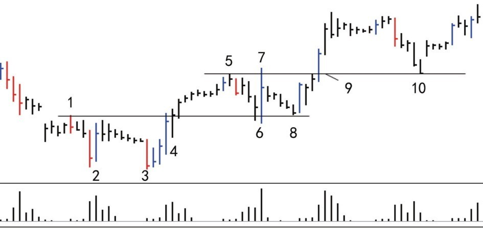
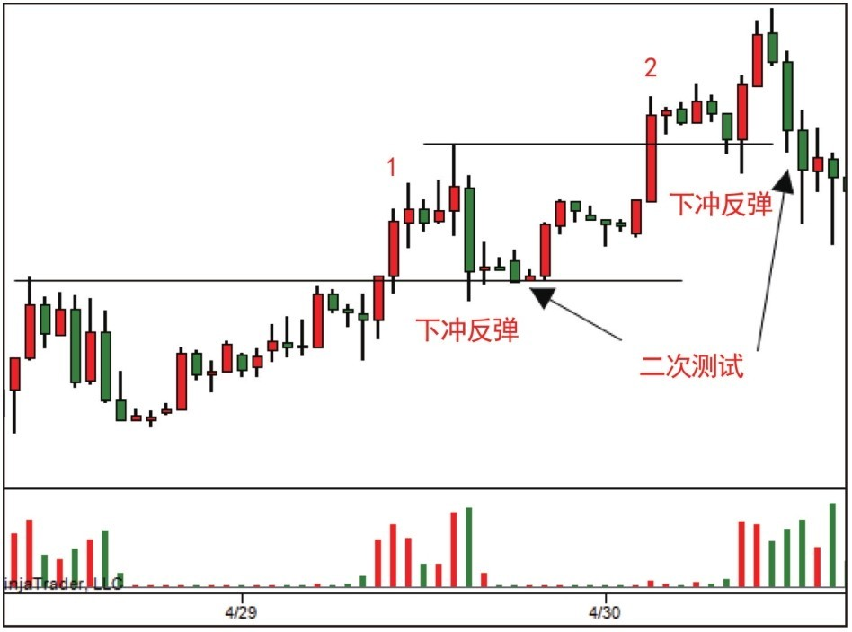
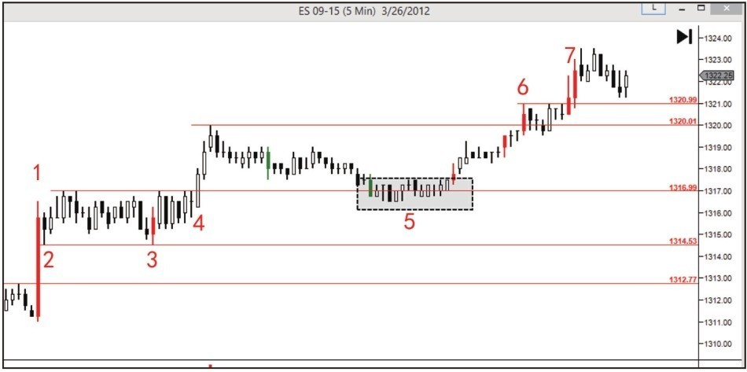
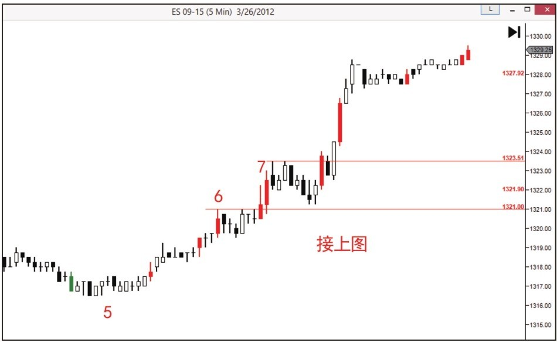

# 第五节 进入牛市

## 核心思想

**第四阶段 = 牛市确认信号阶段**

通过第三阶段的测试（[终极震仓](../术语速查手册.md#shakeout)/[弹簧效应](../术语速查手册.md#spring)），[CM](../术语速查手册.md#cm-composite-man)已经确认：**市场上的股票供应已经彻底耗尽，需求已经完全控制市场**。

现在，CM准备允许价格上涨，进入牛市。牛市由两个关键信号确认：**[SOS](../术语速查手册.md#sos-sign-of-strength)（强力信号）和 [JOC](../术语速查手册.md#joc-jump-across-the-creek)（跳过小溪）**。

**关键原则：两个信号都需要后续回测确认，回测缺量才能安心进场**

---

## 📋 牛市的两个关键信号

| 信号                                                    | 全称             | 位置           | 含义     | 特征         | 进场     |
| ------------------------------------------------------- | ---------------- | -------------- | -------- | ------------ | -------- |
| **[SOS](../术语速查手册.md#sos-sign-of-strength)**      | Sign of Strength | 在震荡区内     | 温和确认 | 长阳+放量    | 回测缺量 |
| **[JOC](../术语速查手册.md#joc-jump-across-the-creek)** | Jump Over Creek  | 突破震荡区顶部 | 强势确认 | 放量长阳突破 | 回测缺量 |

**核心理解**：

- **SOS** = 需求开始控制，但还在震荡区内（供应未完全枯竭）
- **JOC** = 需求完全控制，已突破阻力区（供应已彻底枯竭）
- **回测缺量** = 唯一的进场确认条件

---

## 一、SOS - 强力信号

### 定义

在震荡区内出现**长阳线 + 放量**

### 含义

- 需求开始在市场中显现优势
- 供应还在，但需求压过了它
- 显示从平衡向需求倾斜的过程

### 进场条件

✅ 不是SOS本身，而是**SOS后的回测缺量**

---

## 二、JOC - 跳过小溪

### 定义

价格**快速突破震荡区顶部**，伴随**放量长阳**

### 小溪比喻

```mermaid
graph TD
    A[小溪 = 供应阻力区<br>(震荡区顶部充满卖单)] --> B[卖单逐渐枯竭<br>(小溪变窄)]
    B --> C[强劲需求一举突破<br>(男孩助跑跳过小溪)]
    C --> D[进入新的更高价格领地<br>(开始牛市)]
```

### 进场条件

✅ 不是JOC本身，而是**JOC后的回测缺量**

---

## 📊 SOS和JOC的案例讲解

### 图2-9：SOS和JOC的基本示意


这张图展示了SOS在震荡区内出现的位置，以及JOC突破震荡区的完整过程。

---

### SOS - 强力信号的案例

#### 图2-10：SOS案例（一）



**案例讲解**：

- 在底部形成的震荡区内出现长阳线
- 成交量大幅扩大，说明需求强劲
- **关键**：之后出现回测缺量反弹 = SOS确认

#### 图2-11：SOS案例（二）



**案例讲解**：

- 连续的长阳线和递增成交量
- 展示需求持续控制市场的过程
- **进场时机**：回测到前期支撑后出现缺量反弹

---

### JOC - 跳过小溪的案例

#### 图2-12：JOC突破示意



**案例讲解**：

- 价格快速突破震荡区上边界
- 放量长阳穿破供应阻力
- 这是**最强势的突破形式**

#### 图2-13：JOC之前的探索阻力


**案例讲解**：

- JOC出现之前的探索行为
- 价格多次试图突破阻力区
- 每次反弹的成交量在递减（供应在枯竭）
- **预示**：突破在即

#### 图2-14：突破后的枯燥盘整


**案例讲解**：

- JOC突破后出现的枯燥盘整
- 成交量萎缩，价格波动小
- **这是正常现象**，不是反转信号
- **进场时机**：缺量反弹时进场

#### 图2-15：JOC案例（一）


**案例讲解**：

- 清晰的JOC形式：放量长阳突破
- 需求完全控制，供应被吸收干净
- 后续回测 = 进场机会

#### 图2-16：JOC案例（二）- 牛市中的JOC



**案例讲解**：

- 牛市进行中出现的再次JOC
- 突破前期高点时出现
- 同样需要回测缺量确认
- **继续上涨的信号**

#### 图2-17：JOC案例（三）



**案例讲解**：

- 回调形成的新震荡区中出现JOC
- 快速突破后继续上涨
- 展示JOC在不同阶段都可能出现
- 都需要回测缺量来确认

---

### 图2-18：SOS之后的后续走势



**案例讲解**：

- SOS出现后的完整演变过程
- 从需求扩大 → 供应枯竭 → 突破上升
- 展示整个过程的自然延伸

---

## 📊 进场的最高原则

### 原则1：不能追涨

| 错误做法           | 正确做法             |
| ------------------ | -------------------- |
| 看到SOS/JOC→立刻进 | 看到SOS/JOC→耐心等待 |
| 追随价格往上冲     | 等回测确认缺量后进   |
| 高位追多被套       | 低风险买点进场       |

### 原则2：回测必须缺量

进场的必要条件：

- **小蜡烛** = 价格波动范围小
- **低成交量** = 卖盘极少
- **缺量反弹** = 供应真的已枯竭

### 原则3：一个行为需要另一个行为确认

这是威科夫理论的核心：

| 信号    | 需要确认 | 含义                       |
| ------- | -------- | -------------------------- |
| SOS出现 | 回升确认 | 需求真的控制了市场         |
| JOC出现 | 回测确认 | 突破真的有效，供应真的没了 |

---

## 三、牛市确认的完整流程

### 四个必要阶段

```mermaid
graph TD
    A[1. 二次测试成功] -->|供应在量上枯竭| B[2. 终极震仓/弹簧效应]
    B -->|验证[吸筹](../术语速查手册.md#accumulation)已完成| C[3. SOS或JOC出现]
    C -->|需求开始主导| D[4. 回测缺量确认]
    D -->|需求完全控制<br>供应真的枯竭| E[5. 牛市正式开始]
    style E fill:#e6fffa,stroke:#4fd1c5,stroke-width:2px
```

### 为什么需要这四步？

这四步构成了完整的**因果关系**：

**因**：

- 供应已枯竭（第1-2步验证）
- 需求已占优（第3步信号）
- 供应已消失（第4步确认）

**果**：

- 价格上升进入牛市

---

## 💡 核心认知

### 三个关键理解

**1. SOS和JOC是"宣言"不是"开始"**

- 不是看到它就牛市开始
- 而是CM对市场的"宣言"：[吸筹](../术语速查手册.md#accumulation)完成，可以拉高了
- 真正的开始是：回测缺量反弹

**2. 回测缺量的深层含义**

- 供应确实已经全被吸收
- 底部已经没有卖单了
- 价格准备好进入上升趋势

**3. 完整的[吸筹](../术语速查手册.md#accumulation)到牛市过程**

```mermaid
graph TD
    A[第1-3阶段] -->|秘密准备| B(偷偷[吸筹](../术语速查手册.md#accumulation))
    B --> C[第4阶段]
    C -->|公开宣布| D(SOS/JOC信号)
    D --> E[第5阶段]
    E -->|回测确认| F(进场完成)
    F --> G[牛市运作]
    G -->|明目张胆| H(拉高)
```

---

## 💡 实战要点

### 常见错误

| 错误                 | 原因             | 后果           |
| :------------------- | :--------------- | :------------- |
| 看到SOS就追          | 没等回测         | 高位被套       |
| 看到JOC就追          | 没等缺量         | 抢顶被打       |
| 第一次放量回测就放弃 | 不知道可多次测试 | 错过真正进场点 |
| 只看形态不看量       | 忽视供应信号     | 判断失准       |

### 实战观察标准

| 阶段          | 观察内容   | 好信号       | 坏信号       |
| :------------ | :--------- | :----------- | :----------- |
| **SOS出现后** | 是否缩量   | 缩量反弹     | 放量下跌     |
| **回测时**    | 成交量大小 | 缺量（很小） | 放量（很大） |
| **反弹时**    | 收盘位置   | 中上位置     | 中下或以下   |
| **持续时**    | 价量关系   | 俱增         | 俱减         |

---

## 📌 核心总结

### 五阶段完整总结

### 第一阶段：熊市终止

- 初次支撑 → 恐慌抛售 → [AR(自动反弹)](../术语速查手册.md#ar-automatic-rally-reaction) → 二次测试
- CM进场，供应释放，底部信号

### 第二阶段：[吸筹](../术语速查手册.md#accumulation)开始

- 上涨波>下跌波，疲劳战术
- CM缓慢吸收，震荡区形成

### 第三阶段：[吸筹](../术语速查手册.md#accumulation)完成

- 终极震仓/弹簧效应，二次测试缺量
- 确认供应已全被吸收

### 第四阶段：牛市信号

- SOS或JOC出现
- CM宣布[吸筹](../术语速查手册.md#accumulation)完成，准备拉高

### 第五阶段：进场确认

- 回测缺量反弹
- 进场最安全点

### 关键记住

- ✅ 不追涨，等回测
- ✅ 回测必须缺量
- ✅ 缺量=供应枯竭
- ✅ 枯竭=可以进场

---

## 🔗 与全章内容的连接

| 章节   | 核心概念      | 第五节应用                                            |
| :----- | :------------ | :---------------------------------------------------- |
| 第一节 | 熊市终止4阶段 | [吸筹](../术语速查手册.md#accumulation)完成后的确认   |
| 第二节 | 停止行为      | SOS/JOC后回测缺量                                     |
| 第三节 | 疲劳战术      | CM[吸筹](../术语速查手册.md#accumulation)已完成的信号 |
| 第四节 | 终极震仓      | 为SOS/JOC出现奠基                                     |
| 第五节 | SOS/JOC       | 牛市确认和进场点                                      |

---

## 🔗 导航

- **上一节**：[第四节 - [吸筹](../术语速查手册.md#accumulation)的第三阶段](./第四节_[吸筹](../术语速查手册.md#accumulation)的第三阶段.md)
- **下一节**：[第六节 - [吸筹](../术语速查手册.md#accumulation)过程的操作综合案例](./第六节_[吸筹](../术语速查手册.md#accumulation)过程的操作综合案例.md)
- **上级目录**：[第二章 - 怎么知道主力机构开始接盘了](./README.md)
