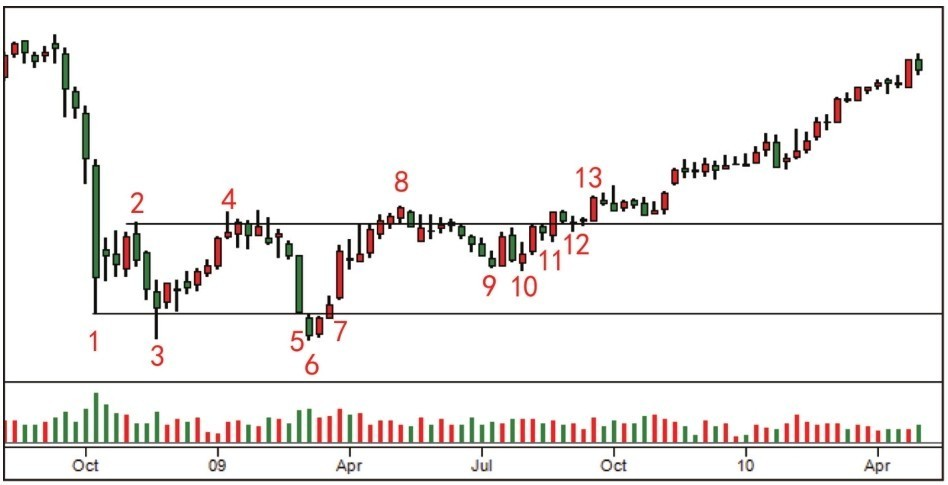

# 第六节 吸筹过程的操作综合案例

### 核心思想

通过三个不同周期的吸筹案例，展示从恐慌抛售到牛市开始的完整过程。学会识别吸筹完成的标志和派发开始的警告信号。

---

## 📊 案例1：吸筹过程较短

### 图2-19：短期吸筹四阶段流程

### 图表讲解：四个关键阶段

### 阶段1：熊市终止（蜡烛1-4）

从初次支撑到二次测试成功

- **蜡烛1-2：初次支撑 → 恐慌抛售**：
  - **蜡烛1**：初次支撑 → CM开始接盘，需求扩大吸收供应
    - 验证标志：价格突破下降趋势线或出现二次测试缺量
    - 重点提示：**不能在此抄底**，需要等待确认

  - **蜡烛2：自然反弹**：超卖后的技术性反弹（空头回补）
    - 反弹突破最近趋势线 → 确认支撑形成
    - 警惕：在此进场容易遭遇震仓

- **二次测试（4号蜡烛 - 成功标志）**：下跌力度明显减弱
  - **成交量现象**：成交量完全消失 → **供应彻底枯竭**

  - **支撑位提高的深层含义**：
    - 在较低价格区，市场供应极度稀少
    - CM买不到足够的股票
    - 必须**提高收购价格**才能继续吸筹
    - 这种行为**确认了吸筒，预示牛市孕育中**

  - **4～6号蜡烛的序列现象**：
    - 小幅盘整，既不创新低也不创新高
    - 持续的极低成交量
    - **含义**：吸筒在进行中，但**还没结束**

  - **结论**：成功的二次测试确认熊市终止，但吸筒仍在进行中

---

### 阶段2：底部死角

供应完全枯竭的最安全进场点

- **死角特征**：蜡烛越来越短，既不创新低也不创新高
  - 市场成交量极度萎缩，看起来非常萧条
  - 但这恰恰是**买入风险最低的时刻**

- **为什么是最低风险**：
  - 供应已彻竭，向下无力
  - 只需需求稍微扩大就能向上突破
  - 进场逻辑不基于某个蜡烛信号，而是**市场进入死角这个现象本身**

---

### 阶段3：牛市确认信号（蜡烛6-10）

需求完全主导的证明过程

- **6号蜡烛（SOS - 强力信号）**：放量长阳突破死角
  - 需求吸收市面所有浮动供应
  - **三项确认**：吸筹完成 + 供应枯竭 + 需求主导
  - 这是牛市开始的理论根据
  - 后续回调属正常，只要不放量就不威胁牛市

- **7号蜡烛（LPS - 最后供应点）**：回到支撑的漂亮反弹
  - 确认市场由需求主导
  - 下方已无股票可买，只能提价成交
  - **又一个安全进场点**

- **8-10号蜡烛（持续强势）**：
  - 特征：**三个更高**（高点、低点、收盘都创高）
  - 伴随递增成交量（SOS的另一种形式）
  - 10号成为JOC，再次提供进场平台
  - 牛市已吸引大量公众参与

---

### 阶段4：吸收与派发警告（蜡烛11-18）

强势出现后的正常现象与风险信号

- **11-16号蜡烛（吸收过程）**：在供应区附近形成小震荡
  - 被套公众在成本价保本卖出，形成压力
  - 成交量扩大（放量）但高位收盘
  - **需求力量更大**，抛售全被吸收
  - **重要规律**：吸收现象只发生在强势出现之后

- **左手边 vs 右手边对比**：

| 区分 | 左手边（蜡烛1-2） | 右手边（蜡烛3+） |
| :--- | :---------------- | :--------------- |
| 时机 | 熊市中第一次反弹  | 二次测试开始     |
| 风险 | 较高（易震仓）    | 较低（已确认）   |
| 进场 | **一般不进**      | **可寻找机会**   |
| 信号 | 需要验证          | 已被确认         |

- **17号蜡烛（再次SOS/JOC）**：再次确认牛市控制

- **18号蜡烛（弹簧效应）**：停止行为，反弹速度显示需求强大
  - 是否成功 = 后续是否创新高

### 图2-20：天量上涨预示派发开始

**蜡烛18的结果**：

- 需求努力有了很好结果，价格持续创新高

**天量上涨的警告**：

- 牛市中上涨不需要天量，只需匀速运行
- 如果出现天量上涨 = 公众抢购高潮出现
- 天量 = 供应开始涌入市场，人们不用抬价就能买入
- 导致价格上涨暂时停止
- **抢购高潮预示CM可能开始派发**
- 如果有仓位，这是**预警信号**

---

## 📊 案例2：长期吸筹（多年周期）

### 图2-21：长期吸筹开始阶段

### 图表讲解：长期吸筹的四个阶段

**初期阶段：从AB区间到首次清盘**

从超卖到熊市确认的过程

- **AB区间**：小型交易区间，价格以高成交量突破后进入超卖
  - 下跌中没有大的购买力
  - 超卖触底后应出现自然反弹

- **恐慌抛售开始**：标准的恐慌抛售（成交量巨大、下跌速度快）
  - 短线可抄，但必须是空头回补
  - 自动反弹随后出现

- **二次测试失败（蜡烛2-4）**：
  - **蜡烛2-4的表现**：
    - 从2、3、4开始的下跌力度与恐慌抛售时相同
    - 说明：**浮动供应还大量存在**
    - 成交量规律：从底部向上逐步递减
    - 结论：**需求已耗尽**

  - **底部状况判断**：
    - 底部形成不确定，将持续多月至多年
    - CM开始缓慢吸收浮供，市场在底部反复
    - 这是**长期吸筒的开始信号**

- **熊市恢复确认（蜡烛5-7）**：
  - **蜡烛5**：
    - 表现：突破上升趋势线、收盘低于前一天
    - 含义：**熊市确认**，希望破灭

  - **蜡烛6**：
    - 表现：触底迅速带量反弹，但没有吸引买家
    - 含义：反弹无力，反弹没有跟随

  - **蜡烛7（关键蜡烛）**：
    - 表现：大幅增加的成交量 + 向下突破支撑
    - 含义：**完全否定之前的反弹希望**
    - **后续影响**：象征着新的清盘开始
    - **交易意义**：确认供应仍在大量存在，浮供未尽

---

### 图2-22：长期吸筹中期

### 图2-21至2-22：中期阶段 - 缓慢吸收与供应压力

**反复折磨与供应压力的积累**

- **快速反弹与需求枯竭**（蜡烛8-9）：
  - SOS形式：快速反弹 + 更高的低点、收盘价、高点
  - 但立即出现需求枯竭信号
  - **预示**：二次测试会出现，质量很重要

- **二次测试仍未成功**（蜡烛9-）：
  - 蜡烛9出现放量下跌 = **供应还在**
  - SOS没有被确认 = **放弃介入**
  - 超卖后自然反弹，循环继续

- **SOT现象（努力无结果）**：观察四次上涨努力（蜡烛9-12）
  - 成交量持续扩大但**没有实际进展**
  - 每次突破都无法突破前期高点
  - **确认特征**：明显的熊市特征

- **供应压力扩大**：
  - SOT确认供应扩大
  - 反弹成交量未减但价格半路夭折 = **供应压力很大**
  - 两次反弹都止于50%位置 = **市场仍是熊市**

- **结论**：吸筹未最后确认 → **终极震仓即将发生**

---

### 图2-23：长期吸筹末期 - 终极震仓

### 图2-24：震仓后进入牛市

**最后的清洗与底部确认**

- **终极震仓表现**（蜡烛15-16）：
  - 急速下跌，最后支撑无阻力
  - 高量反弹暂停下跌
  - 快速反弹 = 确认这是震仓（而不是继续下跌）

- **为什么是终极震仓**：
  - 吸筹已持续数月，这次大跌属于超卖行为
  - 虽然突破最重要支撑，但后续反弹需要验证
  - 关键看：后续反弹是否具有牛市特征

- **吸筹完成的标志**：
  - 震仓之后，市场大部分股票落入CM口袋
  - 最坚定的抄底者也被这次震仓清洗出场
  - **底部已足够纯净**

---

### 图2-24：结果阶段 - 进入牛市

**从底部确认到牛市启动**

- **震仓后的快速反弹**：
  - 价格迅速反弹到前支撑之上
  - **市场从此进入牛市**

- **进场时机**：
  - 第一个回调位置可以买入
  - 此时风险已最小化

---

## 📊 案例3：底部进场的最佳时机

### 图2-25：底部进场案例

### 图表讲解：三个关键进场点

**底部形成过程（蜡烛1-5）**

从初次支撑到确认吸筹的过程

- **蜡烛1-2：初次支撑与自动反弹**
  - 恐慌抛售与临时支撑
  - 自动反弹出现

- **蜡烛3：初次二次测试（弹簧效应）**
  - 长度和成交量仍很大 = **底部供应还很大**
  - **不建议进场**，即使进场也要保护
  - 可以画出震荡区范围

- **蜡烛4：上冲回落**
  - 尝试突破震荡区失败 = **CM还没完成吸筹**
  - 表示还有很多股票要买

- **蜡烛5：震仓开始**
  - 小型恐慌抛售形式

---

**第一个进场点：蜡烛6（停止行为）**

早期发现供应枯竭的机会

- **形态**：扩大的成交量 + 缩小的蜡烛 = 停止行为
  - 需求扩大导致价量背离
  - **供应开始枯竭的信号**

- **进场条件**：
  - 必须看到连续的价格和成交量递增
  - 后续发展符合牛市加强特点

- **风险**：相对较早，需要后续确认

---

**中间过程（蜡烛7-11）**

区分真突破与假突破的过程

- **蜡烛7：SOS信号**
  - 大幅加长 + 扩大的成交量
  - 但随后没有测试 = 没有进场时机

- **蜡烛8-9：探索阻力区**
  - 缓慢回落，说明阻力供应很少
  - 为后面突破提供保障

- **蜡烛11：脱离尝试**
  - 成交量和长度都不明显
  - 继续等待确认

---

**第二个进场点：蜡烛10（二次测试成功）**

标准的底部确认进场点

- **形态**：缺量小蜡烛回测
  - 对前期阻力的二次测试
  - **供应已基本枯竭**

- **交易意义**：
  - 相对安全的进场点
  - 风险中等，确定性增加

---

**第三个进场点：蜡烛12（关键进场点）**

最后机会与突破确认的叠合

- **形态**：成交量增长 + 极小的蜡烛 = 停止行为
  - 正好是价格测试JOC突破点
  - 放量突破但蜡烛极小 = 供应确实已尽

- **交易意义**：
  - **最安全的进场点**
  - 既确认了突破，又确认了供应枯竭
  - 虽然点位不是最低，但确定性最高

- **后续确认**（蜡烛13）：
  - 需求强劲表现
  - 验证前面进场点的正确性

---

**三个进场点的对比**

| 进场点     | 时机 | 形式      | 风险 | 收益 |
| ---------- | ---- | --------- | ---- | ---- |
| **蜡烛6**  | 最早 | 停止行为  | 较高 | 最佳 |
| **蜡烛10** | 中期 | 缺量二测  | 中等 | 良好 |
| **蜡烛12** | 最后 | 放量+停止 | 最低 | 可以 |

**核心原则**：不追求最完美的进场点，而是追求**最安全的进场点**。越早进场风险越高但收益越好；越晚进场风险越低但收益越一般。

### 图2-26：底部进场后的牛市走势

三个进场点之后，市场进入持续的牛市阶段

---

## 💡 核心认知

### 三个案例的共同规律

**短期吸筹路径**：快速→二测→死角→SOS/JOC

**长期吸筹路径**：缓慢→SOT→终极震仓→SOS/JOC

**进场逻辑**：一切都指向"**供应是否枯竭**"

### 派发与吸筹的区别

| 特征   | 吸筹     | 派发           |
| ------ | -------- | -------------- |
| 成交量 | 逐步增加 | 突然增加       |
| 价格   | 缓慢上升 | 快速上升后停滞 |
| 心理   | 折磨公众 | 吸引公众       |
| 操作   | 不着急   | 急着出货       |

### 关键术语

| 术语         | 含义                           |
| ------------ | ------------------------------ |
| **死角**     | 最低风险进场点（蜡烛越来越短） |
| **SOT**      | 努力无结果（熊市特征）         |
| **LPS**      | 最后供应点                     |
| **天量上涨** | 派发警告信号                   |
| **抢购高潮** | 公众疯狂买入，CM派发机会       |

---

## 📌 核心总结

### 最重要的警示

- ⚠️ 天量上涨 = 派发开始，该出场
- ⚠️ 反弹失效 = 供应充足，继续等待
- ⚠️ SOT现象 = 买方力量衰退，继续下跌可能
- ✅ 蜡烛变短 = 供应枯竭，可以进场

### 进场选择

- 三个不同的进场点（蜡烛6、10、12）
- 不追求最完美的点
- 而是追求**最安全的点**
- 从早期进场→风险降低，确定性增加

---

## 🔗 导航

- **上一节**：[第五节 - 进入牛市](./第五节_进入牛市.md)
- **下一节**：[第七节 - 熊市结束的另一种模式](./第七节_熊市结束的另一种模式.md)
- **上级目录**：[第二章 - 怎么知道主力机构开始接盘了](./README.md)
