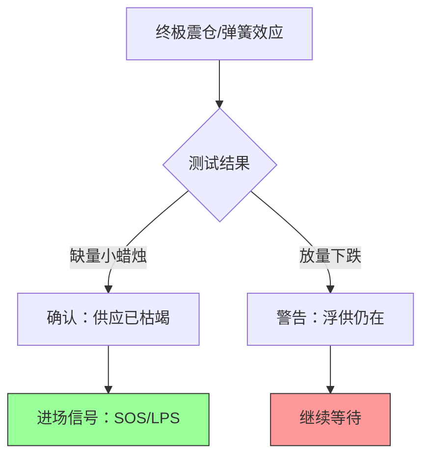
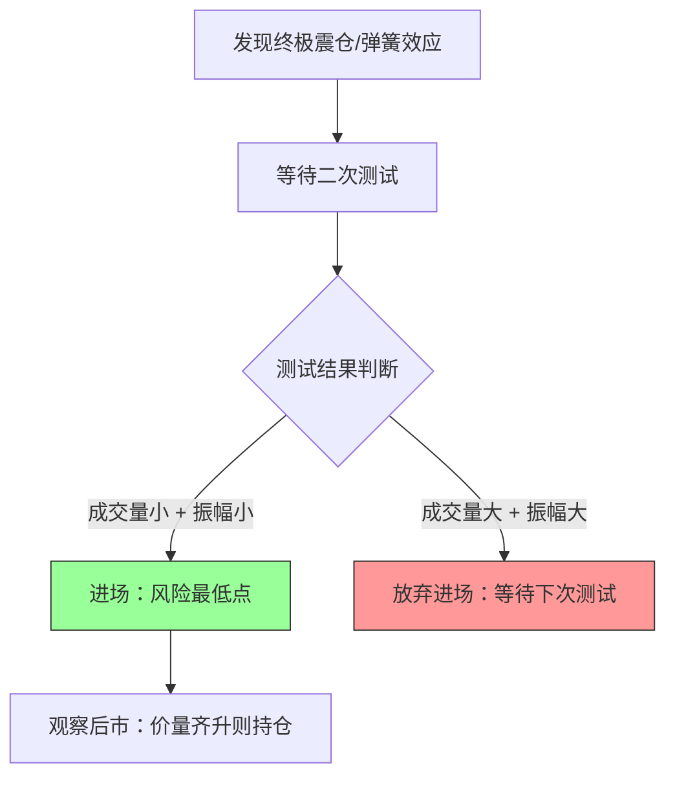

# 第四节 吸筹的第三阶段

## 核心思想

**第三阶段 = 吸筹完成的确认阶段**

从吸筹中期进入到最后阶段，[CM](../术语速查手册.md#cm-composite-man)的核心任务发生了转变：**从被动吸收转为主动测试**。通过终极震仓或弹簧效应来测试市场上是否还有股票供应，**以此区别这是吸筹还是派发（再派发）**，并确认吸筹是否已经完成。

> **关键信号**：终极震仓/弹簧效应后的[**二次测试**](../术语速查手册.md#st-secondary-test)是风险最低的进场点。

---

## 一、测试工具：终极震仓与弹簧效应

### 📊 图2-8：终极震仓示意图

### 1. 定义与区别

| 现象         | 表现形式           | 含义                     | 信号             |
| :----------- | :----------------- | :----------------------- | :--------------- |
| **终极震仓** | 深度跌破吸筹区支撑 | 大幅度下穿，随后快速收回 | **吸筹结束信号** |
| **弹簧效应** | 短暂轻微突破支撑   | 小幅度下穿               | 震仓的温和版     |

**共同目的**：都是 CM 用来判断突破时的供应量。

### 2. CM的三大任务

| 任务      | 方法         | 目的             | 结果           |
| :-------- | :----------- | :--------------- | :------------- |
| **任务1** | 迅速冲破支撑 | 吸收市场剩余股票 | 扫清底部浮筹   |
| **任务2** | 深度恐慌下跌 | 迫使弱者清仓     | 筹码转入CM手中 |
| **任务3** | 制造熊市假象 | 隐藏即将拉升真意 | 最后的诱空     |

---

## 二、测试逻辑：供应是否耗尽？

### 1. 震仓测试流程

### 2. CM的必然选择

> **关键逻辑**：一旦市面上股票被全部吸收（浮供稀缺），CM **只能抬高价格**吸筹，而无法再压价吸筹。因为底部已无货可买，压价只会让别人捡廉价筹码。这也意味着**牛市不可避免地开启**。

### 3. 判断标准：二测 vs 真跌

这是最关键的判断点：**如何区分是成功的二次测试（买点）还是真正的趋势下跌（逃命点）？**

| 维度         | ✅ 成功二测 (吸筹结束)    | ❌ 真实下跌 (派发/未完)  |
| :----------- | :----------------------- | :---------------------- |
| **成交量**   | **极度缩量** (没人卖了)  | **放量** (大量供应涌出) |
| **蜡烛形态** | **小阴线/十字星** (窄幅) | **大阴线** (宽幅)       |
| **支撑表现** | 迅速收回支撑之上         | 无法收回，继续创新低    |
| **后续走势** | 出现长阳反弹             | 伴随阴跌或急跌          |

---

## 三、实战操作：如何安全进场

### 1. 进场决策流

### 2. 二次测试的交易信号

| 结果     | 表现特征    | 含义           | 交易信号            |
| :------- | :---------- | :------------- | :------------------ |
| **成功** | 小蜡烛+缺量 | 供应已全被吸收 | ✅ **进场 (最稳妥)** |
| **失败** | 大蜡烛+放量 | 还有浮供未清   | ❌ **等待 (风险高)** |

---

## 四、核心总结与避坑

### 1. 常见实战误区

| 误区             | 错误                   | 后果                   |
| :--------------- | :--------------------- | :--------------------- |
| **看到跌破就跑** | 不知道这是测试（假跌） | 在底部被甩出，错过牛市 |
| **直接去追震仓** | 不等二次测试           | 如果震仓失败，会被深套 |
| **忽视成交量**   | 只看价格新低           | 无法判断是真跌还是诱空 |

### 2. 本节核心回顾

*   **第三阶段本质**：不是为了买更多（虽然也在买），而是为了**测试**卖盘是否干净。
*   **为何要等二测**：震仓本身看起来很像下跌，只有**缩量二测**才能证明那是CM在吸筹，而不是真跌。
*   **最佳进场点**：不在震仓最低点（太难抓），而在**二测确认点**（确定性最高）。

---

## 🔗 阶段演进表

| 阶段         | 核心任务     | 关键行为          | 我们的应对 |
| :----------- | :----------- | :---------------- | :--------- |
| **第一阶段** | 停止下跌     | 恐慌抛售/初次支撑 | 观望       |
| **第二阶段** | 被动吸筹     | 疲劳战术/反复打压 | 等待       |
| **第三阶段** | **主动测试** | **终极震仓/二测** | **进场**   |
