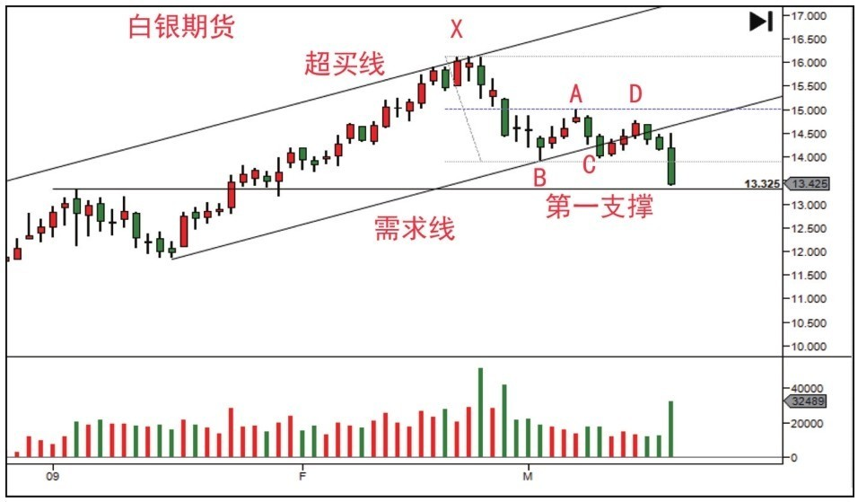
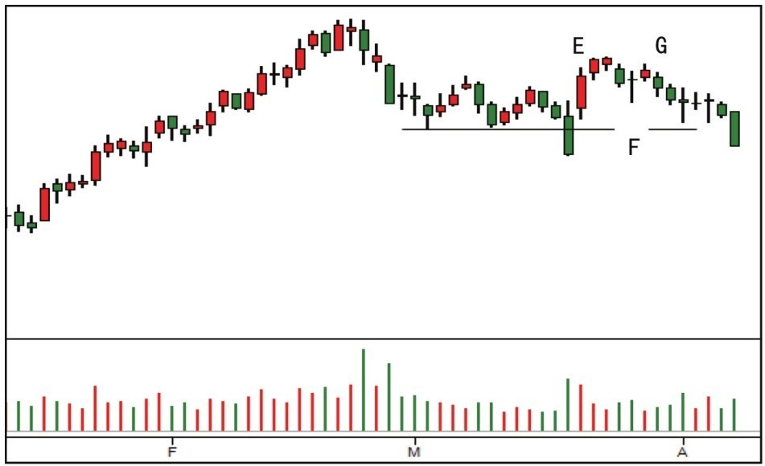

# 第一节 趋势反转与多框架协同

本节通过三个实战案例，深入探讨如何利用多时间框架锁定反转点、识别无需求反弹陷阱，以及在阻力位利用停止行为进行决策。

---

## 一、案例 1：多框架锁定反转点 (图 5-1, 5-2)

### 1. 案例分析 (2009年3月初 标普期货)

- **日线背景**：明显的熊市轨道。蜡烛 A-B 贴着超卖线，但需求尚未显现，盲目抄底极为危险。
- **小时图切入 (图 5-2)**：

1. **放量急涨 (蜡烛 1)**：抹掉前 5 根跌幅。不仅要看力量，更要看后续测试。
2. **测试确认**：蜡烛 1 后的无量回调奠定了吸筹基础。蜡烛 4 跌破低点进行震仓，随后成交量消失，确认**供应枯竭**。
3. **决策基础**：日线 C 对应小时图的成功二次测试位，具备看涨理论基础。

### 2. [实战结果] 验证分析 (图 6-1)

- **日线跟进 (D)**：日线出现上涨跟随，确认了小时图的早期信号。
- **JOC 突破 (E)**：跳离供应区，行情进入需求主导的牛市。
- **结论**：小时图的重要性在于它能更早、更清晰地展示吸筹阶段，而日线则提供大背景支撑。

---

## 二、案例 2：供应背景下的无需求反弹 (图 5-3)

### 1. 案例分析 (上升趋势中的卖盘介入)

- **行为变化 (X)**：放量且高低价差扩大的下跌，说明背景已转为由卖盘控制。
- **无需求上涨 (B-A)**：回调三天的成交量递减，说明买方缺乏扭转局势的需求援军。
- **停止行为 (A)**：上影线加低量，说明供应轻易压制了微弱的需求。

### 2. [实战结果] 验证分析 (图 6-2, 6-3)

- **预测证实**：价格跌破需求线。在 D 处的再次无需求反弹（递减量）是极佳的做空点。
- **恐慌抛售/震仓**：最后一天的长阴伴随巨量，符合震仓特征。如果是吸筹前的震仓，之后应有迅速反弹。

- **反弹夭折 (E)**：虽有反弹，但 E 之后成交量急跌，需求后续无力。
- **测试失败 (F, G)**：F 处的测试结果导致放量下跌 (G)，卖盘最终赢得市场控制权。

---

## 三、案例 3：面对阻力位的停止行为 (图 5-4)

### 1. 案例分析 (死角与 SOT)

- **底部确立 (1-3)**：底部抬高，成交量递减，死角处的向上突破确认了吸筹。
- **幅度递减 (SOT)**：观察 B 与阻力位的距离，上涨幅度明显减小。
- **阻力测试 (X)**：在冰线（前期阻力）处未能放量突破，说明市场缺乏吸收供应的需求。

### 2. [实战结果] 验证分析 (图 6-4)

- **结论**：X 之后的一根放量长阴确认了阻力位的停止行为。在熊市大背景下，阻力位的 SOT 是明确的做空信号。

---

## 📈 核心知识点总结

| 信号/工具            | 实战意义            | 核心逻辑                                         |
| :------------------- | :------------------ | :----------------------------------------------- |
| **多时间框架 (MTF)** | 寻找精准进场点      | 趋势看日线，入场看小时线（需求先行）。           |
| **无需求反弹**       | 识别假突破/诱多陷阱 | 缩量上涨发生在供应背景下，是做空信号。           |
| **SOT (幅度递减)**   | 识别趋势穷尽        | 突破幅度的连续减小，意味着“努力没有结果”。       |
| **震仓 (Shakeout)**  | 吸筹前的终极恐慌    | 极低位的巨量长阴，若随后迅速反弹，则确认为洗盘。 |

---

## 🔗 导航

- [← 返回本章目录](./README.md)
- [→ 第二节: 供应压力与无需求反弹](./第二节_供应压力与无需求反弹.md)
- [↑ 返回总目录](../README.md)
