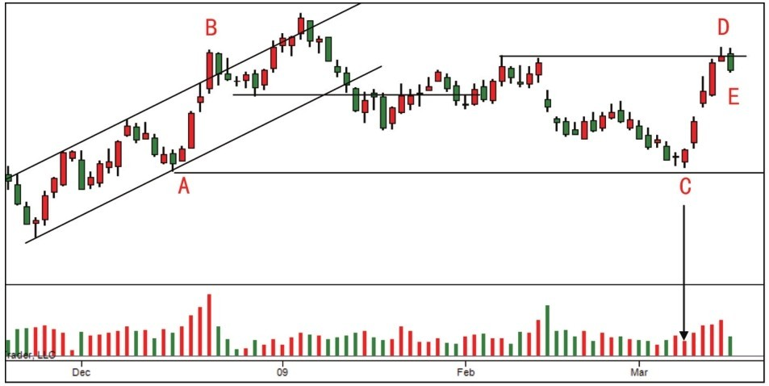
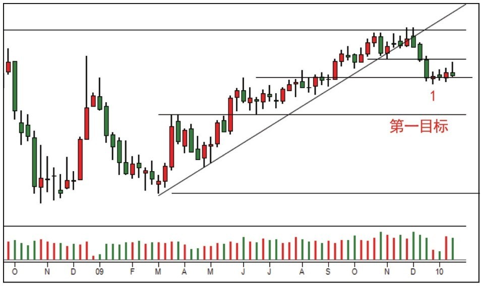
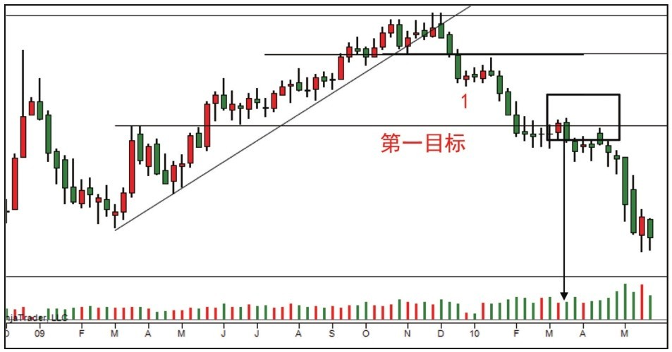

# 第七节 Spring 失效与进场判定

本节探讨在不同背景下 Spring 的表现、回测 50% 位置的重要性，以及如何通过无需求反弹识别趋势的终结。

---

## 一、案例 6：需求背景下的 50% 回调 (图 5-7, 5-8)

### 1. 案例分析 (回调深度与吸收)

- **停止行为 (D)**：量增价缩，说明上涨遇阻。
- **无量回调 (E)**：从 D 开始的回调成交量迅速缩小，说明没有供应参与。
- **牛市守则**：只要价格挺在 50% 位置之上（如 AB 波段所示），牛市逻辑即未受威胁。

### 2. [实战结果] 验证分析 (图 6-9)

- **验证**：蜡烛 E 处的威胁被需求立刻吸收。DE 段的本质是短暂的吸收过程，随后的上扬确认了需求控制权。

---

## 二、案例 20：趋势转折点的无需求反弹 (图 5-26)

### 1. 案例分析 (死角压力与测试)

- **背景转变**：放量阴线突破上升趋势线和死角。
- **反弹虚弱 (1)**：连续 4 个小蜡烛反弹，成交量虽在最后增加，但收盘在低点。这是典型的**阻力位需求衰竭**。

### 2. [实战结果] 验证分析 (图 6-26)

- **结论**：预期的支撑被放量跌破。支撑位 (JOC 回测点) 的突破过程成交量扩大，且由于随后反弹无力，确认了熊市背景的延续。

---

## 三、案例 23：供应控制下的 Spring 失效 (图 5-30)

### 1. 案例分析 (抢购高潮后的陷阱)

- **背景预判**：背景中出现了跳空阴线且放量，说明卖压增强。
- **Spring 逻辑 (1)**：虽然 1 处是标准的 Spring 形状，但由于背景由供应控制，其成功率骤降。

### 2. [实战结果] 验证分析 (图 6-29)

- **结论**：Spring 后出现增量阴线并跌破趋势线，需求毫无抵抗。这证明在**卖盘背景下，Spring 经常失败**，甚至可能成为做空信号。

---

## 四、案例 24：细节锁死——需求与供应的生死线 (图 5-31)

### 1. 案例分析 (力量对比与多空决战)

- **行为改变 (2)**：放量下挫（蜡烛 2）明显确认了供应在持续。
- **细节观测**：2 之后的长阳反弹未创新高，随后 3 处的阴线收盘于底部，说明在高位存在重重压制。

### 2. [实战结果] 验证分析 (图 6-30)

- **结论**：蜡烛 5 最终跌破冰线。CM 撤掉支柱后，价格在无需求反弹 (6) 后陷入崩盘。冰线的贯穿意味着原趋势的彻底终结。

---

## 📈 核心知识总结

| 信号/工具                | 操作警戒           | 判定逻辑                                                   |
| :----------------------- | :----------------- | :--------------------------------------------------------- |
| **Spring 性质判定**      | 背景第一，图形第二 | 卖盘背景下的 Spring 是诱多陷阱；买盘背景下才是进场点。     |
| **50% 支撑检测**         | 趋势强度尺         | 成功的 JOC 后，回调应止于 50% 或更高位。                   |
| **阴阳线对比**           | 多空力量直观图     | 牛市阳线大于阴线；熊市阴线大于阳线；比例失调即是变天信号。 |
| **冰线宣告 (Ice Break)** | 最后的审判         | 它是 CM 设立的心理底线，也是多头的最后一道防线。           |

---

## 🔗 导航

- [← 第六节: 回测验证与超卖线应用](./第六节_回测验证与超卖线应用.md)
- [↑ 返回总目录](../README.md)
