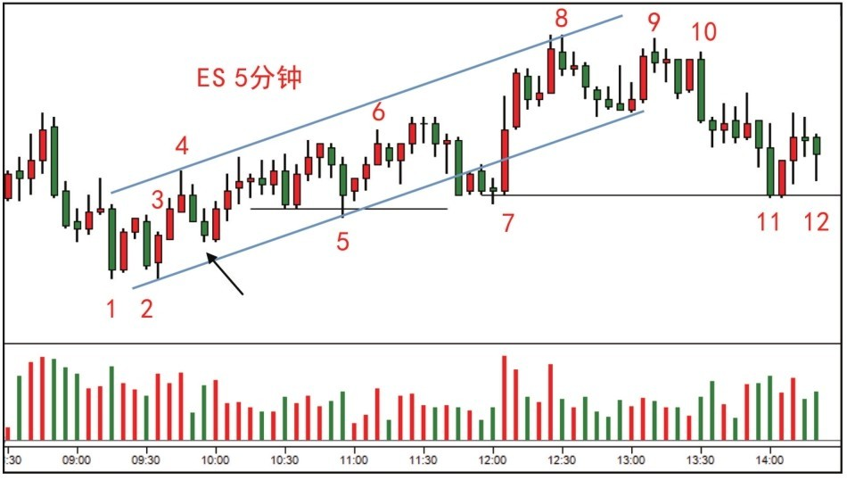
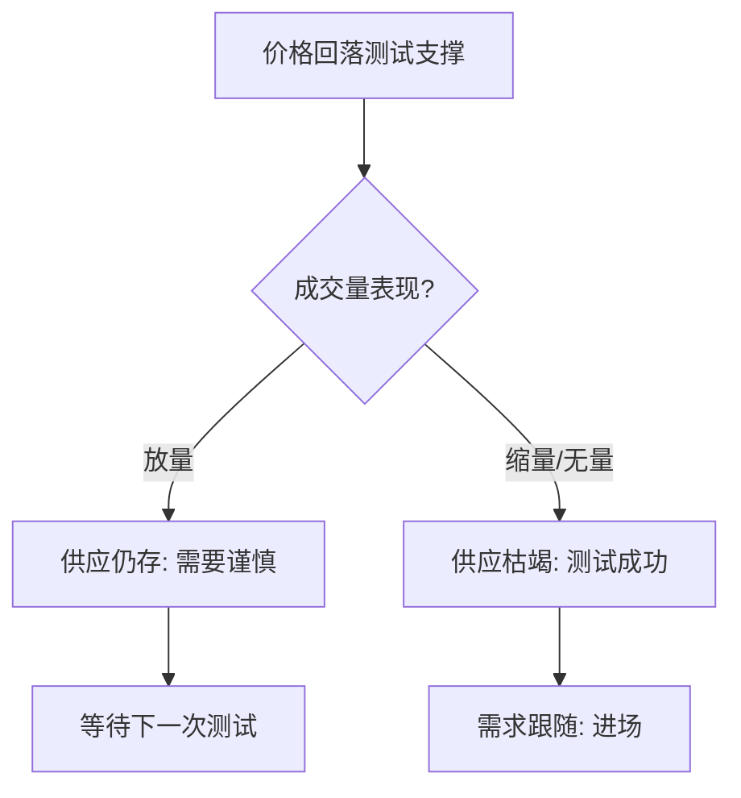
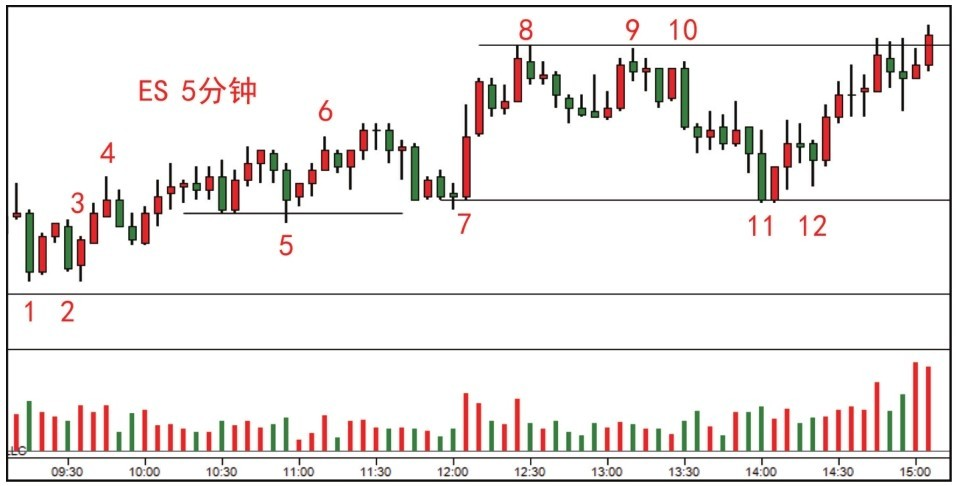
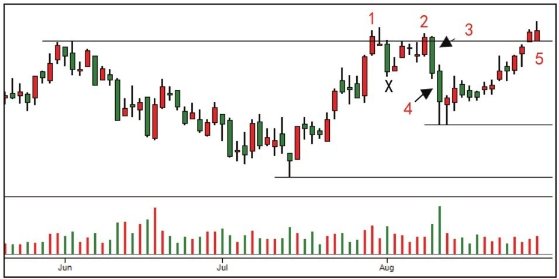
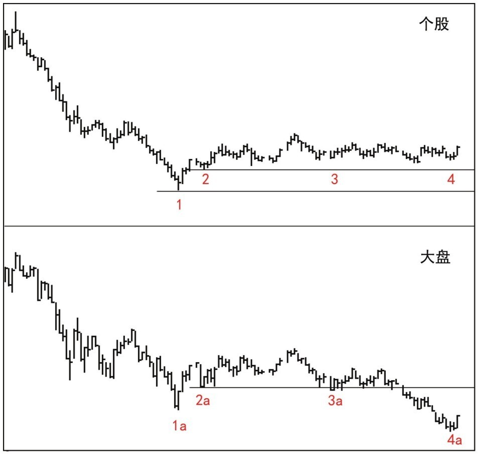

# 第三节 支撑阻力与吸收行为分析

## 核心思想

本节重点探讨如何通过价量关系分析**支撑位的坚实度**与**阻力位的吸收行为**。同时，介绍一种从大盘背景下挑选强势个股的高效方法——**[相对强弱分析 (RS)](../术语速查手册.md#相对强弱-rs)**，这是识别 [CM](../术语速查手册.md#cm-composite-man) 逆势吸筹意图的关键手段。

---

## 一、案例 11：支撑位上的供求关系判定 (图 5-14)

### 1. 案例分析 (二次测试的逻辑)



- **理论基础**：进场后需看到连续上涨伴随增量。
- **危机管理**：若出现小成交量、小蜡烛的无需求反弹，或放量阴线回测，应立即离场。

#### 二次测试 (Secondary Test) 判定流



### 2. [实战结果] 验证分析 (图 6-14)



- **成功信号 (12)**：蜡烛 12 是成功的[二次测试](../术语速查手册.md#st-secondary-test)。[CM](../术语速查手册.md#cm-composite-man) 通过故意压价诱导空头，但低量证明供应已枯竭。
- **确认跟随**：测试后出现带量上涨，目标位锁定前期被套公众的阻力区。

---

## 二、案例 12：识别阻力位的“吸收”陷阱 (图 5-15, 5-16)

### 1. 案例分析 (停止行为与 UT)



- **停止行为 (1)**：量增但价浮缩小，说明阻力明显。
- **[上冲回落 (UT)](../术语速查手册.md#ut-upthrust)**：随后的新高配合缩量且收于低点，是 CM 引诱追高的典型陷阱。
- **无需求反弹 (2-5)**：反弹波段充斥着小成交量，显示供应控制了大环境。

### 2. [实战结果] 验证分析 (图 6-15, 6-16)


- **转弱确认 (6)**：蜡烛 6 作为包容阴线（OKR），确认了供应完全战胜需求，否定了 [JOC](../术语速查手册.md#joc-jump-across-the-creek) 的可能性。


- **破冰逻辑**：50% 原则确认跌势延续。价格跌破“[冰线](../术语速查手册.md#ice-line-ice)”意味着 CM 已撤掉防御，公众彻底陷于套牢。

---

## 三、案例 13：相对强弱分析与选股实战 (图 5-17, 5-18)

### 1. 核心理论 (对比分析法)
- **强势特征**：大盘走弱时个股横盘（回调不足 50%）；大盘恢复时个股涨幅更大。
- **行为逻辑**：大资金（[CM](../术语速查手册.md#cm-composite-man)）在利用大盘恐慌积极收购优质筹码。

#### 相对强弱 (RS) 选股逻辑

```mermaid
graph TD
    A[大盘创新低] --> B{个股表现?}
    B -- 同步新低 --> C[弱势股: 跟随大盘]
    B -- 拒绝新低/横盘 --> D[强势股: **[CM](../术语速查手册.md#cm-composite-man)** 在吸筹]
    D --> E[大盘企稳] --> F[个股率先领涨]
```

### 2. 案例解析 (个股与大盘对比)



- **关键 point (4 vs 4a)**：大盘创新低，个股却稳守支撑，暴露了 **[CM](../术语速查手册.md#cm-composite-man)** 的积极介入。

区间深度剖析](../wyckoff_content/OEBPS/Image00118.jpg)

- **[吸筹](../术语速查手册.md#accumulation)特征**：
    - **低位区间**：[CM](../术语速查手册.md#cm-composite-man) 为了控制成本，在特定价位设置阻力，静静收购。
    - **[JOC](../术语速查手册.md#joc-jump-across-the-creek)** 确认：第二个放量突破宣告吸筹结束，上涨开始。

### 3. [实战结果] 验证分析 (图 6-17)


- **验证**：[JOC](../术语速查手册.md#joc-jump-across-the-creek) 后的低量回测 (d) 是完美进场点。随后出现的连续阳线、更高收盘价确认了牛市趋势。

---

## 📈 核心知识总结

| 分析工具                                                              | 操作意义       | 判定标准                                 |
| :-------------------------------------------------------------------- | :------------- | :--------------------------------------- |
| **[二次测试 (Secondary Test)](../术语速查手册.md#st-secondary-test)** | 确认趋势反转   | 极小量回测支撑位，价差收窄。             |
| **OKR (Outside Key Reversal)**                                        | 标志供应夺权   | 阴线吞没前阳实体，伴随成交量显著增长。   |
| **相对强弱 (RS)**                                                     | 个股筛选       | 大盘跌时它不跌，大盘稳时它领涨。         |
| **[冰线 (Ice Line)](../术语速查手册.md#ice-line-ice)**                | 派发的最后支撑 | 这里的突破标志着派发完成，深度下跌开始。 |

---

## 🔗 导航

- [← 第二节: 供应压力与无需求反弹](./第二节_供应压力与无需求反弹.md)
- [→ 第四节: 冰线交易法与SOT停止行为](./第四节_冰线交易法与SOT停止行为.md)
- [↑ 返回总目录](../README.md)
