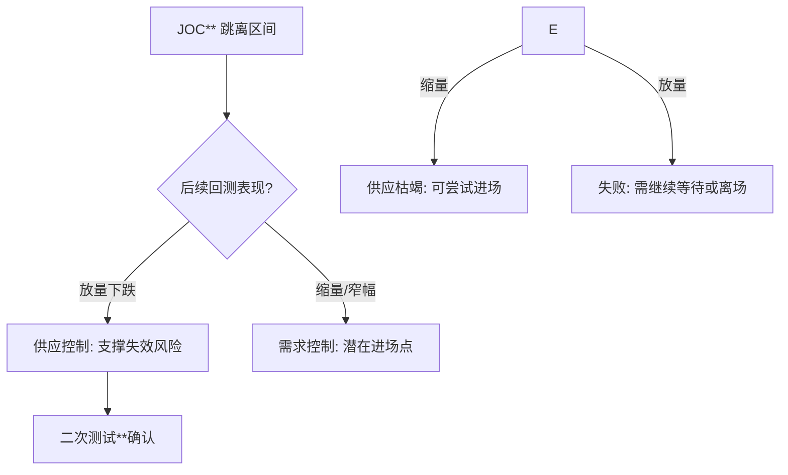
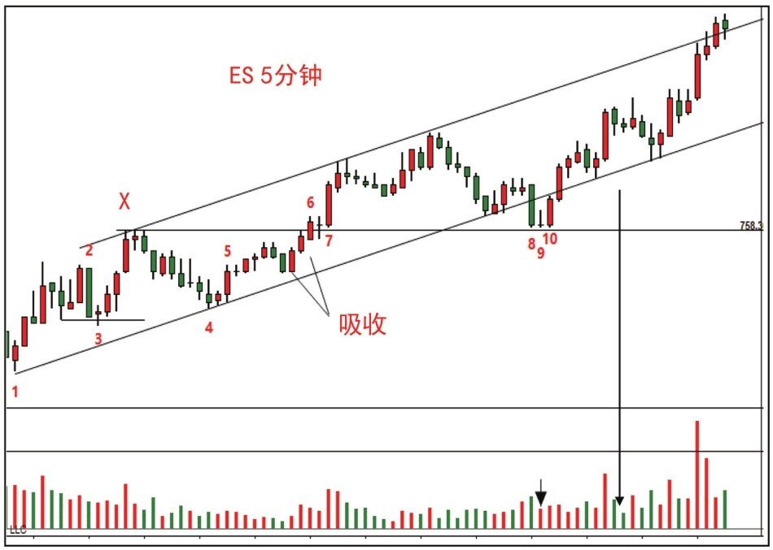

# 第二节 供应压力与无需求反弹

## 核心思想

本节通过两个经典案例，分析如何在上升趋势中识别虚弱的反弹，以及如何利用“**震仓**”与“[**吸收行为**](../术语速查手册.md#st-secondary-test)”锁定高胜率的进场机会。核心在于识别**供应的表达方式**：是压倒性的抛压，还是主力刻意制造的恐慌（**震仓**）。

---

## 一、案例 4：JOC 后的支撑位无力反弹 (图 5-5)

### 1. 案例分析 (上升轨道中的供应介入)


- **强势背景**：价格出现[**JOC**](../术语速查手册.md#joc-jump-across-the-creek)** (跳离区间)**，伴随量价齐升。
- **超买预警 (X)**：价格触及[**超买线**](../术语速查手册.md#overbought)后回落。此时需观察回落过程是否伴随卖盘增加。
- **进场准则**：价格回到跳离区间的支撑位（[**JOC**](../术语速查手册.md#joc-jump-across-the-creek)起始点）处，必须观察供应是否枯竭。如果出现低量、窄价差的**停止行为**，则为买入时机。

#### JOC 回测判定逻辑



### 2. 

[实战结果] 验证分析 (图 6-5, 6-6, 6-7)


- **转弱信号 (1)**：放量下跌，表明供应控制市场。需求线未能提供支撑，价格破位。
- [**二次测试**](../术语速查手册.md#st-secondary-test)** (2-3)**：
    - 蜡烛 2：成交量大，说明供应未枯竭，不符合进场条件。
    - 蜡烛 3：成交量缩小，供应开始真空，由于环境极度脆弱，需求只需微调即可反弹。


- **震荡夯实 (4-5)**：
    - 蜡烛 4：新的[**二次测试**](../术语速查手册.md#st-secondary-test)，无卖盘扩大。
    - 蜡烛 5：支撑位上的[**二次测试**](../术语速查手册.md#st-secondary-test)，低点抬高。此时价格进入“**死角**”，需求稍作努力即可引发喷发。


- **结果**：蜡烛 6 成功突破**死角**，验证了底部的需求优势。

---

## 二、案例 5：吸收行为、JOC 与震仓 (图 5-6)

### 1. 案例分析 (吸筹过程中的逻辑辨析)


#### **关键动作序列分析：**
1. **停止行为**** (1)**：高量、收窄价差、高位收盘，标志需求介入。
2. **疑似****震仓**(2-3)**：蜡烛 2 猛跌但无量，3 处卖盘无跟随且形成 **Spring**。确认 2 是**震仓**行为而非供应。
3. **无需求下滑 (X-4)**：价格在突破 X 后小碎步低量下滑。[CM(狗庄)](../术语速查手册.md#cm-composite-man)故意不竞价，旨在甩掉买突破的公众。
4. [**吸收行为**](../术语速查手册.md#st-secondary-test)** (5-6)**：在阻力位附近的回调缩量，说明阻力处的供应已稀少。蜡烛 6 的放量[JOC](../术语速查手册.md#joc-jump-across-the-creek)确认了吸收结束。
5. **震仓**突破 (8-10)**：蜡烛 8 强力破位具有威胁，但紧随其后的 9 处成交量骤降，说明供应未能持续。

#### 震仓 vs 派发 识别逻辑

```mermaid
graph TD
    A[阻力位附近的震荡] --> B{出现急跌?}
    B -- 是 --> C{是否有卖盘跟随?}
    C -- 否 (缩量/**Spring**) --> D**[震仓**: 扫清浮筹]
    C -- 是 (放量/阴线) --> E**[派发**: 趋势转弱]
    D --> F[快速收复跌幅] --> G"吸收完成: 准备 **[JOC"** 突破]
```

### 2. 

[实战结果] 验证分析 (图 6-8)



- **结论**：蜡烛 10 的大幅反弹形成了[**SOS**](../术语速查手册.md#sos-sign-of-strength)** (强势信号)**。随后的低量测试确认了趋势的牛市性质。在这种背景下，低位**震仓**反而是大型**吸筹**的终极表现。

---

## 📈 核心知识点总结

| 信号/工具                                              | 实战意义         | 关键逻辑                                                                                              |
| :----------------------------------------------------- | :--------------- | :---------------------------------------------------------------------------------------------------- |
| **正常回调**                                           | 确认趋势持续     | 回调幅度小于上涨的 50%，且成交量显著缩小。                                                            |
| **吸收行为 (Absorption)**                              | 突破前的最后确认 | 价格在阻力位下方横盘，回调缩量，说明卖单被[CM(狗庄)](../术语速查手册.md#cm-composite-man)全部吃掉。 |
| **死角 (Death Zone)** | 波动爆发的前兆   | 价格在窄幅震荡中伴随成交量枯竭，预示动力即将释放。                                                    |
| **震仓 (Shakeout)**     | 扫清浮动供应     | 极速猛跌但随后快速收复，目的是让不坚定的公众交出筹码。                                                |
