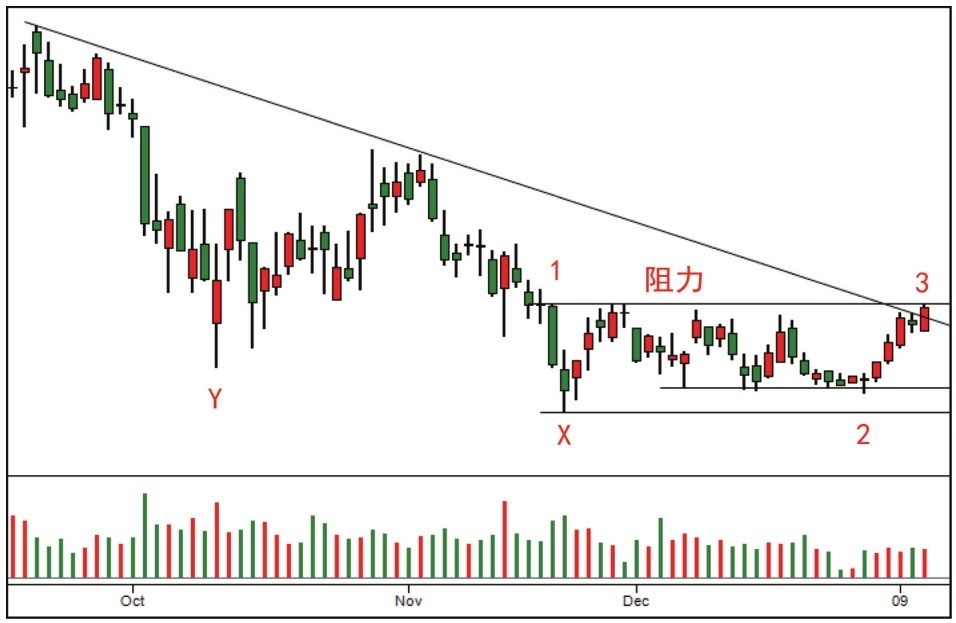
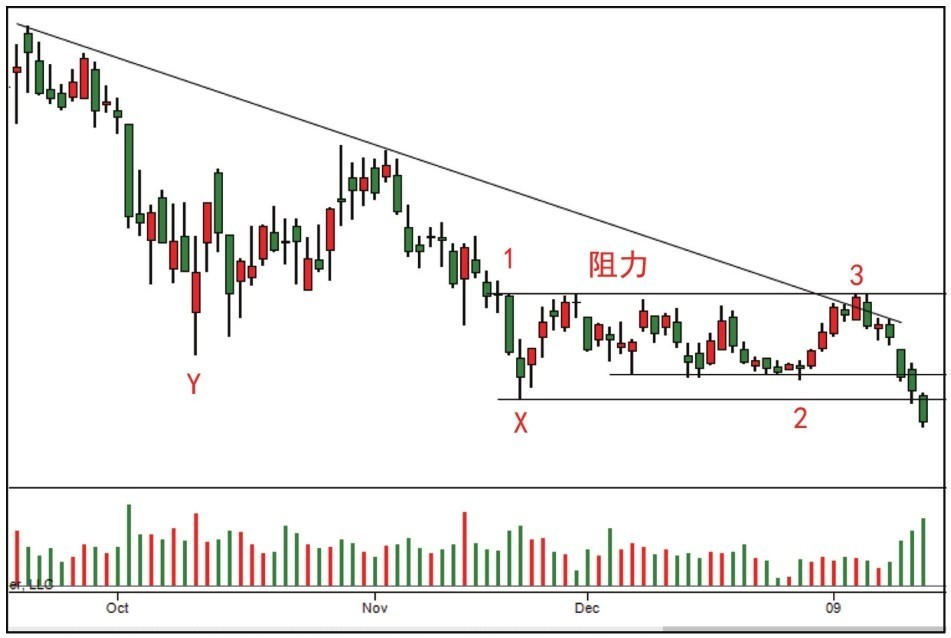
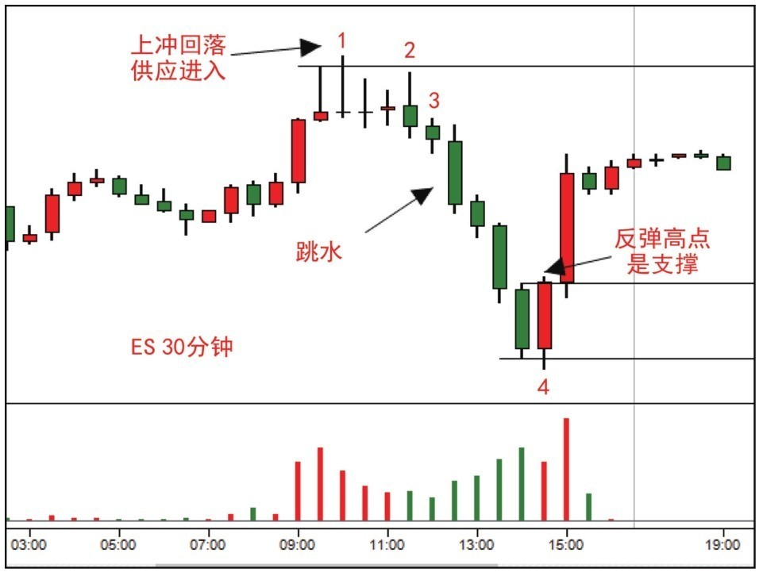
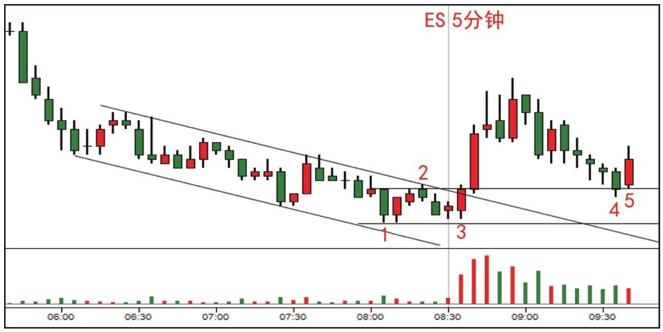

# 第五节 震荡区分析与震仓实战

## 核心思想

本节重点探讨如何通过“**垂直供应柱**”精确界定震荡区边界，以及如何区分市场中看似相似但本质迥异的“**[震仓 (Shakeout)](../术语速查手册.md#shakeout)**”与“**[派发 (Distribution)](../术语速查手册.md#distribution)**”。掌握这些技巧，有助于在趋势反转初期识别关键测试行为。

---

## 一、案例 9：通过垂直供应柱界定震荡区 (图 5-11, 5-12)

### 1. 案例分析 (阻力线的界定)



- **阻力线划定**：蜡烛 1 是**垂直供应柱**（放量大阴跌破位），其顶部是核心供应源。突破此处是转牛的前提。
- **吸筹迹象**：抛售高潮 (Y) 后进入震荡区，成交量随时间减小。蜡烛 2 处的抬高支撑与 **[Spring](../术语速查手册.md#spring)** 确认了吸筹在进行。
- **关键分歧 (3)**：价格到达阻力区 (3)，若无强势上涨 (**[JOC](../术语速查手册.md#joc-jump-across-the-creek)**)，则吸筹逻辑尚不能盖棺定论。

#### 阻力有效性判定

```mermaid
graph TD
    A[暴跌大阴线(垂直供应柱)] --> B[界定阻力位]
    B --> C[价格反弹至阻力]
    C --> D{能否JOC突破?}
    D -- 否 (UT/上影线) --> E[吸筹失败: 仍受压制]
    D -- 是 (大阳线) --> F[吸筹成功: 牛市开启]
```

### 2. [实战结果] 验证分析 (图 6-12)



- **失败判定**：蜡烛 3 后未能出现 **[JOC](../术语速查手册.md#joc-jump-across-the-creek)**，反而随价格下跌成交量递增。由于右手边缺乏强势表现（**[SOS](../术语速查手册.md#sos-sign-of-strength)**），原来的吸筹假设被否定，牛市未能开启。
- **教训**：牛市反转必须看到右手边的强势上涨确认。

---

## 二、案例 10：识别牛市中的震仓行为 (图 5-13)

### 1. 案例分析 (UT、停止行为与震仓)



- **转弱尝试 (1-3)**：阻力区出现 **[UT](../术语速查手册.md#ut-upthrust)**（上冲回落）且伴随高量上影线。随后 2-3 处需求不足，行情看跌。
- **震仓定义 (4)**：随后长阳迅速反弹。**牛市震仓**的特点是：突然放量猛跌（受消息刺激）但无卖盘跟随，且能在短时间内被迅速收复。

#### 牛市震仓判定流

```mermaid
graph TD
    A[牛市震荡整理] --> B[突发利空急跌]
    B --> C{后续表现?}
    C -- 持续阴跌 --> D[真破位: 离场]
    C -- 迅速反包(V型) --> E[**[震仓](../术语速查手册.md#shakeout)**: 假摔]
    E --> F[突破前高] --> G[趋势延续]
```

### 2. [实战结果] 验证分析 (图 6-13, 6-14)


- **后续走势**：案例 10 提醒我们，如果**[震仓](../术语速查手册.md#shakeout)**后能创新高则牛市继续。但在本例后续中，价格回到供应区却动力枯竭，导致大量卖盘涌入，最终引发深度下跌。

---

## 三、案例 18：趋势反转后的回测进场 (图 5-23)

### 1. 案例分析 (跳离点与无量回测)


- **背景反转**：蜡烛 3 的放量反弹及其后的 **[JOC](../术语速查手册.md#joc-jump-across-the-creek)** 标志着从熊市转为牛市。
- **进场条件**：需等待价格回落至跳离点进行“无量测试”。

### 2. [实战结果] 验证分析 (图 6-22, 6-23)



- **成功进场 (4-5)**：蜡烛 4 是完美的 **[Spring](../术语速查手册.md#spring)** 测试，成交量极低说明供应已枯竭。蜡烛 5 的阳线是最终确认。
- **策略视角**：主力机构在牛市初期的低量拉升，旨在不惊动公众的情况下悄然建仓。

---

## 📈 核心知识总结

| 信号/现象                                                   | 核心逻辑     | 实战行动                                                                                    |
| :---------------------------------------------------------- | :----------- | :------------------------------------------------------------------------------------------ |
| **垂直供应柱**                                              | 供应源头     | 其顶部是区间最重要的阻力位，需 JOC 突破。                                                   |
| **右手边原则**                                              | 吸筹强弱判定 | 震荡区右侧必须看到强势拉升 ([SOS](../术语速查手册.md#sos-sign-of-strength))，否则吸筹无效。 |
| **[震仓 (Shakeout)](../术语速查手册.md#shakeout)**          | 洗盘确认     | 猛跌后需立即伴随快速强力反弹，否则应视为破位。                                              |
| **[低量回测 (Test)](../术语速查手册.md#st-secondary-test)** | 进场信号     | 在 JOC 之后，如果回落至跳离点且量能全无，说明“卖压已无”，是起飞信号。                       |

---

## 🔗 导航

- [← 第四节: 冰线交易法与 SOT 停止行为](./第四节_冰线交易法与SOT停止行为.md)
- [→ 第六节: 回测验证与超卖线应用](./第六节_回测验证与超卖线应用.md)
- [↑ 返回总目录](../README.md)
