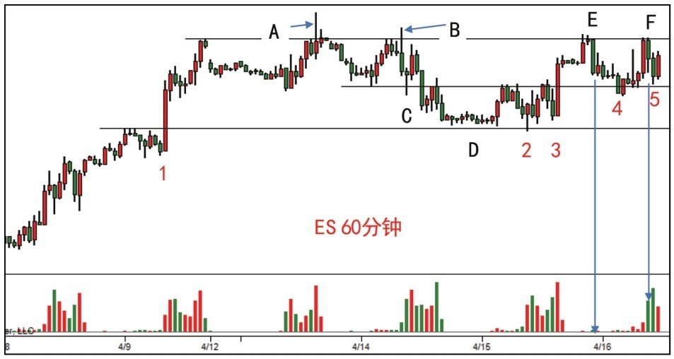
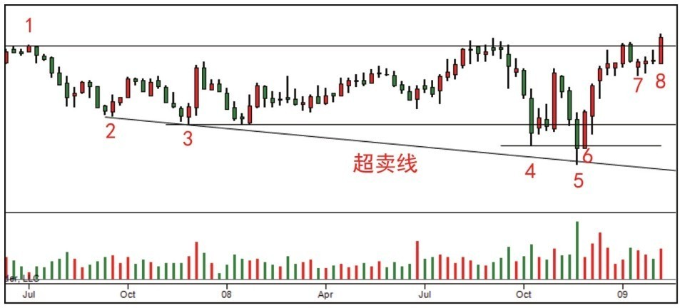
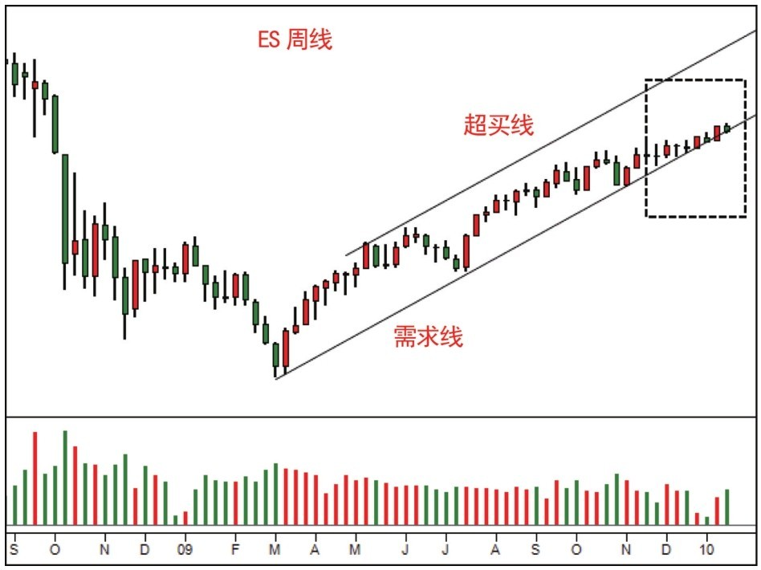

# 第六节 回测验证与超卖线应用

本节探讨如何判定 JOC 后的回测成功与否，如何利用超卖线预判反转，以及在牛市背景下区分震仓与派发。

---

## 一、案例 14：如何判断 JOC 后的回测 (图 5-19)

### 1. 案例分析 (回测中的供应观测)

- **场景**：吸筹结束后的 JOC 突破。
- **威胁 (UT)**：突破后出现的 UT 说明浮动供应仍多，导致回落至支撑位（蜡烛 1）。
- **判定标准**：不能盲目抄底。需看到“努力没有结果”的停止行为，或随后的阳线反击（需求介入）。

### 2. [实战结果] 验证分析 (图 6-18)

- **成功信号 (2)**：蜡烛 2 的强势反弹确认了支撑位需求的存在。尽管 1 处的成交量不减说明卖方在努力，但缩窄的价差和高收盘暴露了卖方力量的衰竭。

---

## 二、案例 15：短线实战——震荡区内的多空博弈 (图 5-20)

### 1. 案例分析 (派发还是再吸筹？)

- **顶部威胁 (A, B)**：高量上影线（UT），看起来像派发。
- **底部支撑 (D, 2)**：回调至需求区时成交量消失，出现 Spring（2）。
- **确认吸筹 (3-5)**：价格回踩区间 50% 位置，蜡烛 5 的猛跌被阳线迅速收复，符合**震仓**特征。

### 2. [实战结果] 验证分析 (图 6-19)

- **JOC 确认**：接近阻力区时的“高收盘”显示了吸收行为，随后的 JOC 确认了再吸筹逻辑。
- **结语**：只要价格挺在 50% 之上，牛市逻辑即未受威胁。

---

## 三、案例 16：超卖线与终极震仓 (图 5-21)

### 1. 案例分析 (利用轨道预判低点)

- **超卖定义**：连接波谷延长的线即为超卖线。价格跌破此线往往预示反弹。
- **终极信号 (5)**：天量卖盘努力但价格未进一步大跌，属于“努力没有结果”。这是 CM 为了吸空筹码制造的**终极震仓**。
- **确认 (6)**：紧随其后的快速反弹收复了 5 的高点，确认底部的牢固。

### 2. [实战结果] 验证分析 (图 6-20)

- **验证**：价格回到阻力位时未见大回落，随后 JOC 跳离。回测跳离点时的无量表现是最佳进场点。

---

## 四、案例 19：供应缺失下的反转条件 (图 5-24, 5-25)

### 1. 案例分析 (周线与日线的背离)

- **结论辨析**：单靠“需求匮乏”不能反转牛市。必须看到**供应扩大**（增量大阴）出现在转弱背景下，趋势才会真正反转。

### 2. [实战结果] 验证分析 (图 6-24, 6-25)

- **转机 (6-8)**：跌破原有支撑后出现超卖，随后蜡烛 6 作为前期支撑的 Spring 触发。低量二次测试确认供应衰减，随后强势需求介入导致全面反转。

---

## 📈 核心知识总结

| 分析工具                     | 操作价值       | 核心逻辑                                                       |
| :--------------------------- | :------------- | :------------------------------------------------------------- |
| **超卖线 (Oversold Line)**   | 预判反转区域   | 价格跌破连接两个波谷的延长线，预示短期动能耗尽。               |
| **停止行为测试**             | 确认进场点     | 哪怕有高量，只要收盘在支撑上且后续被阳线吞没，说明“卖压已无”。 |
| **50% 支撑位**               | 趋势强度分水岭 | 强劲趋势的回调往往止步于前一波段的 50% 处。                    |
| **再吸筹 (Re-accumulation)** | 顺势加仓机会   | 在上升趋势的横盘区，看到底部抬高和 Spring 即可补仓。           |

---

## 🔗 导航

- [← 第五节: 震荡区分析与震仓实战](./第五节_震荡区分析与震仓实战.md)
- [→ 第七节: Spring 失效与进场判定](./第七节_Spring失效与进场判定.md)
- [↑ 返回总目录](../README.md)
