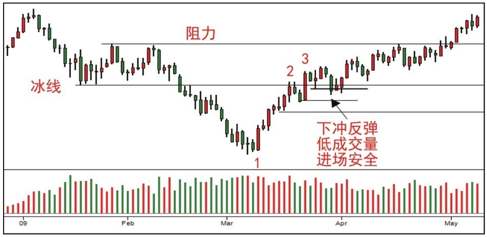
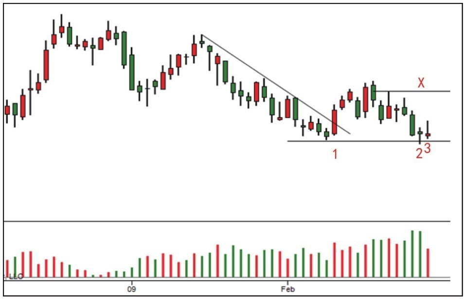
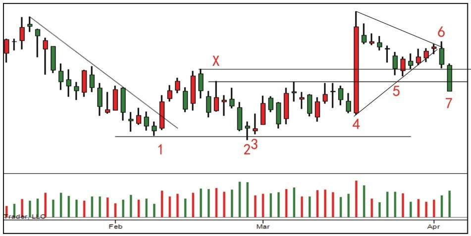
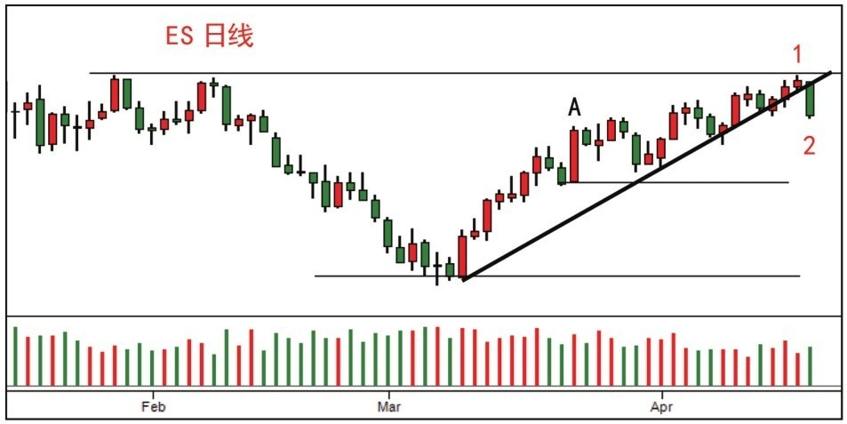
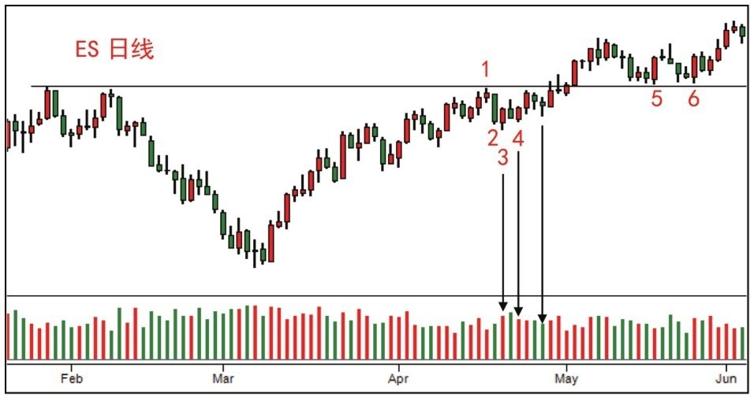

# 第四节 冰线交易法与 SOT 停止行为

本节探讨如何精准定位趋势转折点，涵盖了熊市背景下的“冰线”突破逻辑、上涨中的“SOT”减速信号，以及阻力位关键行为的后续验证。

---

## 一、案例 7：冰线交易法 (图 5-9)

### 1. 案例分析 (熊市中的反弹与突破)

- **趋势背景**：大环境为明显的熊市通道。
- **突破逻辑 (3)**：蜡烛 3 强力突破冰线和供应线。虽然表现强劲，但因速度过快，预判将有超买回落。
- **支撑定位**：
    - **第一支撑**：冰线（原阻力转支撑）。
    - **第二支撑**：蜡烛 3 的最低点。
    - **多空分界**：回调若超过 1-3 涨幅的 50%，则看涨逻辑失效。

### 2. [实战结果] 验证分析 (图 6-10)

- **调整验证**：价格回落并持稳于蜡烛 3 低点之上，说明卖盘被吸收。
- **进场点**：在 50% 位置出现的 **[Spring](../术语速查手册.md#spring)** 是绝佳的补仓/进场机会。

---

## 二、案例 8：SOT 停止行为与二次测试 (图 5-10)

### 1. 案例分析 (上涨幅度的衰减)

- **停止信号 ([SOT](../术语速查手册.md#sot-shortening-of-thrust))**：蜡烛 1 虽然突破了供应线，但随后阳线长度缩短，显示上涨动力（Thrust）在递减。
- **虚假破位 (2)**：蜡烛 2 虽带量创新低，但收盘在中点之上，实际上是 CM 在吸收割肉仓位的震仓。
- **关键测试 (3)**：随后的成交量大幅萎缩，说明供应已彻底枯竭，行情看涨。

### 2. [实战结果] 验证分析 (图 6-11)

- **趋势管控**：阳线低点不断抬高，确认需求控制市场。
- **转弱预警 (5-7)**：蜡烛 5 处的回测成交量过大且反弹无力，随后的 6-7 出现放量阴线，说明二次测试失败，行情转跌。

---

## 三、案例 17：阻力位后的“跟随”关键性 (图 5-22)

### 1. 案例分析 (拒绝下跌逻辑)

- **停止信号 (1)**：阻力位出现 SOT。
- **跟随博弈 (2)**：蜡烛 2 跌破支撑线，直观上利空。但成交量未显著扩大，是否是“陷阱”取决于次日的跟随表现。

### 2. [实战结果] 验证分析 (图 6-21)

- **吸收证据 (3-4)**：蜡烛 3 迅速反抽拒绝下跌。虽然 4 处的二次测试成交量仍大，但阳线收盘证明需求在积极吃货。
- **最终确认**：低位下跌幅度小于上涨，供应耗尽，最终迎来 **[JOC](../术语速查手册.md#joc-jump-across-the-creek) 突破**。

---

## 📈 核心知识总结

| 信号/工具                                                                  | 实战意义       | 核心逻辑                                                       |
| :------------------------------------------------------------------------- | :------------- | :------------------------------------------------------------- |
| **[冰线突破](../术语速查手册.md#ice-line-ice)**                            | 熊市结束的信号 | 突破后回测不深且量缩，是反转确认。                             |
| **[SOT (Shorten of Thrust)](../术语速查手册.md#sot-shortening-of-thrust)** | 预判趋势回调   | 连续突破的幅度越来越小，说明动力在流失。                       |
| **跟随 (Follow-through)**                                                  | 判定胜负手     | 每一个威胁信号（如破位阴线）都必须看到连续的卖盘跟随才算真实。 |
| **50% 原则**                                                               | 衡量趋势强度   | 回调不破前波 50%，趋势依然健康。                               |

---

## 🔗 导航

- [← 第三节: 支撑阻力与吸收行为分析](./第三节_支撑阻力与吸收行为分析.md)
- [→ 第五节: 震荡区分析与震仓实战](./第五节_震荡区分析与震仓实战.md)
- [↑ 返回总目录](../README.md)
