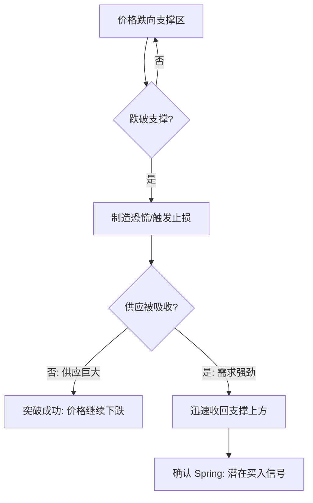
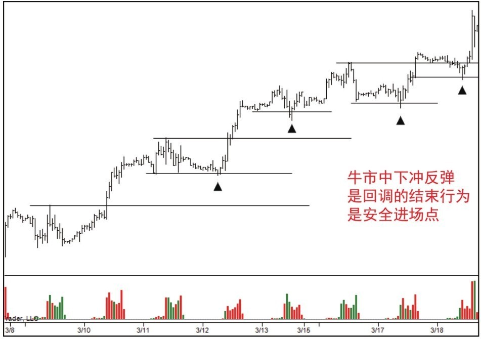

# 第一节 什么是Spring

## 核心思想

**Spring (弹簧效应)**，也称“下冲反弹”，是价格迅速跌破支撑位后又迅速返回支撑上方的市场行为。其本质是**下跌走势的停止行为**，是进入牛市或恢复牛市的强力信号。

---

## 一、Spring 的工作原理

Spring的名字源于伊文思先生。想象一个弹簧：压力越大、弹性越好，反弹就越高。

---

## 二、Spring 的目的与意义

### 1. CM(狗庄)的核心动机
- **吸纳筹码**：制造破位恐慌，诱导公众抛售，[CM(狗庄)](../术语速查手册.md#cm-composite-man)在低位接盘。
- **压力测试**：观察支撑附近是否仍有大量卖单（供应）。

### 2. 市场信号意义
- **牛市回调结束**：在上升趋势的回调中出现Spring，是恢复上涨的绝佳信号。
- **区间交易终结**：预示着震荡盘整即将结束，价格可能转向上行。

---

## 三、识别与风险控制 (图 4-1)

### 1. 识别标准
- **时间窗口**：价格跌破支撑后，通常应在 **1-3 根蜡烛** 之内回到支撑上方。
- **幅度与成交量**：
  - **小幅突破**：上涨概率更大。
  - **大幅突破 + 量增**：说明供应较重，需要[**二次测试**](../术语速查手册.md#st-secondary-test)（Secondary Test）确认卖盘是否彻底稀少。

### 2. 风控原则 (关键)
- **供求背景验证**：买入后，市场应持续表现出“供不应求”。
- **当机立断**：如果Spring后走势转弱，再次出现强大供应，说明判断失误，必须**立即离场**。
- **严禁熊市应用**：**千万不要在熊市中找 ****Spring****！**

---

## 📌 核心总结

1. **Spring**** 是测试供应的手段**：评估突破过程中的供应数量及其是否被全部吸收。
2. **成功的标志**：调整结束，趋势恢复。
3. **失败的意义**：如果Spring失败，往往预示着牛市的终结。
