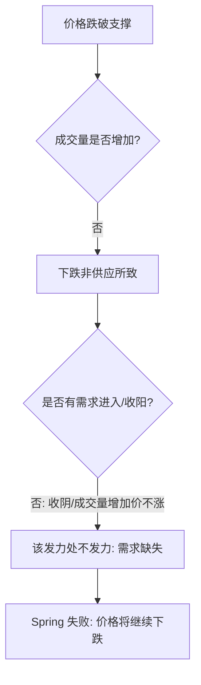

# 第三节 Spring 案例分析

## 核心思想

本节通过多个实战案例，深入剖析 Spring 在不同市场背景（上升趋势、盘整区、熊市陷阱、吸筹末端）下的表现及其确认/失败逻辑。核心在于识别**需求是否力挺**以及**卖盘背景的影响**。

---

## 一、上升趋势与 JOC 回测中的 Spring

在牛市中，Spring 通常是回调结束和趋势恢复的信号。

### 1. JOC 突破点的回测 (图 4-16)

- **场景**：价格突破区间（JOC）后回落至突破点。
- **行为**：在支撑位出现 Spring。如果伴随“终止行为”（高量对应小蜡烛，说明需求吸收了全部供应），则是强力进场点。
- **风控**：一旦 Spring 后没有持续跟随，应立即警惕。

---

## 二、Spring 失败的警示 (图 4-14, 4-15)

Spring 失败往往是牛市终结的重要预警。

### 1. 窄幅盘整中的失败 (图 4-15)
- **现象**：Spring 之后未吸引到大量买盘，反而出现了放量卖盘（蜡烛 2）。
- **逻辑**：市场转为卖盘控制背景。
- **教训**：成功的 Spring 必须有**价格持续上涨**和**成交量随价格递增**。

### 2. 需求缺失导致的失败 (图 4-14)
- **分析逻辑**：

---

## 三、熊市中的 Spring 陷阱 (图 4-20)

**警告**：不要在卖盘控制的背景下寻找 Spring。

- **案例分析**：虽然出现了看似 Spring 的反弹（高量吸收），但随后的反弹（蜡烛 3/4）无法稳固在高位，说明卖单流量依然巨大。
- **结论**：在强供应背景下，抢反弹极易失败（如图 4-20 蜡烛 5 的放量下挫）。

---

## 四、特殊形式：震仓 (Terminal Shakeout, 图 4-21)

震仓是发生在吸筹阶段末端的“特大号 Spring”。

### 1. 震仓的特征与意义
- **行为**：长蜡烛 + 天量快速突破支撑，制造极端恐慌迫使公众割肉。
- **确认**：随后的迅速反弹（蜡烛 2）确认了需求完全吸收了供应，且大量过剩需求推动价格。
- **波形对比**：AB 波（前段）有量无价，说明需求在潜伏；震仓（后段）是对浮动供应的最后清理。

---

## 📈 实战总结：Spring 案例判断矩阵

| 案例类型          | 关键观察点                 | 判定结论                   |
| :---------------- | :------------------------- | :------------------------- |
| **高亮 Spring**   | 回弹是否收在 50% 以上？    | 吸收性需求，通常需二测。   |
| **无需求 Spring** | 反弹过程中成交量是否递减？ | 需求耗尽，小心回落。       |
| **卖区 Spring**   | 靠近前期供应区处的表现。   | 极易受高抛盘打压导致失败。 |
| **震仓型 Spring** | 随后是否迅速重回区间？     | 确认吸筹结束，准备上涨。   |

---

## 🔗 导航

- [← 第二节: Spring 的位置和种类](./第二节_Spring的位置和种类.md)
- [→ 第四节: 使用 Spring 的注意事项](./第四节_使用Spring_应该注意以下几点.md) (待生成)
- [↑ 返回第四章目录](./README.md)
- [↑ 返回总目录](../README.md)
