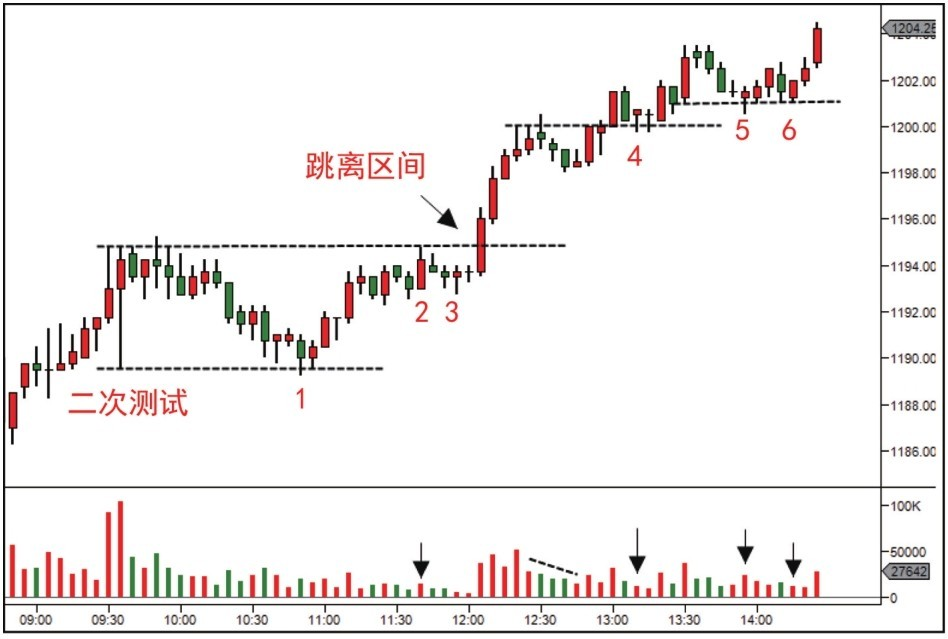
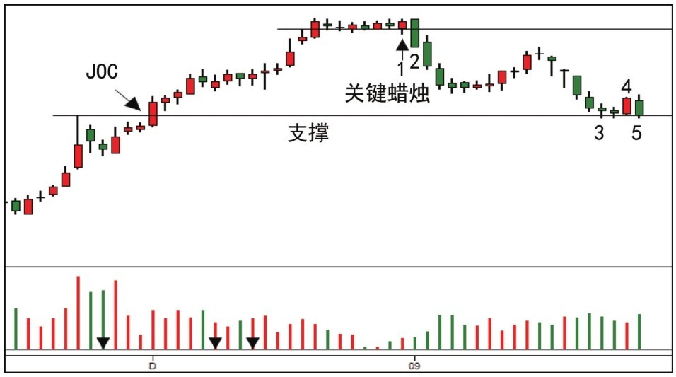
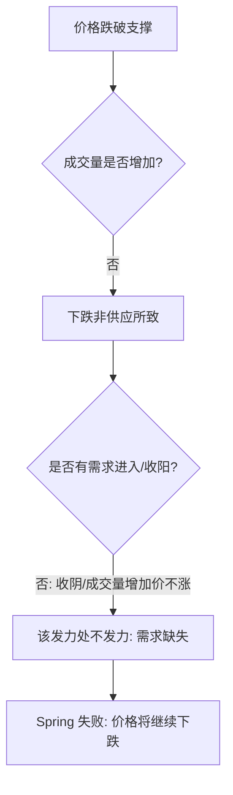
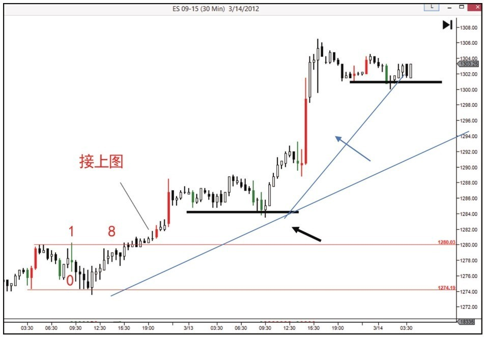
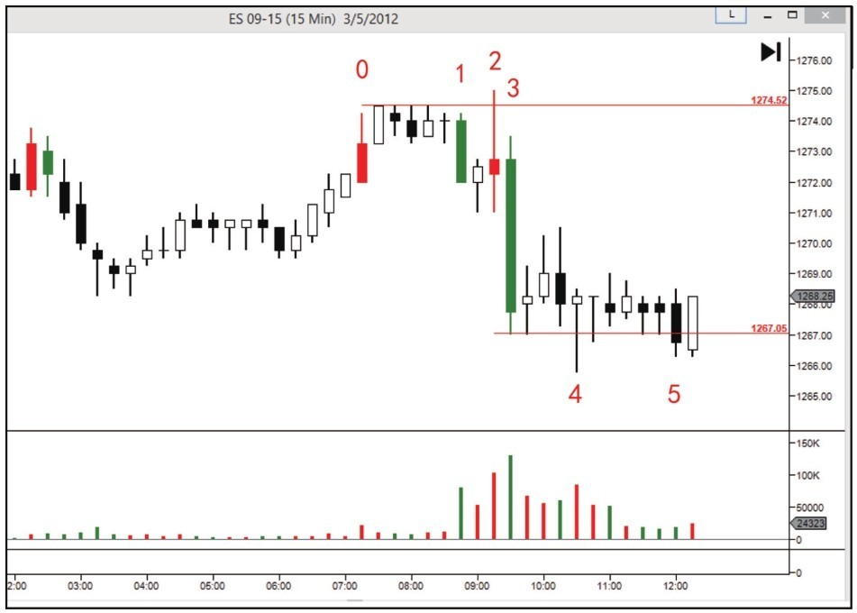
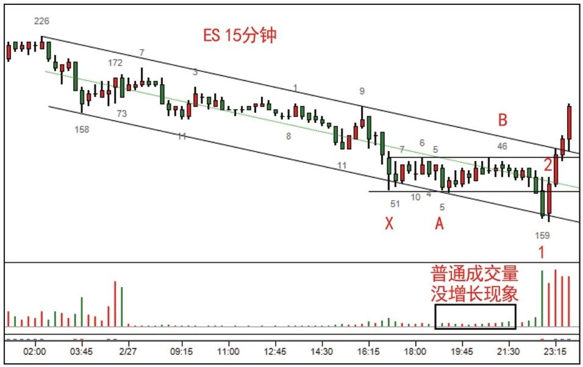
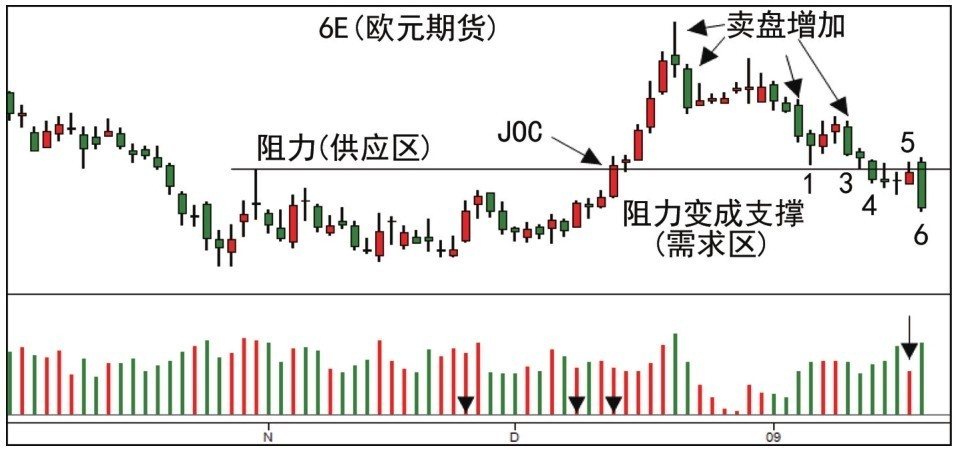

# 第三节 Spring 案例分析

## 核心思想

本节通过多个实战案例，深入剖析 Spring 在不同市场背景（上升趋势、盘整区、JOC 回测、熊市陷阱、吸筹末端）下的表现。核心在于通过观察**需求是否力挺**以及**卖盘背景的影响**来判定 Spring 的真实性和可靠性。

---

## 一、上升趋势中的 Spring

在牛市中，Spring 通常是回调结束和趋势恢复的信号。

### 1. 窄幅盘整与弹跳板 (图 4-5)

- **场景**：牛市中的窄幅盘整底部出现 Spring。
- **行为**：蜡烛 1 出现 Spring。随后价格回调到 3，成交量和蜡烛极小，形成“弹跳板”。
- **意义**：市场已准备好起跳，随后出现 [JOC](../术语速查手册.md#joc-jump-across-the-creek)（跳离震荡区）。

### 2. JOC 突破点的回测与二次测试 (图 4-6, 4-16)

- **行为**：JOC 之后开始区间交易。蜡烛 1 是 Spring，但成交量大说明供应未耗尽。
- **确认**：蜡烛 2 对 Spring 进行二次测试，成交量极小，确认为理想进场点。

- **细节**：蜡烛 3 在支撑位出现 Spring 和“终止行为”（高量小蜡烛）。蜡烛 4 需求持续，预示上涨开始。

---

## 二、Spring 失败的警示

Spring 失败往往是牛市终结的重要预警。

### 1. 支撑位无需求反弹 (图 4-7, 4-14)

- **现象**：Spring 之后（蜡烛 3）的反弹没有吸引到买单，未能持续创新高。
- **逻辑**：无需求反弹判定支撑无效，价格将突破支撑继续走低。

- **判定流程**：

---

## 三、熊市中的 Spring 陷阱

**严禁在卖盘控制的背景下寻找 Spring。**

### 1. 需求匮乏的熊市案例 (图 4-8, 4-9)

- **现象**：蜡烛 1 突破支撑，看似是不错的缩量 Spring。
- **风险**：大背景是熊市，反弹极低成交量说明无需求。

- **后果**：价格并没有反转，而是继续向下寻找需求。

---

## 四、派发前奏与抢购高潮 (图 4-11, 4-12)

Spring 有时也出现在派发早期的震荡中。

- **技巧**：观察急速上涨是否突破阻力。若在空中无阻力处急速上涨，则是**[抢购高潮 (BC)](../术语速查手册.md#bc-buying-climax)**，预示派发开始。

- **特征**：收盘价相近的小区间通常通过 [Spring](../术语速查手册.md#spring) 或 [UT](../术语速查手册.md#ut-upthrust)（上冲回落）结束并开启大行情。

---

## 五、特殊形式：震仓 (Terminal Shakeout)

震仓是发生在吸筹阶段末端的“特大号 [Spring](../术语速查手册.md#spring)”。

### 1. 震仓的实战意义 (图 4-21)

- **识别**：天量长阴快速跌破支撑后再迅速反弹（蜡烛 2），确认需求完全吸收供应。
- **目标**：迫使公众产生极大恐慌，清除最后的浮动供应，为上涨铺路。

---

## 📈 实战总结：Spring 综合判断图

通过对比图 4-18 的增量下影线与图 4-19 的缩量反弹，可以清晰识别出**供应战胜需求**的转折点。

---

## 🔗 导航

- [← 第二节: Spring 的位置和种类](./第二节_Spring的位置和种类.md)
- [→ 第四节: 使用 Spring 的注意事项](./第四节_使用Spring_应该注意以下几点.md)
- [↑ 返回第四章目录](./README.md)
- [↑ 返回总目录](../README.md)
