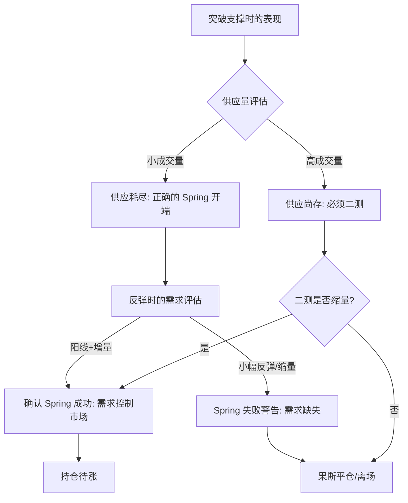

# 第四节 使用 Spring 的注意事项

## 核心思想

**Spring** 交易法虽然强力，但必须建立在**严格的背景确认**与**风险管理**之上。正确使用 Spring 的关键在于：不刻意制造信号、识别背景倾向、并根据后续走势果断决策。

---

## 一、实战守则

### 1. 宁缺毋滥，耐心第一
- **守则**：Spring 不是每天都有。如果没有出现符合条件的信号，**等待也是一种交易策略**。
- **动作**：一旦出现完美 Spring（如 Type 2），绝不能由于犹豫而错过信息。

### 2. 背景决定成败 (核心)
- **环境要求**：成功率高的 Spring 仅发生在**上升趋势**中。
- **禁区**：在**卖盘控制的背景**下（如下跌趋势或强供应区），严禁利用 Spring 进场。

### 3. 给供应以测试空间
- **法则**：如果突破支撑时成交量相对扩大（Type 3），**必须等待** [ST](../术语速查手册.md#st-secondary-test)。
- **确认标准**：[ST](../术语速查手册.md#st-secondary-test) 必须表现为**成交量显著萎缩**且**价差变小**。

---

## 二、进场后的危机管理

### 1. 期待的行为 (期待信号)
- 出现持续创出新高的阳线。
- 成交量随价格上涨而递增。

### 2. 拒绝的行为 (撤退信号)
- 如果反弹力度微弱、需求匮乏。
- 供应趁机进入打压价格。
- **动作**：**立刻出场**，不要抱有幻想，等待下一个 [ST](../术语速查手册.md#st-secondary-test)。

---

## 📈 Spring 衡量标准图

---

## 📌 核心总结

1. **Spring 的本质是衡量器**：用它来衡量突破时的供应量和反弹时的需求量。
2. **成功的标志**：供应耗尽（突破时低量）+ 需求扩大（反弹时高量/阳线）。
3. **实战心态**：不犹豫，不幻想。符合条件即入场，逻辑不再即撤退。
