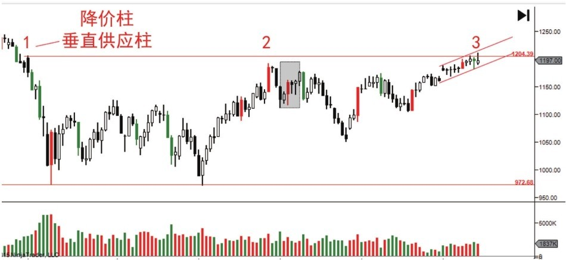

# 第四节 公众对支撑和阻力的误解

## 核心思想

支撑和阻力的本质不是图上的某条线，而是**供求关系平衡点的价格区间**。正确理解供求关系，才能真正把握支撑和阻力的有效性。

---

## 📋 支撑和阻力速查表

| 概念 | 供求关系 | 判断标准 | 交易信号 |
|------|---------|---------|---------|
| **支撑有效** | 需求 > 供应 | 量大不跌（停止行为） | ✅ 可以进场 |
| **支撑失效** | 供应 > 需求 | 无力反弹或缩量 | ❌ 继续下跌 |
| **阻力有效** | 供应 > 需求 | 量大不涨（停止行为） | ❌ 要卖出 |
| **阻力失效** | 需求 > 供应 | 放量突破 | ✅ 可以买入 |

---

## 一、支撑的真实含义

### 定义与判断

| 维度 | 含义 |
|------|------|
| **定义** | 在某个价位，需求 > 供应，买方购买力超过卖方抛售力 |
| **表现** | 卖方不愿意降价，因为有足够的买家在这个价位接盘 |
| **判断标准** | 停止行为：大量卖单流入，但价格没有大幅下跌（量大不跌） |
| **失效信号** | 无力反弹、缺量反弹、持续下跌 |

### 支撑的供求含义

- **有效支撑**：大量卖单流入 → 需求强势吸收 → 供应枯竭 → 价格反弹
- **失效支撑**：卖单流入 → 需求无力承接 → 继续下跌 → 支撑被突破

### 案例：支撑位置的供求关系

**关键点**：
- 放量大涨（VDC）的底部形成支撑区
- 价格会经常回测这个支撑区域
- 在上升趋势中是低风险的买入机会

### 案例：支撑失效的表现

**支撑失效的特征**：
- 触底后没有出现强烈反弹
- 反弹蜡烛小、成交量缺乏
- 买家对这个价格没有兴趣
- 导致价格继续向下寻找买家

---

## 二、阻力的真实含义

### 定义与判断

| 维度 | 含义 |
|------|------|
| **定义** | 在某个价位，供应 > 需求，卖方抛售力超过买方购买力 |
| **表现** | 买方不愿意接价，因为有足够的卖家在这个价位抛售 |
| **判断标准** | 停止行为：大量卖单流入，但价格没有大幅上涨（量大不涨） |
| **失效信号** | 放量突破、缺量突破、持续上涨 |

### 阻力的供求含义

- **有效阻力**：大量卖单流入 → 需求无力承接 → 价格回调 → 形成压力
- **失效阻力**：卖单流入 → 需求强势吸收 → 继续上涨 → 阻力被突破

### 案例：供应线与超卖线

**关键含义**：
- 下轨是超卖线（过度卖出信号）
- 供应线是前期放量大跌形成的阻力区
- 反弹时如果缺乏供应扩大，说明需求会继续主导

---

## 三、支撑和阻力的对称性

### 停止行为的镜像含义

| 位置 | 表现 | 供求含义 | 判断 |
|------|------|---------|------|
| **支撑位** | 量大不跌 | 供应在扩大，但需求强势吸收 | 支撑有效 ✅ |
| **支撑位** | 缩量反弹 | 需求无力，只有低量参与 | 支撑失效 ❌ |
| **阻力位** | 量大不涨 | 需求在增加，但供应强势压制 | 阻力有效 ❌ |
| **阻力位** | 放量突破 | 供应无力，需求强势突破 | 阻力失效 ✅ |

**关键认识**：支撑和阻力完全对称，理解供求关系的镜像逻辑，无需记忆复杂规则。

---

## 四、死角与价格突破

### 死角的定义与特征

| 特征 | 含义 |
|------|------|
| **位置** | 上涨趋势的上轨与水平阻力线的交叉点 |
| **供求状态** | 双重虚弱：上升动力逐渐减弱 + 阻力压力显现 |
| **走势表现** | 波幅变窄、成交量很小、交易不活跃 |
| **关键特点** | 只需很小的力量就能打破脆弱平衡，大动作可能性很高 |

### 死角的市场意义

- 供求都很虚弱，无力维持现有方向
- 小量也能导致大价格变动（力量对比极度失衡）
- 预示行情即将有大动作发生

### 案例：死角的形成与风险

**关键点**：
- 走势在阻力位前形成窄幅通道
- 成交量和交易范围都很小
- 任何微小的力量都可能突破这个脆弱的平衡
- 预示行情即将有大幅波动

---

## 五、上冲回调与下冲反弹

### 上冲回调（在阻力位）

| 判断 | 表现 | 供求含义 | 交易信号 |
|------|------|---------|---------|
| **有效** | 阴线跟随 + 放量 | 供应扩大，反转信号有效 | ❌ 不能继续追多 |
| **无效** | 无阴线或缺量 | 只是试探，没有新卖单 | ⚠️ 谨慎做空 |

### 案例：需求和供应扩大在不同位置的含义

**关键特征**：
- 需求扩大（蜡烛X）：在震荡区右手边，长阳线 + 放量
- 供应扩大（蜡烛2）：下影线 + 放量，在震荡区中部
- 位置和形态共同决定含义

### 下冲反弹（在支撑位）

| 判断 | 表现 | 供求含义 | 交易信号 |
|------|------|---------|---------|
| **有效** | 低量回调 + 放量反弹 | 供应枯竭，需求主导 | ✅ 低风险进场 |
| **失效** | 继续下跌 | 需求无力承接 | ❌ 继续观望 |

### 案例：阻力位突破还是反转

**判断标准**：
- **向上突破**：无供应扩大 + 需求积极吸收 = 放量大涨突破
- **向下反转**：产生大量供应 + 需求无力吸收 = 高量上影线反弹无力

---

## 六、重要概念速查

### 放量大涨（VDC）- 需求爆发

| 特征 | 含义 | 应用 |
|------|------|------|
| 放量 + 大幅上涨 | 需求强势进场 | 形成底部支撑，价格回测时低风险进场 |

### 放量大跌（VSC）- 供应爆发

| 特征 | 含义 | 应用 |
|------|------|------|
| 放量 + 大幅下跌 | 供应强势出现 | 形成顶部阻力，价格回测时需要谨慎 |

### 抢购高潮（BC）- 牛市顶部信号

| 特征 | 含义 | 警告 |
|------|------|------|
| 牛市顶部的放量大涨 | CM在派发，需求达到最高点 | ❌ 不能继续进场，后续将进入派发阶段 |

---

## 💡 实战要点

### 支撑和阻力的唯一判断标准

**停止行为**：大成交量 + 小蜡烛 = 努力≠结果

- 在支撑位：量大不跌 → 支撑有效
- 在阻力位：量大不涨 → 阻力有效

### 常见错误

| 错误 | 原因 | 后果 |
|------|------|------|
| 把支撑当线 | 用固定的线（均线、黄金分割等） | 市场不按照你的指标运动 |
| 支撑失效不出场 | 不看供求只看形态 | 被套在下跌中 |
| 阻力突破就追多 | 不确认需求强度 | 在派发高位接盘 |
| 只看价格不看量 | 忽视供应/需求信号 | 判断不全面 |

---

## 📌 核心总结

### 三个关键认识

**1. 本质 vs 表象**
- ❌ 表象：支撑和阻力是图上的某条线
- ✅ 本质：支撑和阻力是供求关系的平衡点

**2. 判断标准**
- 支撑有效：停止行为（量大不跌）
- 阻力有效：停止行为（量大不涨）
- 镜像逻辑，无需复杂记忆

**3. 死角的含义**
- 供求双重虚弱的形态
- 只需小力量就能打破平衡
- 大动作的根源是平衡脆弱，不是能量积聚

---

## 🔗 导航

- **上一节**：[第三节 - 供求关系](./第三节_供求关系.md)
- **下一节**：[第五节 - 如何识别供应和需求扩大](./第五节_如何识别供应和需求扩大.md)
- **上级目录**：[第一章 - 聪明钱解读市场的工具](./README.md)
