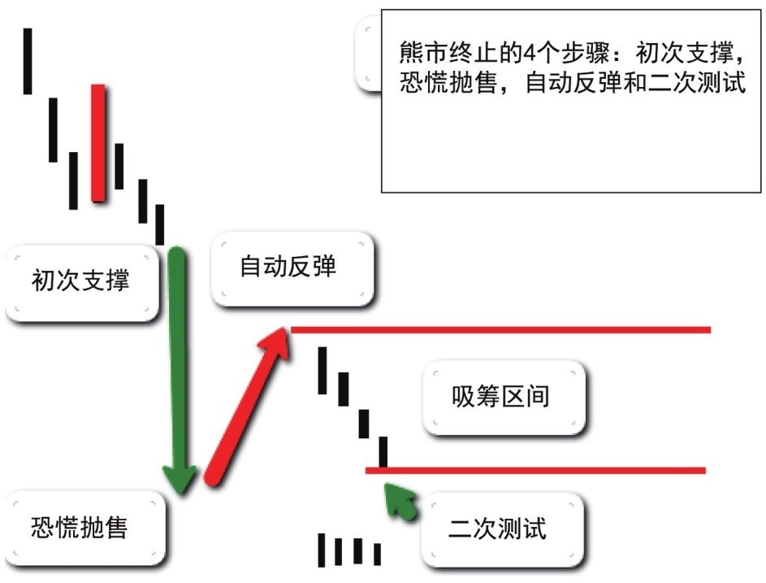
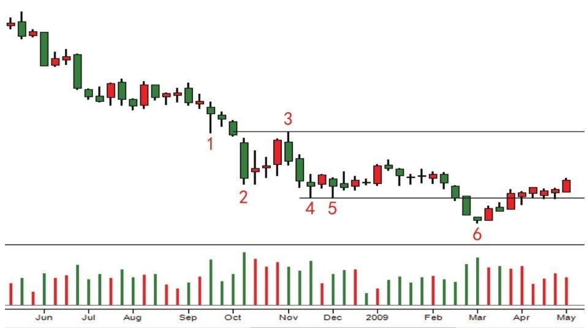

## 第一节 熊市终止的市场行为

## 核心思想

熊市中，无论价格跌的多深，首先要把急于抄底的想法放弃。熊市的终止过程从理论上讲是：**需求扩大后供应逐渐耗尽**。正确的判断方式是：**观察市场行为，而不是基于价格深度判断**。

---

## 📋 熊市终止的4个关键市场行为

| 阶段         | 现象                  | 供求含义 | 交易信号        |
| ------------ | --------------------- | -------- | --------------- |
| **初次支撑** | 扩大成交量使下跌停止  | 需求出现 | ⏳ 观察         |
| **恐慌抛售** | 超长阴线 + 超高成交量 | 供应释放 | ⏳ 不进         |
| **自动反弹** | 反弹不持久            | 空头回补 | ⏳ 不进         |
| **二次测试** | 小蜡烛 + 缺量         | 供应枯竭 | ✅ **底部确认** |

---

## 图2-1：熊市终止的四个阶段

---

## 一、四个阶段详解

### 1️⃣ 初次支撑

**定义**：CM需求进场，用扩大成交量阻止价格下跌

**关键特征**：

- 市场出现扩大成交量使下跌停止
- 初次支撑之前是持续而无反抗的下跌过程
- 表现为：下影线 + 扩大的成交量（停止行为）

**深层含义**：

- 能够抑制价格下跌的关键因素是**需求扩大**
- 初次支撑是来自CM的需求进场信号
- 虽然暂时，但表示市场有转机可能
- **不能单独确认底部**，还需二次测试验证

---

### 2️⃣ 恐慌抛售

**定义**：公众在心理崩溃下无奈抛售亏钱筹码

**关键特征**：

- 价量特征：**超长阴线 + 超高成交量**
- 有时一天，有时持续几天
- 如果没看到这种价量行为，说明恐慌抛售还没出现

**深层含义**：

- **恐慌抛售产生真正持久的牛市**
- 没有恐慌抛售产生的牛市不会持续太久
- 市场的股票开始从公众手中转移到CM手中
- 需求来自CM接盘，供应来自公众抛售

---

### 3️⃣ 自动反弹

**定义**：恐慌抛售之后的正常反弹

**关键特征**：

- 反弹经常是空头回补，不会持续太久
- **不能在这里抄底**
- 必须耐心等待二次测试验证底部

---

### 4️⃣ 二次测试（★ 关键！）

**定义**：自动反弹后的测试过程，决定熊市是否真正终止

**成功标准**：`小蜡烛 + 缺量`

| 结果     | 价量特征       | 含义     | 结论        |
| -------- | -------------- | -------- | ----------- |
| **成功** | 小蜡烛 + 缺量  | 供应枯竭 | ✅ 熊市停止 |
| **失败** | 成交量继续扩大 | 浮供还在 | ❌ 熊市继续 |

**深层含义**：

- 成功二次测试 = 熊市停止的确认信号
- 确认供应已经耗尽，底部形成完毕
- 前面恐慌抛售所形成的支撑是安全的
- 市场可以进入横盘或上升阶段

---

## 图2-2：熊市终止的蜡烛讲解

| 蜡烛  | 形态            | 含义               | 信号            |
| ----- | --------------- | ------------------ | --------------- |
| **1** | 下影线 + 放量   | 初次支撑，需求进场 | ⏳ 观察         |
| **2** | 超长阴线 + 放量 | 恐慌抛售，CM接盘   | ⏳ 准备         |
| **3** | 自然回调        | 空头回补           | ❌ 勿抄底       |
| **4** | 高量            | 二次测试失败       | ⏳ 继续观察     |
| **5** | 缺量回调        | 供应减少信号       | ⏳ 准备进场     |
| **6** | 放量急跌        | 终极震仓，清供应   | ✅ **底部确认** |

**关键认识**：

- 蜡烛1-3 = 初步底部信号
- 蜡烛4成交量大 = 二次测试失败，浮供未尽
- 蜡烛5缺量 = 供应逐步枯竭
- 蜡烛6放量急跌 = 扫清最后死扛者，底部完全确认

---

## 💡 核心认知

**原则 > 形态**：

- 我们需要掌握的是**原则**，而不是**形态**
- **原则是本质，形态是表象**
- 观察市场时，首先要从理论根据的角度观察走势

**正确的抄底依据**：

1. 看到初次支撑（需求出现）
2. 看到恐慌抛售（供应释放）
3. 看到自动反弹（正常反应）
4. 看到**成功的二次测试**（供应枯竭确认）

---

## 💡 实战要点

### 核心判断标准

| 观察点       | 判断标准           | 交易意义        |
| ------------ | ------------------ | --------------- |
| **初次支撑** | 需求出现，下跌停止 | ⏳ 观察不进     |
| **恐慌抛售** | 超长阴线 + 超高量  | ⏳ 准备观察     |
| **自动反弹** | 反弹无力缺乏续航   | ❌ 勿抄底       |
| **二次测试** | 小蜡烛 + 缺量      | ✅ **安全进场** |

### 常见错误

| 错误           | 后果             |
| -------------- | ---------------- |
| 在初次支撑进场 | 被恐慌抛售套住   |
| 在自动反弹抄底 | 二次测试再次下跌 |
| 看指标抄底     | 供应关系无法确认 |
| 不等二次测试   | 陷入高风险位置   |

---

## 📌 核心总结

**熊市终止的四个必要阶段**：

1. **初次支撑** = 需求信号，表示有转机可能
2. **恐慌抛售** = 供应释放，需求开始接盘
3. **自动反弹** = 测试阶段，不代表底部
4. **二次测试成功** = 底部确认的唯一标准

**关键认识**：

- 初次支撑 + 恐慌抛售 ≠ 底部，仅表示开始
- **成功二次测试** = 熊市真正终止的唯一确认
- 四个行为缺一不可，不能跳过任何阶段
- 底部形成是**过程**，不是瞬间事件

---

## 🔗 与第一章的连接

| 第一章概念 | 第二章应用                             |
| ---------- | -------------------------------------- |
| 供求关系   | 熊市终止 = 需求↑ + 供应↓               |
| 因果关系   | 初次支撑→恐慌→反弹→二次测试 = 完整因果 |
| 努力和结果 | 二次测试：量小但价格不跌 = 努力≠结果   |
| 停止行为   | 蜡烛1的下影线+放量 = 停止行为          |

---

## 🔗 导航

- **上一章**：[第一章 - 聪明钱解读市场的工具](../第一章_聪明钱解读市场的工具/README.md)
- **下一节**：[第二节 - 停止行为](./第二节_停止行为.md)
- **上级目录**：[第二章 - 怎么知道主力机构开始接盘了](./README.md)
