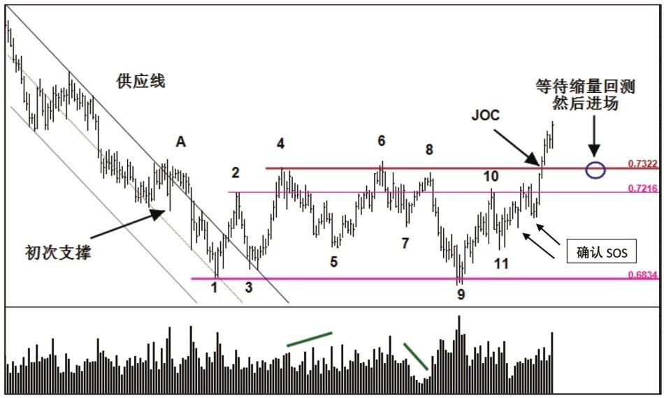

# 第八节 震仓

## 🌪 核心思想

**震仓（Shakeout）** 是 CM 制造恐怖气氛的一个策略。

- **目的**：迫使意志不坚定的公众抛出股票，CM 借此吸收筹码并摊低成本。
- **结果**：清除浮动供应，为牛市启动扫清障碍。

---

## 一、终极震仓 (Terminal Shakeout)

经常发生在吸筹的**末期**或者交易区间的**末期**。

### 1. 行为特征

- **形态**：价格急速、大幅度深跌，冲破所有支撑。
- **背景**：此前通常是区间交易，反弹高度越来越低（如台阶式下降）。
- **心理博弈**：
  - **卖方**：惊弓之鸟的公众，因恐惧暴跌而抛售。
  - **买方**：CM 利用震仓验证浮动供应是否耗尽。即使坚定的持有者也可能被吓跑。

### 2. 震仓后的确认信号

- **必选项**：震仓后必须迅速反弹，且带有牛市特征（持续更高的最高价/最低价/收盘价）。
- **成交量**：稳定递增，而非爆发式剧增（那是抢购高潮）。
- **进场时机**：震仓后的反弹（SOS）和其后的缩量回测（LPS）。

---

## 📊 案例1：吸筹后的终极震仓

### 图2-29：澳元日线（2016年3月）

**关键点解析**：

- **震仓前兆**：反弹高点逐渐降低，说明需求耗尽。
- **震仓过程（8-9）**：天量急速下跌，跌破支撑。
- **快速反弹（9-10）**：SOS 出现，确认了刚才的大跌是震仓而非真跌。
- **进场机会（10-11）**：强反弹停在半路（需求强劲），随后的缩量测试确认了 SOS，是最佳进场点。

---

## 📊 案例2：再吸筹中的终极震仓

### 图2-30：复杂的双重震仓

**关键点解析**：

- **第一次震仓（蜡烛5）**：宽幅阴线深度突破支撑，看似极度危险。
- **吸收确认（蜡烛8）**：成交量略升且价格收高，说明供应被吸收。
- **特殊的二次测试（蜡烛9）**：
  - 这里出现了一个**变体**：二次测试（蜡烛9）本身也是一次**二次震仓**。
  - **特征**：放量宽幅阴线跌破前低。
  - **应对**：需等待蜡烛10的高量快速反弹来确认这又是一次震仓。
- **教训**：走势并不总按教科书发展，要灵活识别“震仓套震仓”的复杂局面。

---

## 二、普通震仓 (Ordinary Shakeout)

### 1. 发生场景

- **位置**：上升趋势中，刚启动不久的个股。
- **原因**：突发消息导致公众临时恐慌，或主力故意洗盘。

### 2. 应对策略

- **不要急于抄底**：放量急跌后，必须等待**二次测试**。
- **成功信号**：二次测试必须是**小成交量** + **小振幅**。这证明供应耗尽。

### 图2-31：牛市中的普通震仓

**关键点解析**：

- **蜡烛1（停止行为）**：放量滞跌，需求进入。
- **蜡烛2（二次测试）**：初始下探但收回，成交量明显缩小 = **供应耗尽**。
- **蜡烛3（确认）**：迅速反弹，跟随牛市特征。此时是绝佳进场点。

---

## 🔗 导航

- **上一节**：[第七节 - 熊市结束的另一种模式](./第七节_熊市结束的另一种模式.md)
- **上级目录**：[第二章 - 怎么知道主力机构开始接盘了](./README.md)
