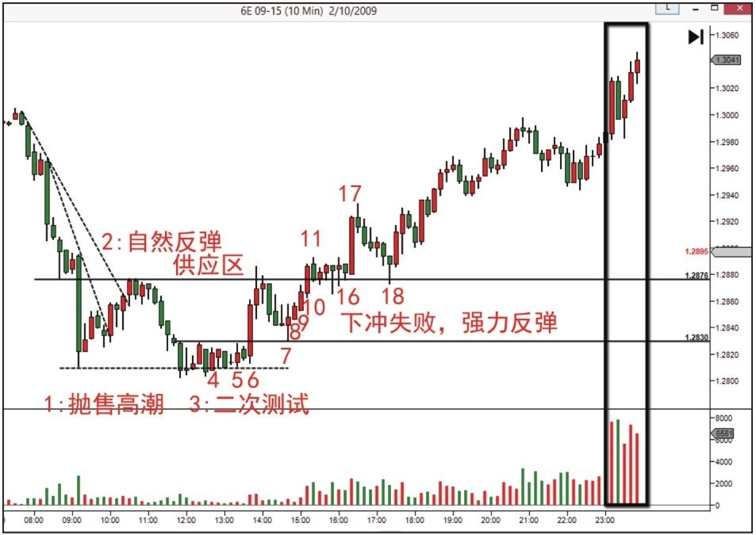
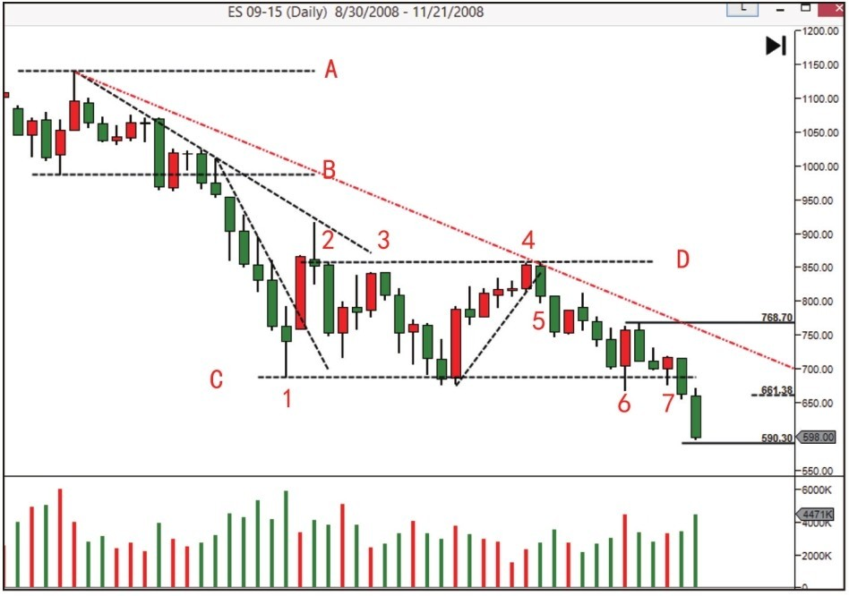
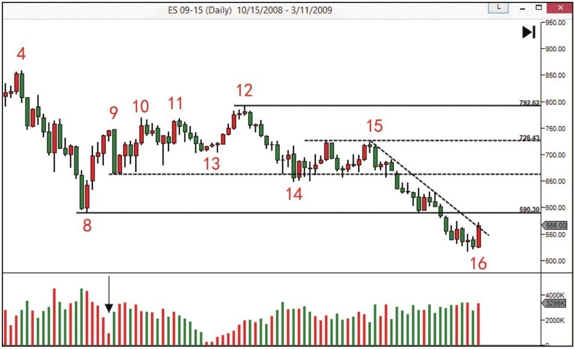
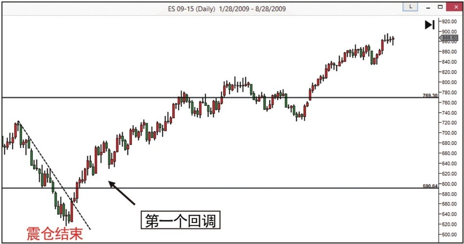
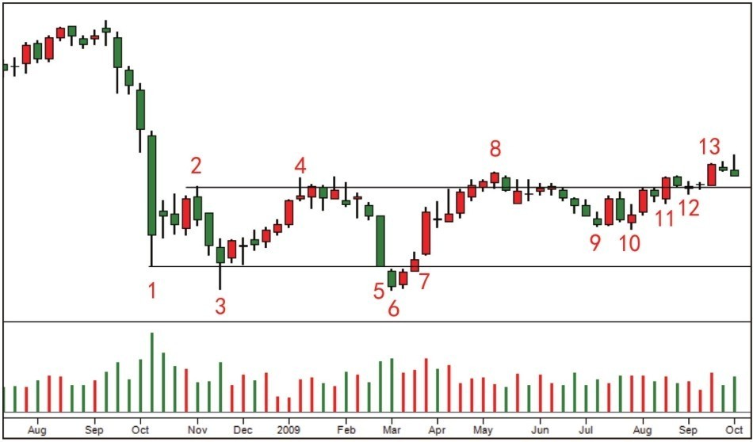

# 第六节 吸筹过程的操作综合案例

## 核心思想

通过三个不同周期的吸筹案例，展示从恐慌抛售到牛市开始的完整过程。学会识别吸筹完成的标志和派发开始的警告信号。

---

## 📊 案例1：吸筹过程较短

### 图2-19：短期吸筹四阶段流程

### 逐蜡烛讲解

**恐慌抛售**：
- 初次支撑之后是恐慌抛售，抛售方是恐慌的公众
- CM的介入使市场需求开始扩大，需求吸收供应
- 验证方法：价格突破下降趋势线或二次测试缺量
- 暂时倾向熊市停止，但这种倾向需要验证，**这里不能抄底**

**自然反弹**：
- 超卖行情后出现自然反弹
- 属于空头回补，不是真正的买单，不会持续太久
- 这个反弹突破最近的趋势线，确认恐慌抛售形成的支撑
- **如果在这里抄底，容易遭遇震仓**

**二次测试**：
- 非常关键，观察成交量是否缩小、蜡烛是否缩短
- 第一次测试成交量和价格范围还很大 → 供应仍存在 → 等待下一个二次测试
- 希望看到缺小的成交量和缩短的蜡烛

**4号蜡烛（成功的二次测试）**：
- 成交量完全消失 → 供应枯竭
- 支撑逐渐提高 → CM已提高收购价格
- 低价区供应稀少，CM需要提高成本价来收购
- 确认这个震荡区是吸筹，预示牛市孕育中

**死角**：
- 蜡烛在支撑上越来越短，既没新低也没新高
- 供求都非常弱，市场看起来很萧条
- 但市场行为告诉我们：**此时买入风险最低**
- 需求只需稍微扩大就能突破，进入上涨趋势
- **死角交易法**：不是因为某个蜡烛或技术指标，而是市场进入死角这个现象本身

**6号蜡烛（SOS - 强力信号）**：
- 长阳伴随高成交量突破死角和阻力
- 需求吸收市面上所有浮动供应，并控制走势
- **确认**：市场在吸筹 + 供应已枯竭 + 需求主导
- 这三条是牛市开始的前提，介入市场的理论根据
- 市场有回调是正常的，只要不是放量回调，牛市不会受威胁

**7号蜡烛（LPS - 最后供应点）**：
- 价格回到支撑出现漂亮反弹
- 对SOS的确认，证明市场由需求主导
- **又是一个安全的进场点**
- 蜡烛在高支撑位反弹 → 下方已没股票可买
- 要想买入只能提高价格

**8、9、10号蜡烛（真正的强势体现）**：
- 特点：三个更高（更高的收盘价、最低价、最高价）
- 伴随递增的成交量（也是一种SOS）
- 蜡烛10是JOC（市场再次提供进场平台，只等缩量回测）
- 牛市行情已吸引大量公众参与，行情看涨

**11-16号蜡烛（吸收过程）**：
- 在供应区附近形成小的震荡区
- 被套的公众在成本价位保本卖出，对上涨形成压力
- 成交量扩大 → 公众抛售
- 但**高位收盘**告诉我们：需求力量更大，抛售全被吸收
- **吸收现象只发生在强势出现之后**

**左手边 vs 右手边**：
- **1-2过程 = 左手边**：熊市中第一次反弹，**一般不在左手边抄底**
- **3开始 = 右手边**：从二次测试开始进入右手边，可寻找进场时机
- **蜡烛6和蜡烛8-10 = 牛市需要的市场行为**

**17号蜡烛（SOS/JOC）**：
- 意义同6号蜡烛
- 出现后给了进场平台
- 回调中若出现极小成交量或强力反弹 → 可进场

**18号蜡烛（弹簧效应）**：
- 停止行为，反弹速度显示需求强大
- 是否成功看后市是否创新高

### 图2-20：天量上涨预示派发开始

**蜡烛18的结果**：
- 需求努力有了很好结果，价格持续创新高

**天量上涨的警告**：
- 牛市中上涨不需要天量，只需匀速运行
- 如果出现天量上涨 = 公众抢购高潮出现
- 天量 = 供应开始涌入市场，人们不用抬价就能买入
- 导致价格上涨暂时停止
- **抢购高潮预示CM可能开始派发**
- 如果有仓位，这是**预警信号**

---

## 📊 案例2：长期吸筹（多年周期）

### 图2-21：长期吸筹开始阶段

**AB区间**：
- 小型交易区间
- 价格以高成交量突破后进入超卖（垂直下跌到蜡烛1）
- 下跌中没有大的购买力
- 超卖触底后应出现自然反弹

**恐慌抛售（蜡烛1）**：
- 标准的恐慌抛售：成交量巨大，下跌速度快
- 接下来是自动反弹
- 此时**可以抄，但必须是短线**（属于空头回补）

**二次测试（蜡烛2、3、4）**：
- **最关键一步**：观察下跌力度是否同恐慌抛售时一样
- 从2、3、4开始的下跌 → 浮动供应还大量存在
- 从底部到蜡烛4：成交量大幅递减 → **需求已耗尽**
- 底部出现需求耗尽 → 导致震仓或继续下跌
- 这种情况持续多月至多年，CM缓慢吸收浮供

**熊市恢复的确认（蜡烛5-7）**：
- 蜡烛5突破上升趋势线，收盘低于前一天 → 熊市确认
- 蜡烛6触底迅速带量反弹，但没吸引买家 → 反弹没有跟随
- 接下来对蜡烛6的测试关键：希望看到供应枯竭或需求进入
- 蜡烛7大幅增加的成交量突破支撑 → **新的清盘开始**

### 图2-22：长期吸筹中期

**再次触底（蜡烛8）**：
- 价格突破支撑后在蜡烛8找到需求
- 蜡烛8-9属于SOS：快速反弹 + 更高的低点、收盘价、最高价
- 蜡烛4-8的大跌是**终极震仓** → 吸筹接近结束
- 对牛市有利：突破趋势线 + 回到前支撑购买力不减
- **负面信息**：成交量随上涨递减 → 需求枯竭
- 这预示回调（二次测试）会出现，质量很重要

**二次测试（蜡烛9-）**：
- 蜡烛8-9反弹出现需求枯竭 → 二次测试尤为重要
- 蜡烛9出现 → 供应还在（放量下跌）
- SOS没得到确认 → **放弃介入市场**
- 蜡烛9急速下跌属超卖 → 超卖后出现自然反弹

**新高突破幅度缩小（SOT - 熊市特征）**：
- 观察9、10、11、12四次上涨努力
- 成交量还保持 → 努力在持续
- 但每次突破都没实际进展 → **明显的熊市特征**
- 蜡烛13-12的成交量持续上涨无应有结果 → **又是熊市特征**

**供应还在增加**：
- 蜡烛12下跌确认SOT，说明供应扩大
- 希望这次回调停在蜡烛9形成的高支撑或蜡烛8的最后支撑

**反弹失效**：
- 蜡烛14起来，两次反弹都止于50%位置
- 属于正常回调，不是反转 → **市场还是熊市**
- 反弹成交量未减，价格却半路夭折 → **供应压力很大**
- 吸筹未最后确认 → **将导致震仓发生**

### 图2-23：长期吸筹末期 - 终极震仓

**震仓（蜡烛15-16）**：
- 从蜡烛15下来急速下跌，最后支撑无阻力
- 直到蜡烛16的高量反弹，下跌暂停
- 如果价格迅速反弹 → 确认这是震仓

**大背景回顾**：
- 吸筹持续数月，这次大跌属于超卖行为
- 最大可能是**终极震仓**
- 虽然看起来像震仓，但价格突破最重要支撑 → 不敢完全确定
- 需要看后续反弹是否具有牛市特征

**吸筹完成的确认**：
- 这次震仓之后，市场大部分股票落入CM口袋
- 最坚定的公众也会因恐慌而抛掉亏钱筹码
- 特别是每次反弹都抄底的公众，这次震仓把他们清洗出场

### 图2-24：震仓后进入牛市

- 震仓结束后价格迅速反弹到前支撑之上
- 市场从此进入牛市
- 在第一个回调位置可以买入

---

## 📊 案例3：底部进场的最佳时机

### 图2-25：底部进场案例

**蜡烛1-2**：
- 蜡烛1：恐慌抛售、临时支撑
- 蜡烛2：自动反弹

**蜡烛3（二次测试 - 弹簧效应）**：
- 长度和成交量比较大 → 底部股票供应还很大
- **还要等一个二次测试**
- 不建议进场；如果冒险进场要保护
- 可以画出震荡区

**蜡烛4（上冲回落）**：
- 尝试立刻突破震荡区失败
- 告诉我们：**CM还没结束吸筹，还有很多股票要买**

**蜡烛5（震仓开始）**：
- 也可说是小型恐慌抛售

**蜡烛6（停止行为 - 可进场）**：
- 扩大的成交量 + 缩小的蜡烛 = 停止行为
- 需求扩大导致价量背离
- **可以进场，但必须看到连续的价格和成交量递增**
- 后续发展符合牛市增强特点

**蜡烛7（SOS）**：
- 大幅加长 + 扩大的成交量 = SOS
- 可惜没测试，所以没进场时机

**蜡烛8-10（探索阻力、二次测试）**：
- 蜡烛8-9：缓慢回落，告诉我们阻力股票供应很少
- 为后面突破提供保障
- 蜡烛10：二次测试，**可以进场**

**蜡烛11（脱离震荡区的尝试）**：
- 成交量和阳线长度不明显
- 耐心等待测试

**蜡烛12（停止行为 - 重要进场点）**：
- 成交量增长 + 极小的蜡烛 = 停止行为
- 正好是价格测试JOC突破点
- **可以进场**

**蜡烛13**：
- 需求强劲的表现
- 确认前面进场点

### 图2-26：底部进场后的牛市走势

---

## 💡 核心认知

### 三个案例的共同规律

**短期吸筹路径**：快速→二测→死角→SOS/JOC

**长期吸筹路径**：缓慢→SOT→终极震仓→SOS/JOC

**进场逻辑**：一切都指向"**供应是否枯竭**"

### 派发与吸筹的区别

| 特征 | 吸筹 | 派发 |
|------|------|------|
| 成交量 | 逐步增加 | 突然增加 |
| 价格 | 缓慢上升 | 快速上升后停滞 |
| 心理 | 折磨公众 | 吸引公众 |
| 操作 | 不着急 | 急着出货 |

### 关键术语

| 术语 | 含义 |
|------|------|
| **死角** | 最低风险进场点（蜡烛越来越短） |
| **SOT** | 努力无结果（熊市特征） |
| **LPS** | 最后供应点 |
| **天量上涨** | 派发警告信号 |
| **抢购高潮** | 公众疯狂买入，CM派发机会 |

---

## 📌 核心总结

### 最重要的警示

- ⚠️ 天量上涨 = 派发开始，该出场
- ⚠️ 反弹失效 = 供应充足，继续等待
- ⚠️ SOT现象 = 买方力量衰退，继续下跌可能
- ✅ 蜡烛变短 = 供应枯竭，可以进场

### 进场选择

- 三个不同的进场点（蜡烛6、10、12）
- 不追求最完美的点
- 而是追求**最安全的点**
- 从早期进场→风险降低，确定性增加

---

## 🔗 导航

- **上一节**：[第五节 - 进入牛市](./第五节_进入牛市.md)
- **上级目录**：[第二章 - 怎么知道主力机构开始接盘了](./README.md)
