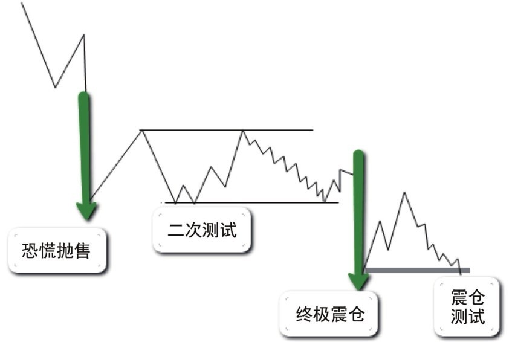

## 第四节 吸筹的第三阶段

### 核心思想

### 第三阶段 = 吸筹完成的确认阶段

从吸筹中期进入到最后阶段，CM的核心任务发生了转变：**从被动吸收转为主动测试**。通过终极震仓或弹簧效应来测试市场上是否还有股票供应，从而确认吸筹是否已经完成。

**关键信号：终极震仓/弹簧效应后的二次测试是风险最低的进场点**

---

## 📋 CM第三阶段的任务与检验

| 任务      | 方法         | 目的         | 结果           |
| :-------- | :----------- | :----------- | :------------- |
| **任务1** | 深度跌破支撑 | 吸收剩余股票 | 坚持者被迫卖出 |
| **任务2** | 快速下跌     | 激发恐慌     | 弱持有者投降   |
| **任务3** | 造成假象     | 隐藏真意     | 测试真实供应   |

### 终极震仓的三个目的

```text
深度跌破吸筹区底部支撑
    ↓
摆出继续大幅下跌的姿态
    ↓
评估市场上还有多少股票待售
    ↓
判断吸筹是否已完成
```

---

## 一、终极震仓与弹簧效应

### 定义与表现

| 现象         | 表现形式       | 含义       | 信号     |
| :----------- | :------------- | :--------- | :------- |
| **终极震仓** | 深度跌破支撑   | 大幅度下穿 | 最后一击 |
| **弹簧效应** | 短暂穿破后反弹 | 小幅度下穿 | 柔和版   |

两者的**目的和意义相同**：都是CM用来判断突破时的供应量

### 📊 图2-8：终极震仓示意图



**关键认识**：

- 终极震仓或弹簧效应 = 吸筹完成的一个信号
- 吸筹结束 = 牛市即将开始
- 二次测试 = 判断底部股票是否全被吸收

---

## 二、核心判断标准

### 供应是否已经全被吸收？

| 观察点       | 成功标准     | 失败标准       |
| :----------- | :----------- | :------------- |
| **突破深度** | 深度跌破底部 | 只是轻微突破   |
| **反弹速度** | 快速反弹起来 | 迟缓或无反弹   |
| **二次测试** | 缺量小蜡烛   | 继续放量下跌   |
| **收盘位置** | 收于中上位置 | 收于中下或以下 |

### 二次测试的判断

| 结果     | 表现特征    | 含义           | 交易信号    |
| :------- | :---------- | :------------- | :---------- |
| **成功** | 小蜡烛+缺量 | 供应已全被吸收 | ✅ **进场** |
| **失败** | 大蜡烛+放量 | 还有浮供未清   | ❌ 继续等待 |

---

## 💡 核心认知

### 三个关键认识

### 1. 第三阶段的本质

- 不是继续吸筹，而是**测试吸筹是否完成**
- 通过终极震仓/弹簧效应来测试
- 从供应角度判断底部是否纯净

### 2. 二次测试的关键

- **小蜡烛+缺量** = 供应已枯竭
- **继续放量** = 浮供还在
- **需要多次测试** = 直到供应完全耗尽

### 3. 进场的最安全点

```text
终极震仓/弹簧效应出现
    ↓
二次测试出现
    ↓
缺量小蜡烛反弹
    ↓
= 风险最低的进场点
```

---

## 💡 实战要点

### 常见误区

| 误区                 | 错误               | 后果           |
| :------------------- | :----------------- | :------------- |
| 看到跌破就吓出       | 不知道这是测试     | 在底部被甩出   |
| 快速反弹就追         | 不等二次测试       | 高位追多被套   |
| 第一个测试失败就放弃 | 不知道可能多次测试 | 错过最终进场点 |
| 只看价格不看量       | 忽视供应枯竭信号   | 判断失准       |

### 实战观察要点

| 阶段       | 观察内容     | 判断标准                   |
| :--------- | :----------- | :------------------------- |
| **震仓中** | 是否快速反弹 | 快反=吸筹完，慢反=还要等   |
| **测试时** | 成交量大小   | 缺量=好信号，放量=坏信号   |
| **反弹后** | 收盘位置     | 中上=确认，中下=失败       |
| **确认后** | 后续走势     | 价量俱增=进场对，反之=出场 |

---

## 📌 核心总结

### 三个必须理解的点

### 1. 为什么需要第三阶段

- 第二阶段虽然供应在减少，但还不够确定
- 需要通过终极震仓来**最后一次测试**
- 确保供应已完全枯竭，CM才能放心推高价格

### 2. 终极震仓的风险

- 这是最后的清仓机会，损伤最小
- 看似危险但实际是最安全的进场点
- 快速反弹 = 底部确认的最强信号

### 3. 二次测试的重要性

- 不是所有震仓后都能立即进场
- 必须等待二次测试来确认
- **缺量** = 唯一有效的确认信号

---

## 🔗 与前阶段的连接

| 前面阶段           | 本阶段应用               |
| :----------------- | :----------------------- |
| 第一阶段：恐慌抛售 | 第三阶段继续清除浮供     |
| 第二阶段：疲劳战术 | 第三阶段最后一击         |
| 支撑位逐步提高     | 第三阶段测试支撑有效性   |
| 缺量反弹           | 第三阶段判断供应是否耗尽 |

---

## 🔗 导航

- **上一节**：[第三节 - 吸筹的第二阶段](./第三节_吸筹的第二阶段.md)
- **下一节**：[第五节 - 进入牛市](./第五节_进入牛市.md)
- **上级目录**：[第二章 - 怎么知道主力机构开始接盘了](./README.md)
